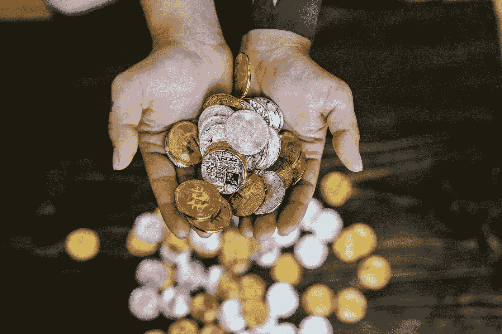

# 在投资加密货币之前，我希望知道的第一件事是

> 原文：<https://medium.com/coinmonks/the-number-one-thing-i-wish-i-knew-before-investing-in-cryptocurrency-447efa4ffaa4?source=collection_archive---------60----------------------->

[Photo by RODNAE Productions from Pexels](https://www.pexels.com/photo/close-up-shot-of-person-holding-gold-and-silver-bitcoins-8369601/)

不，它不是投资狗币或柴犬币，或任何其他飞向月球或更远的迷因币。尽管我确实记得，在去中心化交易出现抛物线之前很久，我曾看到柴犬在一个去中心化交易平台上提供服务，对着狗符号吃吃地笑着，然后简单地滚动过去。这是我错过的最简单的 1000 倍袋。