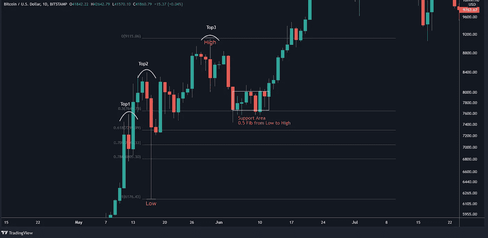
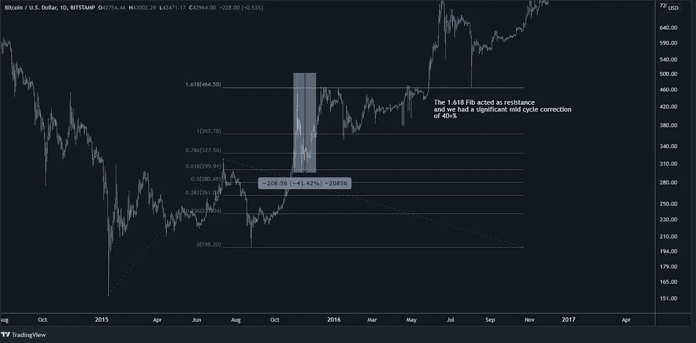
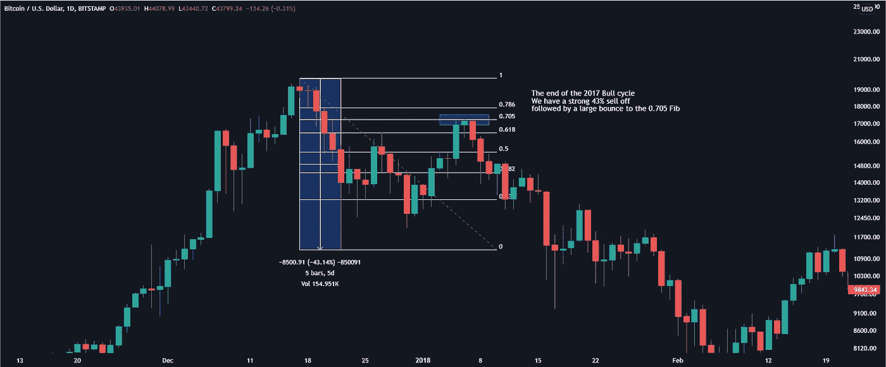

# 你可能忽略的 5 种比特币模式

> 原文：<https://medium.com/coinmonks/the-odd-shapes-of-the-bitcoin-market-cc58bf5560f0?source=collection_archive---------2----------------------->

> 有用和有趣的比特币模式，可以在他们的市场分析中实现。

在我多年玩图表、交易和投资加密的过程中，我总是试图找到随着时间重复的模式，以便更好地阅读市场，并可能理解接下来会发生什么。

在这里，我将与你分享一些有趣而有用的工具和信息，我用它们来进行市场分析:

*   **Top3 地层**
*   **1.618 分机**
*   **Fib 回撤水平的魔力**
*   **所有陀螺快速成型**
*   **下降三角形**

**前 3 层**

我喜欢称之为 Top3 形态，它是价格上涨后出现的看涨盘整形态。一般来说，我们有 3 个连续的本地高点，价格点非常相似，加上 10-25%的温和价格下跌，作为低点(需要保持)。出于这个原因，我们将这个地层命名为 Top3 地层。

2019 Top3 编队:

2020 年 Top3 地层:

把它想象成一场流动性大屠杀——突破交易者会在我们触及局部高点(第二个或第三个顶部)时囤积股票，但之后会遇到快速修正或几天的积累。自 2019 年以来，你可以经常发现这种形成，在抛物线上涨期间充当看涨积累。

前 3 形态的关键要点是，我们需要在短时间内(大约 1 个月)出现 3 个后续的更高顶部，同时出现一个需要保持的低点(10-25%之间)。如前所述，Top3 形态是一个看涨形态，我们更有可能经历一个向上的运动。也就是说，我们可能会有例外，这正是 2021 年 3 月至 4 月发生的情况:

加密中没有什么是 100%的。没有一个单一的指标在任何时候都能正确解读市场。很多时候你需要结合不同的链上和 TA 数据来做一个价格预测，画出支撑线/阻力线。但最重要的是——回测！你的策略没有价值，除非你能证明它是有利可图的，有一个预期的投资回报率，交易样本和а方差估计。更有甚者——我测试过的许多 TA 策略在一个有意义的样本中只能获得 35 %- 40%的利润。这意味着，即使你能交易并跑赢市场(比 HODL 赚更多的钱)，你还是会有 60-65%的小亏损。

**1.618 扩展**

> 或者一个简单的工具如何预测未来的价格目标。

当我第一次进入 crypto 时，我对 1.618 Fib 扩展级别的融合程度非常着迷。这一点在价格发现发生的牛市阶段尤为明显。在熊市中，我发现 Fib 回撤更有帮助，然而，在本文的后面会有更多。

简单地说，我将首先展示我的论文和观察结果，然后给出几个图表示例。

斐波那契扩展主要用于预测价格变动。从那里开始，我们可以绘制未来的阻力区，在 1.618 水平获利，预计一旦我们到达该水平，就会出现深度调整。我们有 3 个点——低位波动(开始波动)、高位波动(结束波动)和从高位波动的回撤。

2015 年——牛市的开始:

2017 年—牛市加速，3 月:

2017 年—牛市加速，6 月:

2017 年—牛市加速，9 月和 11 月:

2017 吹除顶部—偏离 1.618 阻力:

我发现的另一个重要的观察结果有助于我们确定我们的过度扩张程度，那就是每次面对 1.618 的拒绝时的巩固期(花费的时间)。

显然，每次价格恢复并打破一个新的 ATH 都需要更少的时间，直到我们在 3.0 Fib 扩展时达到顶点。

总而言之，在上一个牛市周期(2015 年至 2017 年)，我们有明确的行为模式——在 1.618 Fib 延伸处遇到阻力，随后是一段时间的盘整。每一次，盘整期都变得越来越短，直到我们经历了一个不寻常的抛物线运行到 20，000 美元，突破了 1.618 纤维，并在 3.0 纤维抛售。事后看来，这一切都是有道理的——价格回升和新 ATHs 的开发时间更短，这导致了抛物线和不可持续的市场状况。

自那以后，市场的表现是否也是如此？是和不是。“是”是因为我们仍然可以发现 1.618 点在寻找阻力点方面发挥了重要作用，“不是”是因为市场整体表现不同。这就是为什么与 2017 年周期或任何回溯测试的比较需要考虑 2018 年以来发展的新市场结构。

**神奇纤维回撤水平**

> 每只死猫都有它的主人。或者趋势反转后如何以及何时对冲。

简单明了——每一次主要的比特币抛售都会反弹到至少一个 **0.5 Fib** 的水平，从高点到低点。通常，趋势反转期间的第一次主要抛售会反弹至**0.705–0.786**Fib 回撤区。在接下来的几分钟里，这些纤维水平将是我们关注的主题。

我注意到的一件事是，每一次重大的比特币抛售都伴随着反弹至 0.5 Fib 回撤区或更高。无一例外。这对我们意味着什么，又能如何帮助我们？

首先，如果我们没有在 25%以上的抛售之前退出我们的现货 BTC 头寸，即使你认为可能会出现进一步的熊市，你也可以持有并等待将你的 BTC 对冲为现金。0.5 纤维也可以是一个很好的地方，让你的逢低买入头寸获利。这与你正在使用的一些策略相结合，可以帮助你提高投资回报率。

此外，大规模抛售的最初反弹通常会反弹至 0.705-0.786 的水平。随后的反弹遵循 0.5 纤维规则。

让我们从之前循环中的抛物线吹除顶部开始。

2014:

2017:

我们也可以在一些中期周期顶部发现相同的模式:

2019 年 6 月:

总结一下——无论我们是到达了牛市周期的最后一个抛物线，还是处于周期的中期扩张，大规模抛售之前的最初反弹总是会上升到 0.705-0.786 Fib。

请注意，我已经强调了这些大规模抛售发生得有多快。陀螺形成得很快，非常快。但这是我们将在本文后面讨论的主题。

现在，如果我们在最初的死猫反弹期间没有对冲，或者我们在逢低买入后考虑可能的利润目标，会发生什么？这就是 0.5 Fib 派上用场的地方。

2018:

2019:

总结一下——每一次后续抛售(在第一次抛售之后，触发趋势反转)都会导致至少 0.5 的 Fib 反弹。有时甚至是 0.618 甚至更高。总的来说，抛售越快越剧烈，我们预期的反弹就越大。

**所有的陀螺都快速成形**

> 楼上是楼梯，楼下是电梯。

首先，值得一提的是，大多数 BTC 价格 30%或更多的回撤发生在顶部形成后的 3-8 天内。我们有几个例外，需要更长的时间—12-13 天。在底部(投降)之后，尤其是在新的 ATHs 和价格发现期间，尤其如此。下面的例子聚焦于 2017 年牛市的最后阶段。

2017 年的价格扩展至 20，000 美元

在 2018 年的熊市期间，我们看到这种趋势不那么突出，因此了解我们处于市场周期的哪个阶段很重要。

这有什么关系，为什么有关系？比如说，我们认为底部已经到来，我们正处于新一轮牛市的早期阶段。判断新一轮上涨是否即将到来的一个好方法是，我们如何应对当地的高点(即使我们还没有打破一个新的 ATH)。让我详细说明一下:

局部见顶后的看涨积累:

你在上面看到的是 2020 年下半年的看涨积累。价格在一次扩张后正在回升，为下一轮上涨创造了足够的动力。请注意抛售是多么的“苍白”——仅仅 15%—20 %,然后是一个长时间的盘整(60 天)。这与 2017 年的价格扩张明显不同，当时每个本地顶级公司都遭遇了快速而恶性的 30%以上的抛售。

这同样适用于 2019 年 6 月，当时价格在达到 14，000 美元后暴跌。

请注意这两个市场结构是多么的不同。在 2019 年的 14，000 美元顶部期间，我们经历了快速抛售，随后是看跌确认——价格在 0.705-0.786 的水平被拒绝，然后在下跌过程中获得了更低的低点。在从 14，000 美元顶部开始的 60 天内，我们已经有了一个相当明显的下降三角形结构——一个明显的熊市发展。

说到下降三角形，这就把我们带到了本文的最后一个主题。

**下降三角形**

> 结构清晰，目标明确。

然而，从我们有限的数据来看，这一条是不言自明的——它似乎运行得相当好。我将把重点放在两个明显的问题上，因为我仍然认为它们没有得到太多的关注。

2018 和 2019 下降三角形:

我们可以简化许多(如果不是全部)众所周知的模式——例如,“下降三角形”只不过是一系列较低的高点和一个定期测试的支撑(因此使得支撑可能会打破)。这是一个明显的看跌模式，正如我们所见，技术目标得到了尊重。我们在 2018 年有大约 50%的区间，几乎完美地匹配了从 6000 美元到 3000 美元的投降式下跌。这同样适用于 2019 年——30%的目标或多或少完美实现了。

**我认为这里的关键要点是:**

1.  缩小以看到更大的图片，而不是陷入噪音
2.  尊重空头结构，并意识到牛市不会持续

另一个与第一点相关的注意事项是——很多时候，特别是当下降三角形形成，价格波动变得停滞不前时——人们会感到厌倦，这通常会导致过度交易，并缩小时间范围，以便采取一些行动。我认为，考虑“我们处于周期的哪个阶段”几乎总是更明智的做法，因为这决定了价格波动的可能性。只要在 TradingView 上玩玩 RSI，你就能发现在牛市中我们处于“超买”状态的时间有多长。或者当价格在熊市中继续下跌时，我们可以在“超卖”状态下呆多久。这同样适用于 MA 交叉——只是回测在牛市中做空 MA 交叉的盈利能力。你可能会发现，周期的牛市阶段有利于霍德勒，而熊市阶段有利于卖空者。逆市下注通常不是一个好的策略。

也就是说，2014 年至 2017 年的市场周期与我们自 2018 年以来经历的市场周期存在明显差异。但这是另一个话题了。我希望你喜欢这篇文章，并发现它很有用！

> 免责声明:
> 
> 以上分享的内容不是理财建议。
> 
> 这篇文章重点介绍了我感兴趣的一些模式和工具，仅供娱乐之用。
> 
> 加入 Coinmonks [电报频道](https://t.me/coincodecap)和 [Youtube 频道](https://www.youtube.com/c/coinmonks/videos)了解加密交易和投资

## 另外，阅读

*   [OKEx vs KuCoin](https://blog.coincodecap.com/okex-kucoin) | [摄氏替代度](https://blog.coincodecap.com/celsius-alternatives) | [如何购买 VeChain](https://blog.coincodecap.com/buy-vechain)
*   [币安期货交易](https://blog.coincodecap.com/binance-futures-trading)|[3 commas vs Mudrex vs eToro](https://blog.coincodecap.com/mudrex-3commas-etoro)
*   [在印度利用加密套利赚取被动收入](https://blog.coincodecap.com/crypto-arbitrage-in-india)
*   [德国最佳加密交易所](https://blog.coincodecap.com/crypto-exchanges-in-germany) | [WazirX P2P](https://blog.coincodecap.com/wazirx-p2p)
*   [如何购买 Monero](https://blog.coincodecap.com/buy-monero) | [IDEX 评论](https://blog.coincodecap.com/idex-review) | [BitKan 交易机器人](https://blog.coincodecap.com/bitkan-trading-bot)
*   [加拿大最好的加密交易机器人](https://blog.coincodecap.com/5-best-crypto-trading-bots-in-canada) | [赌注加密](https://blog.coincodecap.com/staking-crypto)
*   [如何在印度购买比特币？](/coinmonks/buy-bitcoin-in-india-feb50ddfef94) | [瓦济克斯审查](/coinmonks/wazirx-review-5c811b074f5b)
*   [最佳网上赌场](https://blog.coincodecap.com/best-online-casinos) | [硬件钱包](/coinmonks/hardware-wallets-dfa1211730c6) | [Jet-Bot 评论](https://blog.coincodecap.com/jet-bot-review)
*   如何在 WazirX 上购买柴犬(SHIB)硬币？
*   [比特币主根](https://blog.coincodecap.com/bitcoin-taproot) | [排名前 6 的比特币信用卡](/coinmonks/bitcoin-credit-card-bc8ab6f377c6)
*   [最佳免费加密信号](https://blog.coincodecap.com/free-crypto-signals) | [YoBit 评论](/coinmonks/yobit-review-175464162c62) | [Bitbns 评论](/coinmonks/bitbns-review-38256a07e161)
*   【Huobi 的加密交易信号 | [BitMEX 评论](https://blog.coincodecap.com/bitmex-review)
*   [7 个最佳零费用加密交易平台](https://blog.coincodecap.com/zero-fee-crypto-exchanges)
*   [分散交易所](https://blog.coincodecap.com/what-are-decentralized-exchanges) | [比特 FIP](https://blog.coincodecap.com/bitbns-fip) | [Pionex 审查](https://blog.coincodecap.com/pionex-review-exchange-with-crypto-trading-bot)
*   [用信用卡购买密码的 10 个最佳地点](https://blog.coincodecap.com/buy-crypto-with-credit-card)