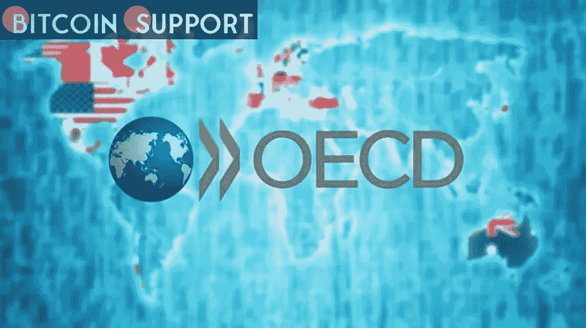

# 经合组织已经提出了一个加密货币税收透明度框架的提案，供公众反馈

> 原文：<https://medium.com/coinmonks/the-oecd-has-made-a-proposal-for-a-tax-transparency-framework-for-cryptocurrency-available-for-4d4dc2273a8c?source=collection_archive---------69----------------------->

**Visit our website:-** [**https://bitcoinsupports.com/**](https://bitcoinsupports.com/)

经合组织声称，加密市场在税收透明度方面构成了“重大危险”，认为除非采取进一步措施，否则任何收益都将付诸东流。

经济合作与发展组织(OECD)提出了报告加密交易和识别用户的新标准，以提高国际税务机构的透明度。

经合组织周二公布了一份公开咨询文件，其中包括一项建议，要求加密服务提供商更好地识别用户身份并报告某些交易。该组织表示，由于目前的申报规则，税务部门对涉及加密资产的交易没有“足够的透明度”。经合组织声称，加密市场在税收透明度方面构成了“重大危险”，认为除非采取进一步措施，否则任何收益都将付诸东流。根据该计划，已经在从事密码服务(如交易所、零售交易和转让代币)的个人和企业，将在法律实施之日起的 12 个月内遵守报告要求。公众被要求就该提案是否涵盖包括不可伪造代币在内的加密资产，以及税收报告法和从参与冷热钱包加密交易的人那里收集信息的“尽职调查”方法发表意见。根据一份报告摘要，“与传统金融产品不同，加密资产可以在没有传统金融中介参与的情况下转移和保留，也没有任何中央管理员可以完全了解交易或加密资产持有情况”。"因此，加密资产可能被用来破坏现有的国际税收透明度措施."https://twitter.com/amyleerosen/status/1506266043693510656

这个想法将在 4 月 29 日之前公开征求意见，会议定于 5 月底举行。经合组织表示，它计划在 10 月份巴厘岛举行的 20 国集团会议上报告新的报告规则。美国居民正处于纳税季，许多人需要在 4 月 18 日之前报税。许多总部位于美国的中央交易所提供美国国税局(Internal Revenue Service)的文件，显示上一年的交易，尽管各国的税务机关通常对处理或转移加密资产有不同的报告要求。代币或密码兑换成现金经常被纳税人报告为资本收益或损失。

**访问我们的网站:-**[**【https://bitcoinsupports.com/】**](https://bitcoinsupports.com/)

**免责声明:这些是作者的观点，不应被视为投资建议。读者应该自己做研究。**

> 加入 Coinmonks [电报频道](https://t.me/coincodecap)和 [Youtube 频道](https://www.youtube.com/c/coinmonks/videos)了解加密交易和投资

# 另外，阅读

*   [7 个最佳零费用加密交易平台](https://coincodecap.com/zero-fee-crypto-exchanges)
*   [最佳网上赌场](https://coincodecap.com/best-online-casinos) | [期货交易机器人](/coinmonks/futures-trading-bots-5a282ccee3f5)
*   [分散交易所](https://coincodecap.com/what-are-decentralized-exchanges) | [比特 FIP](https://coincodecap.com/bitbns-fip) | [宾邦评论](https://coincodecap.com/bingbon-review)
*   [用信用卡购买密码的 10 个最佳地点](https://coincodecap.com/buy-crypto-with-credit-card)
*   [加拿大最佳加密交易机器人](https://coincodecap.com/5-best-crypto-trading-bots-in-canada) | [Bybit vs 币安](https://coincodecap.com/bybit-binance-moonxbt)