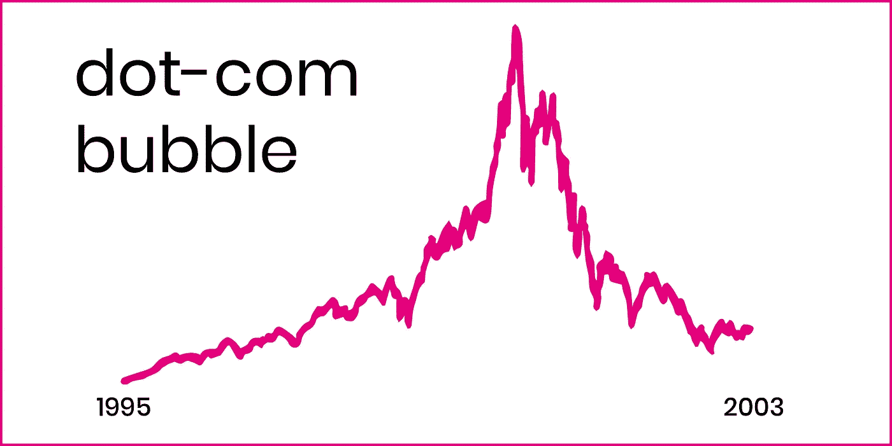

# 的。简言之，数字加密货币的起源

> 原文：<https://medium.com/coinmonks/the-origin-of-digital-currencies-in-a-nutshell-5fce3779f857?source=collection_archive---------11----------------------->

在接触比特币和区块链的技术层面之前。我们必须理解分散化货币体系的更大图景及其起源。因此，本文将简要概述数字分散货币网络的根源，以及哪些情况导致了比特币网络的发展。

## 回到 80 年代和 90 年代

自 2010 年代中期以来，主流媒体开始关注加密货币。尽管如此，媒体报道仍在一些可预测的话题之间循环，如激进的价格波动和环境影响。当比特币、以太坊(Ethereum)，尤其是迷因币(meme-coins)达到历史高点或迅速下跌时，我们见证了传统渠道如何尽力掩盖市场状况。然而，在主流媒体成名的短暂时刻，比特币大多抢尽了风头。这本身不是问题，问题是媒体如何将比特币描绘成一种新的货币技术，这只是部分正确。

比特币的白皮书发表于 2008 年 10 月，由于其巨大的成功，我们认为中本聪是分散货币铁路的教父，目前有数百万人使用。然而，数字货币铁路的起源可以追溯到 80 年代初。[7]

David Chaum 博士可能是密码学和分布式基础设施领域最有影响力的人之一。[9]1983 年 Chaum 发表了一篇论文，阐述了他对通过加密盲签名操作的数字现金(DigiCash)系统的看法。引入盲签名意味着交易如同现金交易一样不可追踪，因此保护了消费者的隐私。[7] Chaum 将私人银行作为目标，向其客户发行数字货币，这些客户可以进行数字和私人交易。

乔姆不仅远远领先于他的时代和同龄人，他的作品也是活跃于 90 年代的赛博朋克运动的基础。写 Cypherpunk 运动很容易成为一篇独立的文章，因此，我们不会进一步探讨这个主题。然而，我们不能忘记赛博朋克运动的巨大贡献。他们未来派和自由主义的思维方式，就像乔姆的一样，远远领先于其时代，并形成了我们当前分散式铁路的基础。

Chaum 在 1989 年将他的 DigiCash 想法转化为一项业务，商业银行是它的主要消费者。银行对 Chaum 的数字支付系统表现出兴趣，但由于互联网的早期阶段，以及缺乏大规模采用。DigiCash 在扩大用户群方面经历了一段困难时期，既有商家愿意接受支付，也有消费者愿意使用这种数字货币。因此，该公司于 1998 年宣布破产，并被 eCash Technologies 公司收购，这是一家类似的公司，也致力于数字支付系统。[7]

Chaum 的故事只是一个时代的一小部分，在这个时代，万维网的自由化成为了彻底创新的催化剂，导致了 Web 1.0。这一部分的主要收获是理解数字匿名和在某些情况下分散货币的概念已经存在。据此，我们可以进入下一个问题:为什么数字分散货币系统的突破需要这么长时间？

## 2000 年代的金融危机

网络时代(1990-2000 年代)是全球信息高速公路的开端，催生了无数新公司、商业模式和财务评估(如点击、眼球等)。).由于网景和雅虎公开估值的成功，其他互联网相关公司采取了上市的飞跃，并筹集了惊人的 IPO。正如今天的大多数科技企业一样，这些公司在负现金流的情况下运营，因此依赖于其网络(即用户群)的增长。这种增长(或炒作)将从风险资本家(VC)和散户投资者那里引入新的资金，保持平衡。然而，10 年的上升期在 2000 年结束了。[2] [3]

当网络泡沫破裂时，大多数人对互联网的未来失去了信心。市场崩溃了，大多数当时被贴上“创新”标签的公司破产了，幸存下来的公司遭受了巨大的损失。因此，在 21 世纪初，数百万散户投资者和风投经历了惊人的损失。回想起来，我们知道这是注定要发生的，崩盘最终让市场变得更加成熟。然而，与导致全球动荡的 2008 年房地产危机相比，互联网泡沫破裂只是一个小问题。

Outline of the dot-com era

众所周知，几十年来，美国以将生产和服务外包到海外而闻名。因此，我们可以假设，金融危机的发展可以被视为其内部制造的“服务”之一。廉价信贷、被操纵的信用评分和贪婪导致全球数百万人失去了他们的房子、投资组合和储蓄。这将引发一波货币混乱，迫使银行停业，并引发政府纾困。没有一个国家能够幸免于这场由几个中央集权的行为者管理不善造成的灾难。[8]

仍在 2007-2008 年下跌趋势的最大限度内，全球第二大货币欧元给欧洲市场带来了动荡。这场危机始于 2008 年，当时冰岛的银行系统破产，原因是三家主要的私人银行倒闭(与美国危机有关)。[6]不幸的是，没过多久，其他欧洲国家就发现自己陷入了困境。美国住房危机的影响和欧洲国家无力支付政府债务，使希腊、葡萄牙和西班牙等欧盟成员国陷入债务螺旋。[5]

我仍然记得希腊公民在自动取款机前排队取出一张€50 元钞票的镜头，以及银行为防止银行挤兑而设置的取款上限。然而，由于自动取款机的现金用完，大多数市民甚至没有机会提取一张钞票。只有在欧盟委员会、欧洲央行和国际货币基金组织的干预下，受影响的国家才得以稳定，漫长的复苏之路才得以开启。[5]这场危机向我们展示了欧元的疲软。当一个成员倒下时，对所有其他成员的威胁都是真实的。“我为人人，人人为我”的心态向与欧元挂钩的成员国展示了信任和力量，但它的脆弱性也不容忽视。

尽管住房危机和欧元危机似乎都是过去的遗迹，但我们不应该低估它们对新货币网络发展的影响。正是 2008 年的金融危机促使中本聪开发了比特币协议及其引人注目的白皮书。

## 比特币的起源

对于金融界来说，2008 年是激动人心的一年。首先是美国住房危机，然后是欧洲危机后不久，第三是现存最大的去中心化货币网络的诞生。匿名创始人中本聪受够了持续的货币失败，因此，开发了一个新的公平的货币网络。Satoshi 从其前辈那里获得灵感，并结合 Chaum 的 DigiCash 和 Cypherpunks 的愿景，开发出第一个成功的分散数字资产。

众所周知，Satoshi 是如何从它的前辈那里吸收元素，并采用已经证明了其价值的技术的。例如，利用点对点(p2p)技术，由于其开源的性质，这是分散的并且(几乎)不可能停止。这一点在 20 世纪 90 年代末和 21 世纪初得到了证明，当时 Napster 和 LimeWire 等 p2p 服务提供了一种新的信息共享方式，主要是受版权保护的内容(如音乐、电影和软件)。[1]

然而，Satoshi 并不仅仅是复制其前辈的想法。让它脱颖而出的一个因素是区块链技术的实施。正如 Chaum 的 DigiCash 一样，Stuart Harber 和 Scot Stornetta 在 90 年代早期提出了不可变数据块链的概念。[4]由于设计选择使用区块链作为网络的主要框架。Satoshi 确保了比特币网络将是防欺诈的，由于其去中心化的性质，他确保任何人都可以进行交易，并通过验证交易来维护网络，这被称为“采矿块”以换取比特币。[10]

有趣的是，2000 年代末的情况如何激励像 Satoshi 这样的创新者开发一个分散的货币体系，不受任何单一实体的控制，并通过其 100 多年来释放的硬供给上限来抵御通胀。他决定通过每四年将采矿奖励减半来慢慢释放流通中的新比特币，防止个体实体控制网络。虽然这一点还有待证实，但可以肯定地说，大部分比特币供应已经在流通，没有一个实体拥有大部分供应。

Satoshi 建立了一个网络，这个网络符合他那个时代的叙事，并且仍然符合我们今天生活的叙事。疫情严重破坏了我们的经济生态系统，并造成了惊人的深度循环。因此，比特币或其他去中心化资产的支持者对去中心化网络作为一种可能的解决方案被越来越多地采用持乐观态度。比特币或其他加密资产是否能帮助我们度过这场风暴还是未知数。然而，有一点是清楚的:一个由法令驱动的经济体总是会被诱惑从其无限的资源中借款。

## **结论**

比特币的推出是对金融体系现状的一种回应。比特币等分散金融(DeFi)提供了一个看待当前金融体系的新视角，而不是由中央机构控制我们的货币政策。一个激进的想法发展成为一个万亿美元的网络，不受任何单一实体控制，对任何人开放自由交易。

我希望这篇文章已经向你简要介绍了 Satoshi 是如何以及为什么开发比特币的。在某些部分，我们偏离了轨道，你可能没有完全理解每一部分。但是不要担心，这需要时间，在某些时候它只是点击。要了解更多信息，请参阅脚注中的资料——或者使用谷歌，然后迷失在兔子洞里。

## 来源

[1] Goel、Sanjay、Paul Miesing 和 Uday Chandra。"非法点对点文件共享对媒体行业的影响."*加州管理评论* 52，第 3 期(2010):6–33。【https://doi.org/10.1525/cmr.2010.52.3.6\. 

[2]晚安，托马斯和桑迪·格林。"修辞、风险和市场:网络泡沫."*演讲季刊* 96 年第 2 期(2010):115–40。[https://doi.org/10.1080/00335631003796669.](https://doi.org/10.1080/00335631003796669.)

[3]海斯、亚当和帕特里斯·威廉姆斯。“网络泡沫。”网络日志。 *Investopedia* (博客)，2019 年 6 月 25 日。网络泡沫。

[4]《区块链技术史:详细指南》 *101 区块链*(博客)，2020 年 11 月 3 日。区块链技术的历史:详细指南。

[5]肯顿、威尔、安东尼·巴特尔和卡特里娜·穆尼切洛。“欧洲主权债务危机。”网络日志。 *Investopedia* (博客)，2021 年 10 月 28 日。[https://www . investopedia . com/terms/e/European-sovereign-debt-crisis . ASP # citation-1。](https://www.investopedia.com/terms/e/european-sovereign-debt-crisis.asp#citation-1.)

[6] Kvalnes、yvind 和 salvr Nordal。"可疑行为的正常化:冰岛金融危机的伦理根源."*《商业伦理杂志》* 159，第 3 期(2018):761–75。[https://doi.org/10.1007/s10551-018-3803-8.](https://doi.org/10.1007/s10551-018-3803-8.)

[7]什里瓦斯特瓦、尼基尔、苏曼·德维和吉滕德拉·库马尔·维尔马。"数字货币:赋权的新货币." *2020 年计算性能评估(ComPE)国际会议*，2020 年。[https://doi.org/10.1109/compe49325.2020.9200036](https://doi.org/10.1109/compe49325.2020.9200036)。

[8] Singh，Manoj 和 Maguerita Cheng。“https://www . investopedia . com/Articles/Economics/09/Financial-Crisis-review . ASP”网络日志。 *Investopedia* (博客)，2021 年 11 月 27 日。[https://www . investopedia . com/articles/economics/09/financial-crisis-review . ASP](https://www.investopedia.com/articles/economics/09/financial-crisis-review.asp)。

[9]维格纳、保罗和迈克尔·凯西。*加密货币时代:比特币和区块链如何挑战全球经济秩序*。纽约:皮卡多，2016。

[10]许多交易被组合成块，并通过网络的验证者(挖掘者)进行挖掘(验证)。如果这看起来很抽象，不要担心，不能立即掌握底层机制是正常的。Saifedean Ammous 的比特币标准是一个很好的起点。我目前正在写一篇文章，讨论基本的底层机制。