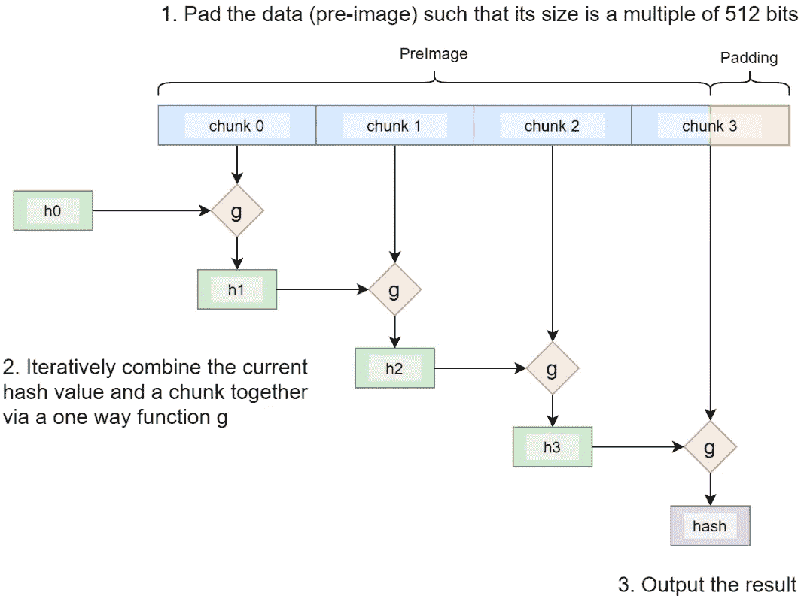
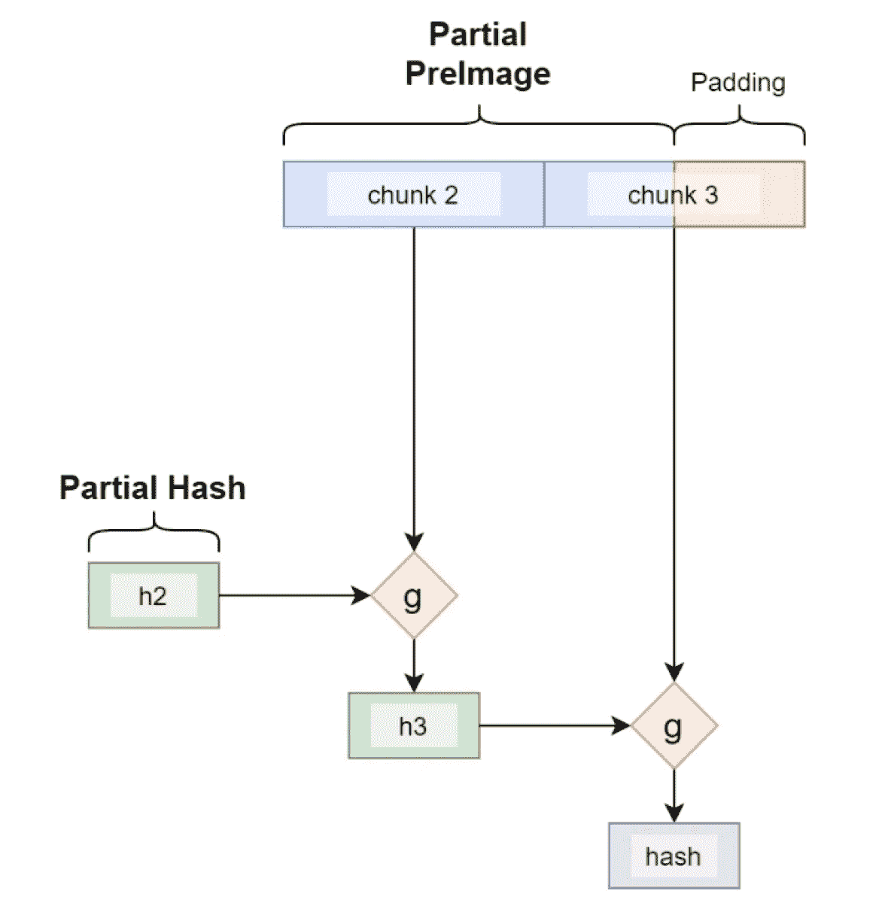

# 部分原像技术

> 原文：<https://medium.com/coinmonks/the-partial-preimage-technique-b60498c47ba?source=collection_archive---------7----------------------->

## 如何善用长度扩展攻击

一般来说，要计算输入的散列(称为原像)，需要它的整体。我们展示了一种新颖的技术，只使用部分原像来计算散列，适用于各种散列算法。

# SHA256 的工作原理

让我们以 SHA256 为例。在内部，它的工作方式如下:

1.  原像被分成 512 位的块。必要时会添加填充。
2.  每个块被迭代地馈入函数 **g** ，连同内部状态(当前散列 h0-h3)，其输出被用作下一次迭代的输入。
3.  最后一个状态是最终的哈希。

[Merkle–Damgård construction](https://en.wikipedia.org/wiki/Merkle%E2%80%93Damg%C3%A5rd_construction)

这个过程叫做**[Merkle–damg rd 施工](https://en.wikipedia.org/wiki/Merkle%E2%80%93Damg%C3%A5rd_construction)。 **g** 是一个压缩函数，接受两个固定长度的输入并产生一个固定长度的输出。**

# **部分原像技术**

**由于构造的迭代性质，如果我们从任何中间迭代开始，我们可以获得相同的散列，只要我们有当前的内部状态/散列和剩余的原像。**

****

**Compute Hash from Intermediate State**

## **长度扩展攻击**

**SHA256 的迭代和有状态特性使其容易受到所谓的[长度扩展攻击](https://en.wikipedia.org/wiki/Length_extension_attack)。攻击者可以使用**sha 256**(*message 1*)和 *message1* 的长度来计算被攻击者控制的 *message2* 的**sha 256**(*message 1*‖*message 2*)，而不需要知道 *message1* 的内容。**

**我们将攻击面转向它的头部，并利用它来为我们服务。**

## **示例用法:获取没有完整 Tx 的父 Tx 的 nLocktime**

**我们使用一个玩具示例来演示如何利用上述技术。契约要求解锁它的消费交易必须给[锁定时间](https://learnmeabitcoin.com/technical/locktime)增加一个指定的延迟。这通常需要注入完整的父事务并解析它以获得锁时间。多亏了这项技术，我们可以通过只包含最后一块来实现它。**

**[Contract *IncrementLocktime*](https://github.com/sCrypt-Inc/boilerplate/blob/master/contracts/incrementLocktime.scrypt)**

**函数***partialSha256()***实现 SHA256，并根据事务的尾部和所有前面部分的当前哈希计算事务的 sha 256 哈希( *h0-h7* )。第 53–158 行对应于将函数 **g** 应用于一个块。**

## **讨论**

**将部分前映像技术应用于上述契约可能没有意义，因为实现 SHA256 的开销超过了仅注入部分事务的节省。但是，当事务较大时，好处可能会超过开销，随着脚本和事务大小的不断增长，这种情况越来越常见。**

**除了 SHA256 之外，这种技术还适用于散列算法 MD5、RIPEMD-160、SHA-1 和其他也基于 Merkle–damg rd 结构的 SHA-2。鉴于这些哈希算法在比特币中的流行，这种技术可以得到广泛应用。**

# **承认**

**这个想法源于史蒂夫·沙德斯。白皮书和部分原像的代码归 Ying Chan 所有，他以前在 nChain 工作，现在在 Cambridge Cryptographic 工作。**

**[1]是串联。**

**[2]假设 4 字节 nlocktime 在最后一个块中，而不是跨最后两个块分割。**

> **加入 Coinmonks [电报频道](https://t.me/coincodecap)和 [Youtube 频道](https://www.youtube.com/c/coinmonks/videos)了解加密交易和投资**

# **另外，阅读**

*   **[最佳网上赌场](https://coincodecap.com/best-online-casinos) | [期货交易机器人](/coinmonks/futures-trading-bots-5a282ccee3f5)**
*   **[分散交易所](https://coincodecap.com/what-are-decentralized-exchanges) | [比特 FIP](https://coincodecap.com/bitbns-fip) | [宾邦评论](https://coincodecap.com/bingbon-review)**
*   **[用信用卡购买密码的 10 个最佳地点](https://coincodecap.com/buy-crypto-with-credit-card)**
*   **[加拿大最佳加密交易机器人](https://coincodecap.com/5-best-crypto-trading-bots-in-canada) | [Bybit vs 币安](https://coincodecap.com/bybit-binance-moonxbt)**
*   **[阿联酋五大最佳加密交易所](https://coincodecap.com/best-crypto-exchanges-in-uae) | [SimpleSwap 评论](https://coincodecap.com/simpleswap-review)**
*   **购买 Dogecoin 的 7 种最佳方式**
*   **[最佳期货交易信号](https://coincodecap.com/futures-trading-signals) | [期交所评论](https://coincodecap.com/liquid-exchange-review)**
*   **[用于 Huobi 的加密交易信号](https://coincodecap.com/huobi-crypto-trading-signals) | [Swapzone 审查](/coinmonks/swapzone-review-crypto-exchange-data-aggregator-e0ad78e55ed7)**
*   **最佳[密码交易机器人](https://coincodecap.com/best-crypto-trading-bots) | [购买索拉纳](https://coincodecap.com/buy-solana) | [矩阵导出评论](https://coincodecap.com/matrixport-review)**
*   **[Coldcard 评论](https://coincodecap.com/coldcard-review) | [BOXtradEX 评论](https://coincodecap.com/boxtradex-review)|[uni swap 指南](https://coincodecap.com/uniswap)**