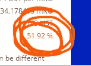
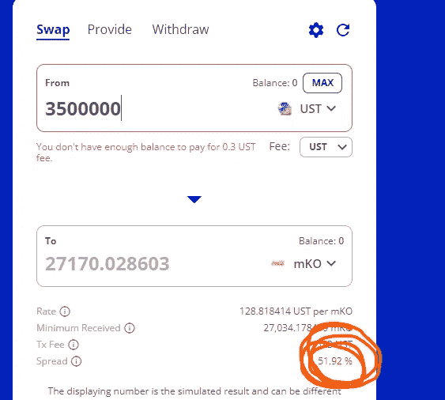

# “完美”交易

> 原文：<https://medium.com/coinmonks/the-perfect-trade-e81d7f6a68c4?source=collection_archive---------43----------------------->

本周有一个惊人的交易完美的设置，我杀了它。

不，事实上，我完全搞砸了，甚至还赔了钱。让我们回顾一下发生的事情。

Not that 51.92% is really expected, but half that?

# 设置

大约一年前，我写了一篇关于镜像协议的概述。如果你还没有使用镜像协议，请快速浏览一下这篇文章，然后在这里见我…

Mirror 的管理层决定提高 mSPY 和 mKO 两家公司的最低抵押比率(MCR)。之前是 110%，现在提高到 130%。对于协议来说，这是一个更安全的水平，但会导致抵押比率在该范围内的任何用户的清算。由于清算将在变更后的盘前开市时进行，在一个已知的时间内，mKO 和 mSPY 交易价格将在一个非常短的时间内出现大幅上涨。

[Joseph Savage ⚑ @MasterGerund](https://twitter.com/MasterGerund/status/1514314107867971588)

> 在 [@mirror_protocol](https://twitter.com/mirror_protocol) 上有价值约 350 万美元的 mKO 头寸将在明天 MCR 增加时被清算，而在 [@terraswap_io](https://twitter.com/terraswap_io) 流动性池中只有 650 万美元的 mKO。大概没什么… [#Terra](https://twitter.com/hashtag/Terra?src=hashtag_click) [#IYKYK](https://twitter.com/hashtag/IYKYK?src=hashtag_click)

# 死刑

尽管我知道 mKO 比 mSPY 有更多的未决清算，我还是在 mKO 和 mSPY 之间平分了我的头寸。多样化，对吗？

我看到了美元的迹象，巨大的发薪日，潜在的 25%的移动…所以我把我所有的 mKO 和 mSPY 锁进金库，借了其他的 mass 来对抗它，在市场上卖了它们，并且尽我所能的放大。

我对交易非常有信心，以至于我拿走了我投资组合的 60%,这样我就可以很容易地变现，然后转移到这个交易中，然后用杠杆把它抬高了 70%,所以我的总交易规模加起来是……我总投资组合的 60% * 1.7 = 102%。高度自信，体型大。

# 余波

纽约凌晨 4 点开盘，西海岸凌晨 1 点我还在办公桌前，刚煮好的咖啡，睡了 3 个小时。

开市前，清算开始进行，mSPY 和 mKO 都上涨了 25%，正如预期的那样。但我只有 4000 美元的 mSPY liquid，不得不一次一个地清空所有的金库，才能完全释放剩余的资金。前几笔交易有 20%的溢价，开局不错 terra 上的交易耗时 20-30 秒(正常情况下为 3-5 秒)，没什么帮助…

我完成了大约 1/3 的跳马，平均出场价比入场价高 10-15 %,这是一个很好的开始。但到了那个时候，所有的平仓都已经在市场上发挥了作用，所有进行非杠杆交易的人都拿走了他们的利润，开始做空，因为他们预计 mSPY 和 mKO 的价格会回到对甲骨文的一个小折扣。

我通过了我一半的金库，mSPY 和 mKO 的溢价完全消失了。我现在在 mSPY 和 mKO 定价上收支平衡，但我仍然为我的借款支付平仓费，以及滑点来弥补我用来杠杆的空头头寸。

当我平仓的时候，我已经下跌了 5%。由于我的杠杆高达投资组合的 102%，这意味着在一次“完美”的交易后，我本周下跌了 5%。

# 摘要

我打破了我所有的规则，我把一个“完美的”25%的设置变成了 5%的损失。

如果我遵循我的正常风险框架，我会有大约 20%的投资组合在交易中，赚了大约 25%,带着我的总资本基础增加了 5%!

如果我投入 60%的投资组合，但没有杠杆，这一周仍然有 15%的丰厚收益。

# 课程

*   第一课:坚持你的风险框架
*   第二课:不要让它过于复杂
*   第三课:不要贪婪，它会把“聪明”变成愚蠢
*   第四课:杠杆会改变交易的风险参数——确保你完全理解影响，否则不要使用杠杆
*   第五课:当一笔交易仍然很拥挤时，你必须准确地把握时机，否则你仍然可以成交
*   第六课:“完美”的交易总是很拥挤。你不是房间里唯一聪明的人。
*   第七课:小目标，小小姐。既然你不能完美的计时，确保你的尺寸是可以控制的，这样你至少可以接近它

顺便说一句，我一直在重新学习第四课…这应该能教会我一些东西。也许我从这件事中学到了错误的教训。你怎么想呢?

***不是财务或税务方面的建议。*** *本简讯具有严格的教育意义，并非投资建议或购买或出售任何资产或做出任何财务决策的建议。这份简讯不是税务建议。和你的会计师谈谈。自己做研究。*

***披露。*** *我可能会不时地在本简讯中添加我使用的产品的链接。如果你通过这些链接之一购买，我可能会收到佣金。此外，野蛮角落作家持有加密资产，并在某些市场积极交易。*

> 加入 Coinmonks [电报频道](https://t.me/coincodecap)和 [Youtube 频道](https://www.youtube.com/c/coinmonks/videos)了解加密交易和投资

# 另外，阅读

*   [在美国如何使用 BitMEX？](https://coincodecap.com/use-bitmex-in-usa) | [BitMEX 评论](https://coincodecap.com/bitmex-review)
*   [最佳期货交易信号](https://coincodecap.com/futures-trading-signals) | [流动性交易回顾](https://coincodecap.com/liquid-exchange-review)
*   [南非的加密交易所](https://coincodecap.com/crypto-exchanges-in-south-africa) | [BitMEX 加密信号](https://coincodecap.com/bitmex-crypto-signals)
*   [MoonXBT 副本交易](https://coincodecap.com/moonxbt-copy-trading) | [阿联酋的加密钱包](https://coincodecap.com/crypto-wallets-in-uae)
*   [雷米塔诺评论](https://coincodecap.com/remitano-review)|[1 英寸协议指南](https://coincodecap.com/1inch) | [购买弗洛基](https://coincodecap.com/buy-floki-inu-token)