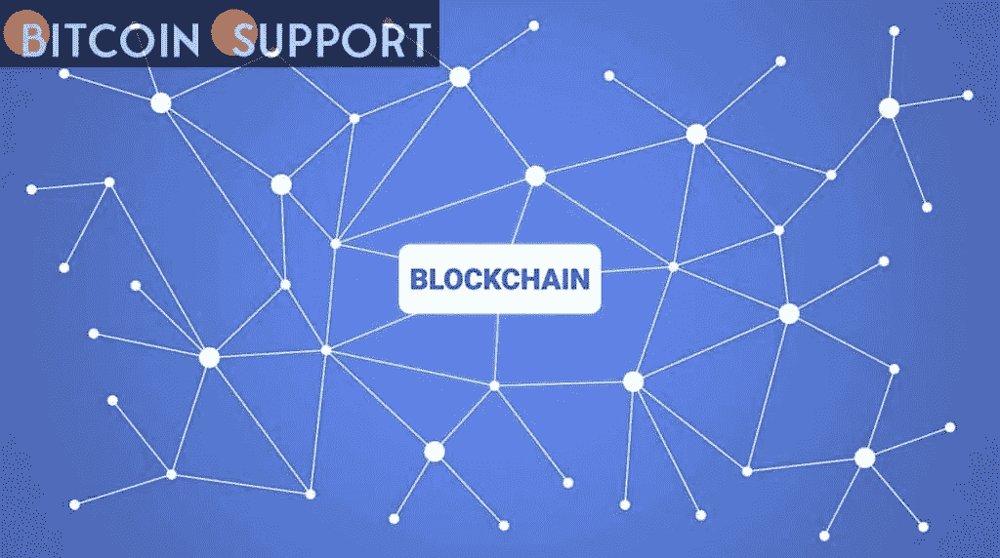

# 菲律宾宣布大力发展区块链技能

> 原文：<https://medium.com/coinmonks/the-philippines-announces-a-massive-effort-to-develop-blockchain-skills-1d1a0186af0d?source=collection_archive---------84----------------------->

**Visit our website:-** [**https://bitcoinsupports.com/**](https://bitcoinsupports.com/)

- Dr. Enrico Paringit stated that he intends to promote blockchain education in universities.

— Education can benefit from blockchain technology, and the skillset could assist in certifying a student’s credentials.

— The country was ranked third in Southeast Asia for digital asset adoption.

The Philippines has ambitious plans for the future, and a large portion of them revolve around blockchain technology. University-based innovation centres will be established to improve students’ and workers’ knowledge and abilities, as well as those of the government.

Dr. Enrico Paringit, executive director of the Department of Science and Technology — Philippine Council for Industry, Energy, and Emerging Technology Research and Development (DOST-PCIEERD), stated that he will support university-level blockchain education.

“We want to expand our workforce’s knowledge and abilities in order to advance the adoption of blockchain technology by teaching these skills to our students in universities. We need to embrace and adopt blockchain technology in the public sector as well,” Paringit remarked at Digital Pilipinas’ recent Nascent Technology Summit (DP).

The DOST-PCIEERD and the DP have inked an agreement to develop university-based innovation centres throughout the country.

The arrangement comes less than a month after a tripartite cooperation to develop the Think and Tinker Laboratory — Technology Business Incubation (TBI) programme was announced. Mapa University’s technology and engineering school, DOST-PCIEERD, and Digital Pilipinas are the three partners.

The TBI programme is a pilot project for the university-based innovation centre, with the goal of fostering collaboration between education, industry, and government in the areas of blockchain, cryptocurrency, APIs, open finance, and educational technology, among other emerging technologies.

The agreement was signed by DOST Secretary Fortunato de la Pea, Dr. Paringit, and DP convenor Amor Maclang. And it was witnessed by Sopnendu Mohanty, Chief Fintech Officer of the Monetary Authority of Singapore (MAS).

Maclang emphasised that blockchain may be applied to education in a variety of ways, and the competence might assist in certifying a student’s credentials.

“A crucial application of blockchain technology in education is record keeping. Blockchain technology can automate much of this process and streamline verification procedures, saving both the school and instructors considerable time,” Maclang explained.

**Visit our website:-** [**https://bitcoinsupports.com/**](https://bitcoinsupports.com/)

**Significant shift in the way education is seen**

This year, DP has placed a premium on education. The Digital Pilipinas Academy has teamed with Affinidi, a Singapore-based certification authority, to offer micro-certification courses on AFIN’s APIX Oxygen platform.

“We want to emphasise microeducation and microeducation this year. The country’s educational system has undergone dramatic changes. We no longer see our children pursuing traditional four- or eight-year college degrees, but rather focus on easy-to-acquire technical skills that provide rapid certification,” Maclang remarked.

She stated that her organisation will partner with educational institutions and significant businesses to create an internship programme that would allow students and career changers to work with many corporations in less than a year. This will equip them with the necessary abilities while also ensuring that they are Web 3.0 certified upon graduation.

“While many people may not wish to enrol in long-term seminars, they can learn on-demand from market leaders. The hurdles to learning are less daunting in this decentralised environment.”

Todd Schweitzer, CEO of open banking technology solutions vendor Brankas, highlighted that the Philippines is an enticing target for Web 3.0 due to the presence of numerous digital banks offering investment opportunities.

He stated that 70% of the adult population is still unbanked and that even those who do have a bank account are still underserved.

“They receive their wage and withdraw the funds. With the advent of play-to-earn games like as Axie infinite, we are seeing an increasing number of Filipinos, particularly the younger generation, gain wealth through the usage of cryptocurrencies and APIs that enable the establishment of these economies based on blockchain technology. “Web 3.0 contributes significantly to asset decentralisation and democratisation,” he stated during the panel discussion.

According to blockchain data platform Chainalysis, the country placed third in Southeast Asia in terms of digital asset adoption last year.

**Visit our website:-** [**https://bitcoinsupports.com/**](https://bitcoinsupports.com/)

**Disclaimer: These are the writer’s opinions and should not be considered investment advice. Readers should do their own research.**