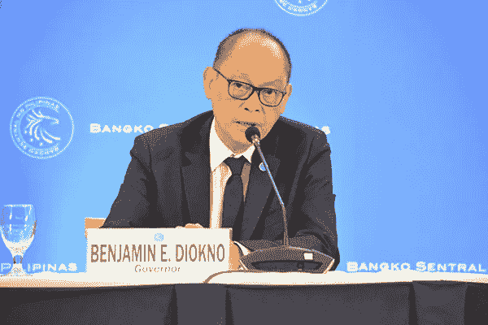

# 菲律宾将开始实施 CBDC 试点方案

> 原文：<https://medium.com/coinmonks/the-philippines-will-begin-a-pilot-programme-for-cbdc-implementation-ae14bc4f693c?source=collection_archive---------19----------------------->

**Visit our website:-** [**https://bitcoinsupports.com/**](https://bitcoinsupports.com/)

据 BSP 州长 Benjamin E. Diokno 称，该项目的目标是提高“支付系统的安全性、可靠性和效率”

随着金融世界的不断发展，新的货币种类正对历史悠久的货币基础设施构成威胁。目前，包括菲律宾在内的许多国家都对央行数字货币感兴趣。

菲律宾央行行长 Benjamin E. Diokno 在由菲律宾中央银行(BSP)和金融普惠联盟协调的联合仪式上，宣布启动菲律宾 CBDC 试点项目 CBDCPh。据迪奥克诺称，该项目旨在提高“支付系统的安全性、可靠性和效率”

**“该项目旨在加强组织能力和与消除国家支付系统中的摩擦相关的核心 CBDC 概念的实践知识。”此外，迪奥克诺强调了 CBDCs 的可能影响。据百慕大总督称，CBDC 将能够协助政府管理的现金援助方案。他强调了疫情在证明基于账户的财政援助分配的效用方面的效用。迪奥克诺认为，这可以用来“立即帮助社会上最弱势的群体。”**

**Visit our website:-** [**https://bitcoinsupports.com/**](https://bitcoinsupports.com/)

州长本杰明·e·迪奥克诺
虽然有许多潜在的好处，州长也提到了潜在的障碍，如缺乏技术基础设施。“货币当局和监管机构将需要具备必要的技能和技术能力，以有效地实施和管理与 CBDC 发行相关的风险，”迪奥克诺说。在美国，美联储董事会成员莱尔·布雷纳德敦促美国领导有关 CBDCs 的研究和政策。布雷纳德指出，以中国的发展为例，美元的跨境支付优势可能会被 CBDC 在其他国家的发展所削弱。

**访问我们的网站:-**[**https://bitcoinsupports.com/**](https://bitcoinsupports.com/)

**免责声明:以上为作者观点，不应视为投资建议。读者应该自己做研究。**