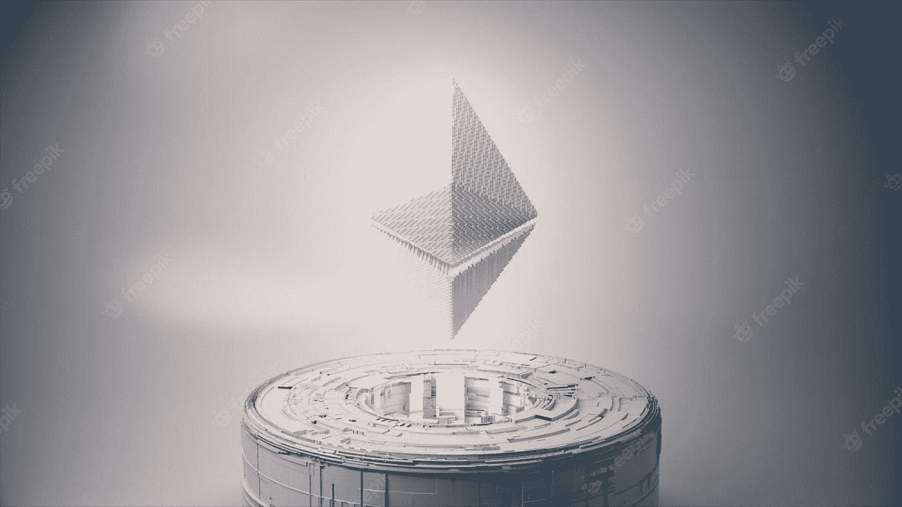
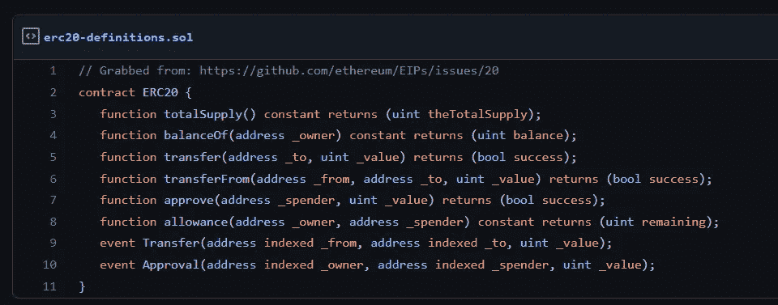
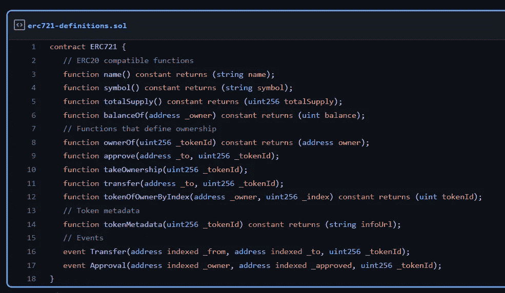
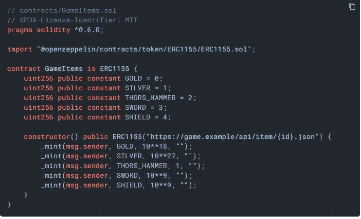

# 流行的 ERC 标准

> 原文：<https://medium.com/coinmonks/the-popular-erc-standards-4e5370584ec0?source=collection_archive---------14----------------------->

**以太坊**是一个开源项目，所以自然地，社区的人们以 **EIP(以太坊改进提案)**的形式提交他们的提案，以便对以太坊协议进行可能的改进。如果这些改进与令牌标准有关，如 **ERC(以太坊请求评论)**等。，它属于应用范围。

还可以建议 EIPS 对以太坊虚拟机(EVM)[ **核心** ]、以太坊节点通信[ **联网** ]、API/RPC[ **接口**进行改进

在这篇文章中，让我们来谈谈一些流行的 ERC 标准，我们都必须知道。

# ERC-20

这是一个可替换的令牌标准。我们能够使用内部函数铸造和燃烧代币。人们可以在两个账户之间转移代币，就像从一个银行账户向另一个账户汇款一样。如果我们正在交互的智能合约需要将一些令牌从我们的帐户转移到智能合约，我们需要提供特殊批准。这可以设置为一个值，也可以是无限批准。而在外部拥有的账户之间转移代币很容易(EOA)。如果我们向智能合约发送令牌，这并不实现 ERC20 标准—我们的令牌会被锁定并永远丢失。该标准无法处理传入的令牌事务。一个简单的例子是，我创建了一个名为' **SHITCOIN** '的令牌，并将其转移到 Vitalik.eth 或任何随机地址，目前在 ERC20 中，EOA 地址无法拒绝此交易。

ERC-20

# ERC-223

为了克服 ERC-20 中缺乏通过`transfer`处理输入交易的功能，引入了 ERC-223。开发人员可以定义一个自定义逻辑来接受或拒绝通过`tokenReceived`函数发送的令牌。如果接收方合同未实施`tokenReceived`，交易将自动恢复。这一更改是在报告了多个用户向非基于 ERC20 的合同发送令牌并永久丢失其令牌的情况后提出的。

此外，我们不再需要`(approve + transferFrom)` path ERC20 标准来将令牌转移到合同。这是一个多步骤的过程，需要更多的气体。用户可以调用`transferToContract()`，它在单个事务中完成这项工作。

# ERC-721

这个标准是由我们通常所说的 NFTs 实现的。它是一个不可替代的令牌标准，这意味着每个项目都是唯一的，不能相互交换。每个项目的索引都映射到所有者的地址。该标准还规定了一个元数据文件，该文件是一个 JSON 文件，包含有关 NFT 属性和 PFPs 图像的信息，因为在区块链上存储数据的成本很高。NFT 元数据可以存储在中央服务器或 IPFS 上。

另外，`onERC721Received`检查令牌或项目是否正被发送给与 ERC-721 兼容的合同。如果`safeTransferFrom`收到一个功能选择器作为响应，那么它将继续传输。

ERC-721

# ERC-777

这是 ERC-20 的改进标准。它具有我们所说的委托转让，无需为智能合约的令牌转让提供批准。您可以随时恢复此委托。这是通过 ***操作员*** 完成的。此外，它使用定制逻辑实现了发送/接收调用的钩子。与 ERC-223 不同，接收挂钩也可以在 EOA 地址上实现。

# ERC-1155

在这个标准中，单个接口可以包含可替换和不可替换的令牌类型。ERC-1155 的一个很好的用例可能是元宇宙项目，它由可替换的游戏内货币和不可替换的游戏内物品组成。

此外，在 ERC-721 的情况下，如果我们想要将大量的项目转移到多个地址，它们必须在不同的块中独立执行，耗费非常高的汽油。ERC-1155 引入了**‘批量转移’**来解决这个问题。查询余额和审批也可以通过批处理来完成。

ERC-1155 Example

感谢阅读！

> 加入 Coinmonks [电报频道](https://t.me/coincodecap)和 [Youtube 频道](https://www.youtube.com/c/coinmonks/videos)获取每日[加密新闻](http://coincodecap.com/)

# 另外，阅读

*   最好的比特币[硬件钱包](/coinmonks/hardware-wallets-dfa1211730c6) | [BitBox02 回顾](/coinmonks/bitbox02-review-your-swiss-bitcoin-hardware-wallet-c36c88fff29)
*   [block fi vs Celsius](/coinmonks/blockfi-vs-celsius-vs-hodlnaut-8a1cc8c26630)|[Hodlnaut 点评](/coinmonks/hodlnaut-review-best-way-to-hodl-is-to-earn-interest-on-your-bitcoin-6658a8c19edf) | [KuCoin 点评](https://coincodecap.com/kucoin-review)
*   [Bitsgap 评审](/coinmonks/bitsgap-review-a-crypto-trading-bot-that-makes-easy-money-a5d88a336df2) | [Quadency 评审](/coinmonks/quadency-review-a-crypto-trading-automation-platform-3068eaa374e1) | [Bitbns 评审](/coinmonks/bitbns-review-38256a07e161)
*   [加密复制交易平台](/coinmonks/top-10-crypto-copy-trading-platforms-for-beginners-d0c37c7d698c) | [Coinmama 审核](/coinmonks/coinmama-review-ace5641bde6e)
*   [印度的加密交易所](/coinmonks/bitcoin-exchange-in-india-7f1fe79715c9) | [比特币储蓄账户](/coinmonks/bitcoin-savings-account-e65b13f92451)
*   [OKEx vs KuCoin](https://coincodecap.com/okex-kucoin) | [摄氏替代品](https://coincodecap.com/celsius-alternatives) | [如何购买 VeChain](https://coincodecap.com/buy-vechain)