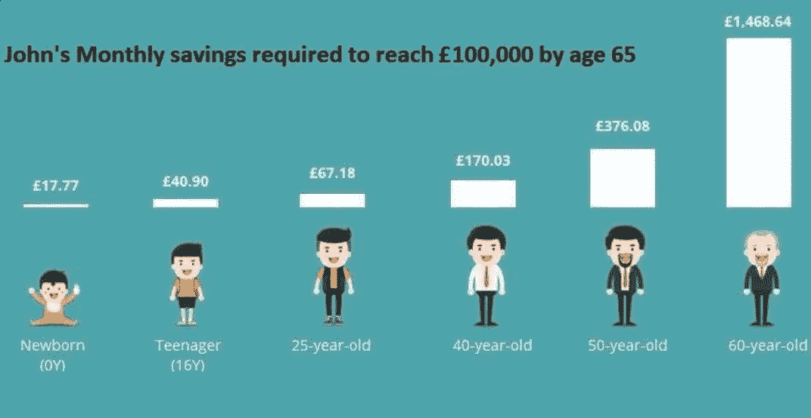
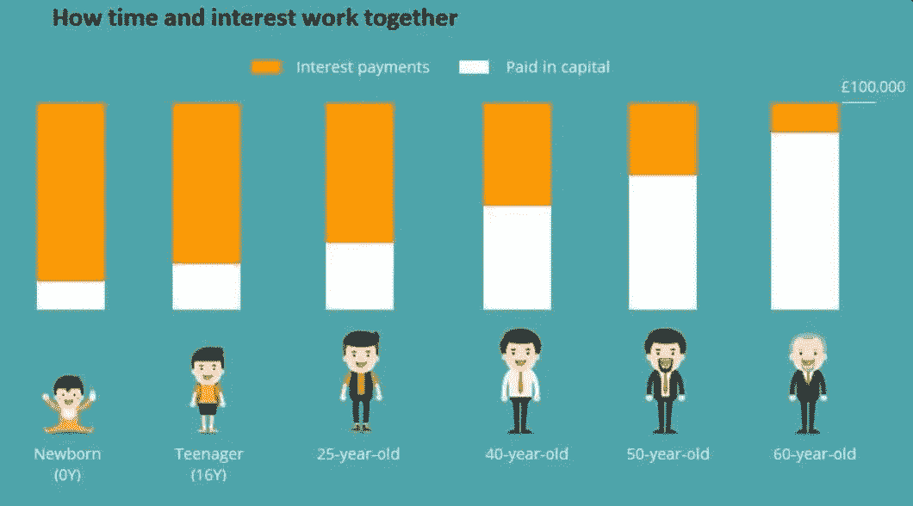
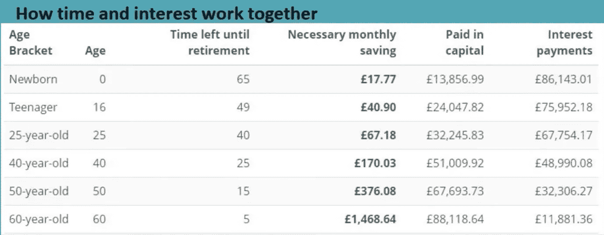

# 复利的力量

> 原文：<https://medium.com/coinmonks/the-power-of-compound-interest-437d0d04e1d5?source=collection_archive---------28----------------------->

阿尔伯特·爱因斯坦曾将复利描述为“世界第八大奇迹”，他说:“理解复利的人赚取复利，不理解复利的人支付复利。”

复利是指一个人从本金余额中赚取的利息被再投资并产生额外的利息。

沃伦·巴菲特称之为成功投资的最重要因素。更好的是，每个投资者都可以从“人类最伟大的发明”中获利，而不仅仅是天才或亿万富翁。

复利效应指的是当你把你的利息再投资时，代表你增长的钱的雪球。

你今天在市场上投入的利息(或股息)将在明天为你产生更多的利息。那是因为你的兴趣也赚利息。你把兴趣堆积的时间越长，你的雪球就越大。让我们看一个实际例子来说明复利效应。

如果你以 5%的回报率投资 10，000 美元，那么十年后你将获得 16，288.95 美元，而不仅仅是 15，000 美元。

复利效应创造了额外的 1，288.95 美元，如果你只是每年花掉利息，你就不会赚到这笔钱。随着时间的推移，这种效应会变得更加强大。

想象一个投资者，我们叫他约翰，他想在 65 岁退休时存下 10 万英镑的退休金。

图表显示了约翰需要存多少才能达到他的目标，这取决于他开始存钱的时间。我们假设年增长率为 5%，以过去 40 年的标准来看，这是相当保守的。

关键的一点是，复利发挥其魔力的时间越长，约翰自己需要支付的就越少。

如果约翰在 60 岁之前什么都不做，那么他需要找到一个高达 1468.64 英镑的月收入来实现他的目标。复利几乎没有时间来帮助他的事业。

但是如果一些聪明的亲戚或父母从约翰出生的那天开始为他存钱，那么每个月只需要找到 17.77 英镑。一旦约翰开始赚钱，这是他自救的一小笔钱。

即使约翰等到 25 岁，他也只需要每月存下 67.18 英镑，到 65 岁就能达到 10 万英镑。

每个开始日期之间所需储蓄的差异是 100，000 英镑中有多少由您的累计利息支付来处理。

如果给予复利足够的时间来产生自己的动力，即使是很小的贡献也可以滚雪球。

让你的钱发挥作用，如果你开始得足够早，那么复利最终会超过你支付的金额。

在发展普通人的财务福祉方面，小步骤可以产生很大的影响。这包括与基本财务实践相关的行动，如预算、银行和借款。

考虑长远:成功的投资是几十年的风险投资。重要的不是选择市场时机，而是市场中的时间。遵循平均成本策略，在固定的时间间隔投资固定的金额。

如果我们分析长期的影响，少量的钱可以产生不同的效果。无论你是投资、削减开支、支付人寿保险还是增加贷款还款，影响都是巨大的。因此，小步骤和一致性对资金管理的影响是非常大的。

回到约翰的例子，你可以看到他的 100，000 目标中有多少来自复利(橙色条)和储蓄(白色条)。

如果那些好心的亲戚让约翰在新生儿出生时就能坚持下去，他一生只需要存 13，856.99 英镑就能达到 10 万英镑。

在这种情况下，John 支付的利息是他实际存款的 6.2 倍！复利完成了大部分的工作，约翰不费吹灰之力就赚到了 86，143.01 英镑。

25 岁的约翰也处于一个舒适的位置。他的 10 万英镑中约有三分之二来自利息支付。他只要亲自找 32245.83。

从长远来看，早开始对你有好处。你越早开始储蓄，复利就越能帮你摆脱困境。

在投资者的长期计划中，这是最有价值但被低估的因素之一，因为它的影响最初相对不易察觉。

复利在金融上相当于中国的一句古话:移山的人从搬走小石头开始。

你的投资回报越大，复利效应就变得越强，这就是为什么把你在股票市场获得的利润再投资是最好的杠杆。

即使每月的小额供款也足以存下 10 万英镑甚至更多。当你使用 ETF 储蓄计划时，每月储蓄变得很容易。它们使你能够将固定金额投资于一篮子多样化的股票，如摩根士丹利资本国际世界交易所交易基金。

如果你想自己计算，有很多应用程序或网站会自动为你计算。我们在这里为你留下了其中的一个。