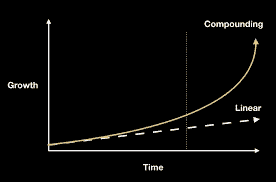

# 复利的力量！

> 原文：<https://medium.com/coinmonks/the-power-of-compounding-6c30e6ed89f0?source=collection_archive---------21----------------------->

很多时候，当个人开始他们的秘密交易经历时，他们会感到沮丧。你们很多人大概都经历过以下情绪:我拿 20 块钱，存到这个账户里。*过一会儿再回来*，啊哈，伙计…我只赚了 0.20，这样下去我永远也赶不上了。

在这一点上，许多人倾向于放弃或尝试一些不同的东西。然而，那些把它视为**复利**力量的人将会有一个非常不同的经历，看待事物的角度也会有所不同。

**使用 **Pionex** 和他们的交易机器人时，每个人都从某个地方开始** 机器人会为你做交易。他们关注较小的价格波动，并希望利用这些小的价格波动来根据你选择的投资获利。对于许多想交易的人来说，这是一个很好的起点。人们喜欢选择开始交易的另一个地方是购买一枚硬币，然后持有它，直到他们可以卖掉它获利。无论你选择哪种方式，我都想向你展示复利的力量。

**1%就是 1%**

当我刚开始的时候，我意识到我应该存一些钱。一点也不多，我变得非常沮丧，因为我没有做很多，使用这些机器人没有像我希望的那样工作。我对整个形势的看法完全错了。

让我们算一些数字，当我开始时，我会在一个机器人上押 100 美元左右，然后让它运行，我可能会赚回 1.00 美元。我怎么能用 1 美元在机器人身上做任何事。但是，我忘了复利。当看投资时，我看的是*只有 100，*和*只有 1.00* ，但是当你把那 1%复合起来，它可能**非常强大**！

我附上了上面的图片，因为它显示了复合的力量，以及它如何真正开始增加。在图中，我用了 3 个不同的例子，分别是 1%，2%和 3%。如你所知，初始余额为 100，在 10 次交易中，每次复利为 1%，你可以将投资增加到 110。如果你用 3%做同样的事情，你可以把你的投资增加到 134。所以复利的力量是开始你的交易经历和冒险的好方法。

**为什么这很重要？**

复利的力量应该对你很重要，因为有了这种心态，你可以继续对自己的进步充满信心。如果你有 2.00 英镑，你赚了 0.02 英镑，你就赚了 1%。如果你有 10，000 英镑，你赚了 1%，你就有 100 英镑。不管怎样，你仍然赚了 1%,你应该对你的利润感觉很好。如果您对 Pionex 感兴趣，或者刚刚开始您自己的加密之旅，请随时查看下面的链接！我还加入了我的 YouTube 频道，以获取更多的教育加密信息，并帮助支持这些内容。

**链接**

**YouTube** : [点击这里！](https://www.youtube.com/c/gridbotguru)

**Pionex for US** 市民:[点击这里！](https://pionex.us/en-US/sign/ref/RnIZeirs)

**Pionex 面向全球**公民:[点击此处！](https://www.pionex.com/en-US/sign/ref/zVt0KmHU)

报名参加**比特币基地** : [点击这里！](https://www.coinbase.com/join/wyatt_h)

> 加入 Coinmonks [电报频道](https://t.me/coincodecap)和 [Youtube 频道](https://www.youtube.com/c/coinmonks/videos)了解加密交易和投资

# 另外，阅读

*   [BigONE 交易所评论](/coinmonks/bigone-exchange-review-64705d85a1d4) | [电网交易 Bot](https://coincodecap.com/grid-trading)
*   [氹欞侊贸易评论](https://coincodecap.com/anny-trade-review) | [CoinSpot 评论](https://coincodecap.com/coinspot-review)
*   [新加坡十大最佳加密交易所](https://coincodecap.com/crypto-exchange-in-singapore) | [购买 AXS](https://coincodecap.com/buy-axs-token)
*   [投资印度的最佳加密软件](https://coincodecap.com/best-crypto-to-invest-in-india-in-2021) | [WazirX P2P](https://coincodecap.com/wazirx-p2p)
*   [西班牙 5 大最佳文案交易平台](https://coincodecap.com/copy-trading-spain)
*   [Pionex 双投](https://coincodecap.com/pionex-dual-investment) | [AdvCash 审核](https://coincodecap.com/advcash-review) | [秉持审核](https://coincodecap.com/uphold-review)