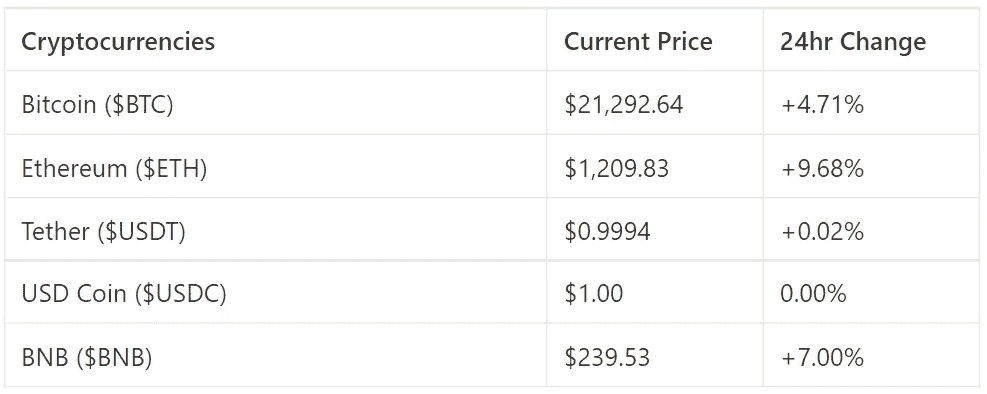
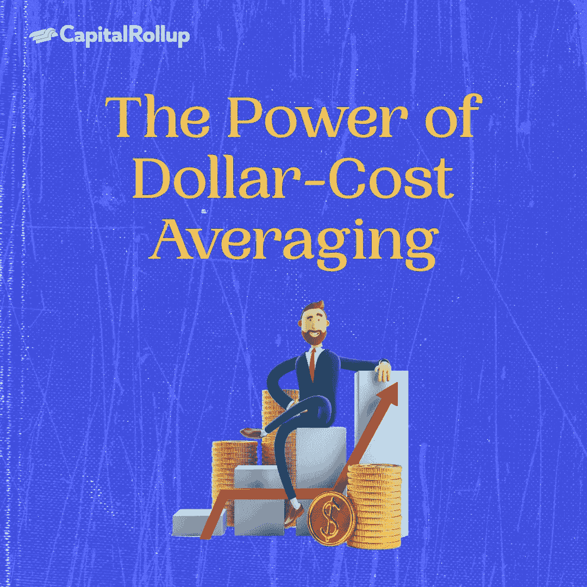

# 平均成本的力量

> 原文：<https://medium.com/coinmonks/the-power-of-dollar-cost-averaging-b97f7f910609?source=collection_archive---------18----------------------->

欢迎来到最新一期的 CapitalRollup Digest！今天的文摘是 6 月 24 日的，大约需要 5 分钟。我们马上开始。

*   今天的市场看起来怎么样？(前 5/10 大流行加密货币)

# 平均成本的力量

许多加密投资者从不谈论由于波动性，购买他们投资的硬币/代币有多困难。

或许加密投资者最常问的问题是“我应该买哪种硬币？”就是“我应该什么时候买？”。虽然这个问题听起来像一个新手会问的问题，但即使是经验丰富、长期购买 crypto 的最有经验的投资者也会问这个价值百万美元的问题。

现实是，每个人都想赚钱，加密投资是一个你可以很容易失去每一分钱，你已经取得了。没有人想在牛市的*顶部*买入，每个投资者都希望能够在熊市的*底部*买入。

然而，我们都同意，即使是最老练的交易者也不可能做到这两点。或许 99%的加密投资者永远也不能在你的投资下跌或崩盘前进出。

你可以定期投资一个固定的金额，而不是一直为你喜欢的密码寻找最佳的切入点。这就是所谓的平均成本。

# 什么是平均成本？

美元成本平均法是一种投资策略，它可以帮助你平均你的加密投资的进入价格，因此，你可以每周购买价值 100 美元的加密，而不考虑价格，而不是一次购买 1000 美元的加密，这样无论市场如何波动，你的进入价格都是平均的，也就是说，如果它高于或低于你的初始进入价格。这是一个久经考验的投资策略。在 DCA 下，投资者对总投资额进行分割，并分时段购买目标资产。不管资产价格如何，购买都会继续，直到投资金额用尽。这可以帮助你最小化波动的影响，消除判断正确进场点的需要。

# 成本平均法是如何工作的？

这里有一个简单的例子来理解 DCA 是如何工作的。让我们假设你已经决定投资 1000 美元在一个定价为 100 美元的代币上。按照这个价格，你将得到 10 个代币。现在，假设你决定在 10 周内投资 1000 美元，如果你每周投资 100 美元，市场下跌，价格在接下来的几周开始波动。价格从 100 美元涨到 85 美元、70 美元、80 美元、90 美元和 110 美元。你的钱最终会变得更有价值。

发生这种情况是因为当价格下降时，你能够得到更多的代币，而不是在你立即购买时得到 10 英镑。

# 为什么平均成本是好的？

如果你是一个初学者，不了解市场的技术方面，最好用美元成本平均法投资你选择的加密货币。如果你打算长期投资，那就更好了。

平均成本可以帮助你进入市场，而不用一直担心或担心市场状况。

如果你想开始实践你的美元成本平均策略，CapitalRollup 允许你以低至 10 美元的价格投资于加密指数基金。

因此，你可以定期投资少量资金，而不是一次性购买大量加密指数基金，随着时间的推移，这些资金会积累成更大的规模。

点击这里查看 [CapitalRollup](http://capitalrollup.com) ，点击这里查看加密索引指南。

# 琐事🤔

**是什么决定了比特币的价格？**

A.供求

B.想要和需要

C.政府

D.中央银行

在下一期的 CapitalRollup Digest 中找到答案。😉

# 每日一词！

💡**加密索引**

指通常包含 4-6 种其他加密货币或代币的投资或资产。与单独购买真实的加密货币相比，它们为加密投资提供了更安全、更有利可图的回报；例如，如果瑞士联邦理工学院股价下跌 25%，BTC 股价上涨 40%，你的投资仍然上涨 15%

**用在句子中的术语:**
*—查克，你知道吗，一个人可以直接用自己的银行账户购买* ***加密指数****capital roll up 上的基金。*

*   **社区更新📢**

我们与 3 位行业领袖组织了一次 Twitter 空间会议，我们在会上讨论了“如何建立长期加密组合(3-5 年)”，您可以在这里 收听

# **我们今天在读什么📰**

**美元成本平均法:随着时间的推移积累财富。 [***阅读更多***](https://www.gemini.com/cryptopedia/dollar-cost-average-crypto-invest)**为什么你应该关心你的加密的平均成本。** [***阅读更多***](https://blockworks.co/why-you-should-care-about-dollar-cost-averaging-your-crypto/)**

****和朋友一起学习和投资加密💰****

**当您邀请您的朋友开始使用 CapitalRollup 进行有利可图的投资时，您将获得独特的奖励。**

**💬对 CapitalRollup Digest 有什么反馈吗？ [**告诉我们！**](mailto:hi@capitalrollup.com)**

> ***加入 Coinmonks* [*电报频道*](https://t.me/coincodecap) *和* [*Youtube 频道*](https://www.youtube.com/c/coinmonks/videos) *了解加密交易和投资***

# **另外，阅读**

*   **[有哪些交易信号？](https://coincodecap.com/trading-signal) | [Bitstamp vs 比特币基地](https://coincodecap.com/bitstamp-coinbase) | [买索拉纳](https://coincodecap.com/buy-solana)**
*   **[密码交易机器人](/coinmonks/crypto-trading-bot-c2ffce8acb2a) | [维护审查](https://coincodecap.com/uphold-review)**
*   **[如何给 MetaMask 钱包添加 Arbitrum？](https://coincodecap.com/how-to-add-arbitrum-to-metamask-wallet)**
*   **[KuCoin vs 北海巨妖 vs BitYard](https://coincodecap.com/kucoin-vs-kraken-vs-bityard)**
*   **[最适合加密交易的 VPN](https://coincodecap.com/best-vpns-for-crypto-trading)**
*   **[ProfitFarmers 回顾](https://coincodecap.com/profitfarmers-review) | [如何使用 Cornix Trading Bot](https://coincodecap.com/cornix-trading-bot)**