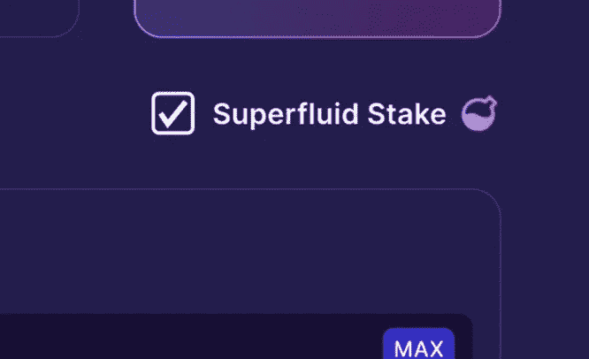

# IBC 和渗透区的力量

> 原文：<https://medium.com/coinmonks/the-power-of-ibc-and-osmosis-zone-21faa7655d4a?source=collection_archive---------6----------------------->

你听说过或使用过渗透区吗？好吧，以防万一，你是一只从 21 年 6 月 19 日开始冬眠的熊。本质上，渗透是一个 AMM DEX 实验室，使用宇宙 SDK 建造，这是每个主权区块链在没有任何许可的情况下相互通信和发送数据的标准代码，这被称为(IBC)区块链间通信。

How data is sent from 1 blockchain to the other.

这是革命性的许多原因之一是，与 IBC 以外的其他区块链相比，交易量微乎其微；此外，它不会对每个令牌的几个包装版本造成混淆，这种混淆既不好看也不会带来愉快的客户体验。渗透区允许宇宙生态系统内的无缝跨链交易。

例如:如果你想把你的原子送到渗透区，你点击渗透区内的存款，然后嘣的一声，几秒钟内原子就花在气体上了。目前，渗透区的最佳功能之一是没有天然气费来交换，入股或增加流动性池的流动性。
下图展示了 38 种不同的区块链，它们使 Cosmos SDK 能够实现完全的互操作性。

[Map of Zones](http://mapofzones.com)

关于渗透区和$OSMO 令牌的一些基本事实:

[**词汇学:**](/osmosis/osmo-token-distribution-ae27ea2bb4db)

每天大约在 UTC 时间 17:30，每日纪元发生，新的代币被释放(奖励)给那些下注或提供流动性的人。

在最初的代币模型下，创世纪
年铸造了 1 亿个代币，第一年将发行 3 亿个代币，然后“第三次”发生，这类似于比特币的减半，而渗透代币供应将被⅓每年(365 个时代)切断，直到**最大供应 10 亿个。**

**ALPHA:** 从某种意义上说，渗透区是一个实验室，因为它是同类中的第一个。渗透技术将推出 [**超流体桩**](/osmosis-community-updates/osmosis-superfluid-staking-faq-a7b49797cb72) 这将是革命性的。

超流体桩是自验证机削减以来最大的进步。它是靠渗透作用发展起来的。这是一种押注 OSMO 令牌的方法，OSMO 令牌是您 LP(流动性提供者)头寸的基础。

例如:当你在 ATOM/OSMO 这样的 OSMO 流动性池中提供流动性时，你提供了 50%的 ATOM 和 50%的 OSMO。当您绑定/锁定 LP 头寸时，您会因帮助促进池中交易而获得费用和流动性挖掘激励。在超流体打桩之前，那是它的结束。然而，现在您锁定的 OSMO 可以通过渗透作用进行跟踪，并用于帮助保护链条和赚取额外的赌注奖励。

在 Osmosis，没有风险资本家的资金，也没有支付任何费用或贷款来让$OSMO 令牌在一个集中的交易所上市——有机增长，这是所有加密中第一个在没有数百万美元启动资金的情况下达到这种高度的。目前，根据 Coingecko.com 的数据，OSMO 在所有加密领域排名第 46 位。此外，$JUNO(也是 IBC 区块链)也进入了前 70 名，没有在 CEX 上市。这是 IBC 和渗透区的力量。渗透并不试图成为 AMM 指数的第一名，因为那会发生——它正在推动与这个领域的大型集中化参与者竞争。随着所有的桥梁即将渗透和以外的所有生态系统:**“很快密码中的说法将是‘温渗透上市？’不是‘文’吗？**

The Power of TRUE Decentralization with no Centralized Exchange listings.

TVL as of 2–28–22

我向你保证，如果你第一次使用渗透区，你会像: ***我这一生都在做什么*** *？*的确，这是终极的客户体验，不久将会在界面中直接内置实时客户服务支持，为新用户提供更好的体验。

你还在等什么？从[https://app.osmosis.zone/](https://app.osmosis.zone/)开始

> 加入 Coinmonks [电报频道](https://t.me/coincodecap)和 [Youtube 频道](https://www.youtube.com/c/coinmonks/videos)了解加密交易和投资

## 另外，阅读

*   [3 商业评论](/coinmonks/3commas-review-an-excellent-crypto-trading-bot-2020-1313a58bec92) | [Pionex 评论](https://coincodecap.com/pionex-review-exchange-with-crypto-trading-bot) | [Coinrule 评论](/coinmonks/coinrule-review-2021-a-beginner-friendly-crypto-trading-bot-daf0504848ba)
*   [如何购买 Monero](https://coincodecap.com/buy-monero) | [IDEX 评论](https://coincodecap.com/idex-review) | [BitKan 交易机器人](https://coincodecap.com/bitkan-trading-bot)
*   [CoinDCX 评论](/coinmonks/coindcx-review-8444db3621a2) | [加密保证金交易交易所](https://coincodecap.com/crypto-margin-trading-exchanges)
*   [红狗赌场评论](https://coincodecap.com/red-dog-casino-review) | [Swyftx 评论](https://coincodecap.com/swyftx-review) | [造币厂评论](https://coincodecap.com/coingate-review)
*   [Bookmap 评论](https://coincodecap.com/bookmap-review-2021-best-trading-software) | [美国 5 大最佳加密交易所](https://coincodecap.com/crypto-exchange-usa)
*   [如何在 FTX 交易所交易期货](https://coincodecap.com/ftx-futures-trading) | [OKEx vs 币安](https://coincodecap.com/okex-vs-binance)
*   [CoinLoan 审查](https://coincodecap.com/coinloan-review) | [YouHodler 审查](/coinmonks/youhodler-4-easy-ways-to-make-money-98969b9689f2) | [BlockFi 审查](https://coincodecap.com/blockfi-review)
*   [XT.COM 评论](https://coincodecap.com/profittradingapp-for-binance)币安评论 |
*   [SmithBot 评论](https://coincodecap.com/smithbot-review) | [4 款最佳免费开源交易机器人](https://coincodecap.com/free-open-source-trading-bots)