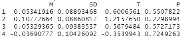

# TVL 对 L1 密码货币的预测力

> 原文：<https://medium.com/coinmonks/the-predictive-power-of-tvl-on-l1-cryptocurrencies-5b1fd042e097?source=collection_archive---------17----------------------->

**前言**

在此之前，我曾提及区块链的 TVL(总市值锁定)与其 MC(市值)T2(T3)之间的关系。虽然这两个变量之间的关系似乎很弱，但效果却相当微弱；换句话说，我不能真的把我的赌注下在 TVL/MC 指标上来赚钱。我能够做到，这将使芬顿成为现存最被低估的区块链。

[Soiman 等人(2022)](https://arxiv.org/abs/2204.00251) 撰写了关于 TVL 对 DeFi 令牌的预测力的论文——他们发现总体市场情绪对 DeFi 令牌价格的影响比协议的 TVL 效应大得多，而且他们无法真正找到 TVL/MC 指标预测力的证据。

我将把研究范围从 DeFi 代币稍微扩大到 L1 密码货币，看看 L1 连锁店的 TVL 增加是否会导致 L1 密码货币价格的积极变化。

**方法**

The Prediction Model

研究方法相当简单。我从雅虎金融搜集了 11 种 L1 密码货币的价格数据，并从 DeFiLlama 下载了 11 种 L1 连锁店的 TVL 数据。

我将利用两个时间序列数据的每周日志回报，并将 TVL 数据滞后 1 至 4 周，以观察 TVL 的变化是否对未来的价格变化给出任何预测性迹象。

简单地说，我将检查:

*   如果 L1·TVL 今天上涨 10%
*   1 到 4 周后，L1 的价格会上涨 x%吗？

我调查过的 L1 连锁店包括:ETH，LUNA，BNB，AVAX，FTM，SOL，TRX，MATIC，ONE，RUNE，CELO。

我选择了这 11 家 L1 连锁店，因为它们是唯一提供 1 年以上 DeFiLlama 数据的连锁店。

**数据**

**以太网**

Ethereum statistics

行表示滞后的周，列表示测试统计。对于 Ethereum，唯一具有统计学意义的关系(p < 0.01) comes from lag = 4, which means

“If Ethereum TVL increases by 10% today, ETH price is likely to increase by 10% * 0.3858473 after 4 weeks.”

For 1–3 weeks, the p-values are too high, though p-value of 0.167647548 for lag = 1 might worth take a look.

**Terra**

Terra statistics

对于 Terra 生态系统，结果在很大程度上是相同的 lag = 4 是在 5%水平上唯一显著的结果，p = 0.02400000006 在其他 3 个滞后中，lag = 1 的 p 值最小，为 0.79，这在这里实际上没有意义。

**平衡计分卡**

BSC statistics

对于 BSC，我们将 lag = 1 作为显著值。

BNB price change after 1 week (black), BNB TVL change (blue)

统计数据非常有趣，所以我在这两个时间序列上画了一个简单的图表——对于 BNB 来说，价格变化与 TVL 变化有着显著的联系。

将其与 LUNA 进行比较:

LUNA price change after 1 week (black), LUNA TVL change (blue)

在那里关系看起来不存在。

**雪崩**

Avalanche statistics

对于雪崩，滞后= 1 和 2 均具有统计学意义。

**Fantom**

Fantom statistics

对 Fantom 来说，这些都不重要。这与我们的实证分析是一致的:我们都知道 Fantom price 的表现一直低于其连锁活动。因此，对于 Fantom 来说，即使 TVL 上涨，我们也不认为 FTM 价格会上涨。

**索拉纳**

Solana statistics

对于索拉纳，我们有滞后= 1 & 4 是显着的。

**创**

Tron statistics

对于 Tron，我们有 lag = 1 是重要的。

**多边形**

Polygon statistics

对于多边形，滞后= 1 & 2 表示在 1%水平上显著，滞后= 3 表示略高于 10%水平。

**和谐**

Harmony statistics

对和谐来说，没有任何关系。

**ThorChain**

ThorChain statistics

对 ThorChain 来说，同样没有关系。这有点令人惊讶，因为 ThorChain 以其 TVL * 3 令牌组学而闻名。也许投机泡沫上的波动比符文的确定性价格大得多，所以我们不能根据 TVL 来预测符文价格。

**Celo**

Celo statistics

对于 Celo 来说，没有显著的关系。

**结论**

我们观察了 11 个链来发现 TVL 对 MC 的预测能力，但是我们不能发现这两个变量之间的任何循环关系。对某些链而言，这种关系是存在的，但程度不同，滞后时间也不同。

然而，这并不意味着 TVL 是一个无意义的指标；这仅仅意味着 TVL 作为一个预测变量是没有用的。如果我在不引入任何时滞的情况下直接回归 *PriceChange ~ TVLChange* ，除了 LUNA (p = 0.2)、FTM (p = 0.5)、MATIC (p = 0.8)外，大部分 L1 链都在 1%水平显著。

综上所述，对于某些连锁店来说，TVL 增长对其价格增长没有太大影响，但对于大多数连锁店来说，二者在某种程度上是相关的。仅仅根据 TVL 指标进行投资是一个危险的决定，但 TVL 的强劲增长应该是一个很好的连锁增长指标(尽管不是领先的)。

**参考**

1.  [https://arxiv.org/abs/2204.00251](https://arxiv.org/abs/2204.00251)
2.  DeFiLlama.com
3.  Finance.yahoo.com

> 加入 Coinmonks [电报频道](https://t.me/coincodecap)和 [Youtube 频道](https://www.youtube.com/c/coinmonks/videos)了解加密交易和投资

# 另外，阅读

*   [如何在 FTX 交易所交易期货](https://coincodecap.com/ftx-futures-trading) | [OKEx vs 币安](https://coincodecap.com/okex-vs-binance)
*   [OKEx vs KuCoin](https://coincodecap.com/okex-kucoin) | [摄氏替代度](https://coincodecap.com/celsius-alternatives) | [如何购买 VeChain](https://coincodecap.com/buy-vechain)
*   [ProfitFarmers 回顾](https://coincodecap.com/profitfarmers-review) | [如何使用 Cornix 交易机器人](https://coincodecap.com/cornix-trading-bot)
*   [如何匿名购买比特币](https://coincodecap.com/buy-bitcoin-anonymously) | [比特币现金钱包](https://coincodecap.com/bitcoin-cash-wallets)
*   [瓦济里克斯 NFT 评论](https://coincodecap.com/wazirx-nft-review)|[Bitsgap vs Pionex](https://coincodecap.com/bitsgap-vs-pionex)|[Tangem 评论](https://coincodecap.com/tangem-wallet-review)