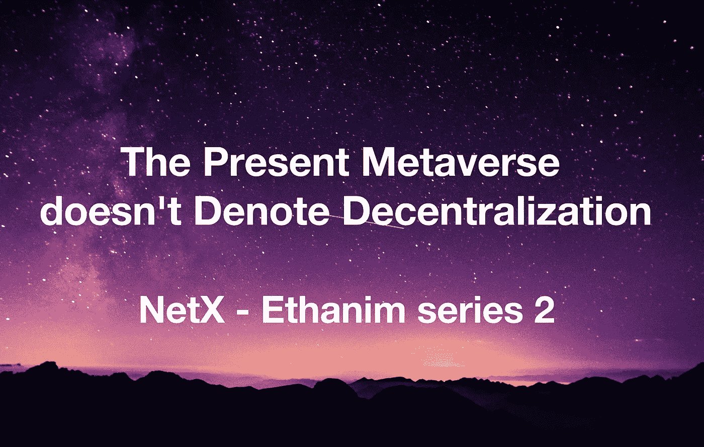

# 现在的元宇宙并不意味着分权

> 原文：<https://medium.com/coinmonks/the-present-metaverse-doesnt-denote-decentralization-51cf038f6651?source=collection_archive---------15----------------------->

TL；速度三角形定位法(dead reckoning)

*   人们对元宇宙有不同的看法。有人把它看作是当前世界的延伸，有人把它看作是 Web 3.0 的世界。
*   通往元宇宙的道路充满了曲折。权力下放尚未实现。此外，价值观仍然是个问题。

随着虚拟世界融入现实世界，人口密集的社区占据了元宇宙的每一个角落。社区成员都找到了自己的位置，他们的兴趣指引着他们。在这个有序扩张的世界里，每个人都打造了一种独特的生活方式。我期待看到一个平等、充满活力的元宇宙。

不同的人可能会为元宇宙画不同的画。有的准备开连锁炸鸡店；有些人梦想举办音乐会；一些人努力成为房地产巨头；有些人只是希望交更多的朋友。无论这个世界看起来如何，我们对应许之地的梦想和期望不会停止。问题是这种愿望何时才能实现？

# **关键障碍对发展至关重要**

在现有的元宇宙中，区块链将去中心化作为 Web 3.0 的核心技术。虚拟现实(VR)和增强现实(AR)实现了增强现实。5G 技术产生更快的网络传输。这些技术将元宇宙建设成一个可以通过电脑访问的虚拟世界，而不仅仅是我们头脑中的幻想。但是它远远落后了。

Web 3.0 在一个权力集中的世界里发起了一场无声但激烈的革命，权力斗争是最大的障碍。可穿戴硬件设备的技术还没有先进到可以满足生活的需求。5G 技术的应用仍然局限于某些地区。元宇宙在聚光灯下闪闪发光。人才和资金都在涌向这片 IT 热土。但其底层基础设施尚未成熟。在公众的强烈关注下，元宇宙从一开始就承诺有一个光明的前景。然而，现有的障碍和挑战在现阶段仍然难以克服。

# **权力下放并不意味着乐观**

对于传统企业和政治权力来说，去中心化预示着一场高风险的赌博。他们必须权衡后果和随之而来的经济增长。因此，他们中的许多人选择呆在他们的舒适区。只有那些大胆的公司和赤手空拳的个人，在他们对 Web 3.0 的热情和对元宇宙的积极展望的激励下，才敢踏上这片不发达的土地。

Web 3.0 并不总是公正的。对权力和金钱的渴望是不可避免的。无论是出于资金还是项目开发的目的，只有少数项目能够完全实现去中心化；许多人在途中退回到中央集权。以放权为幌子的项目占据了行业的半壁江山。拉地毯是常有的事。项目创建者的套现，在 Web 3.0 中并不被定义为“非法”，但总是让用户对无价值的 NFT 和硬币束手无策。

值得播出的是这些实现了一定程度的去中心化的项目。他们作为行业的精神支柱崛起，权力移交给社区和用户。荣誉奖章是吸引更多类似的持久项目所需要的。

技术问题也存在。目前，区块链仅支持应用数字资产的去中心化，但缺乏对大规模复杂计算的支持。几乎所有的操作，如逻辑计算、数据存储、图像渲染等。是集中的，但是，它完全控制了数字资产在链上的分布。此外，项目的社区治理并不能保证持续的分权，这受到许多因素的影响，如项目规模、社区人口规模、决策方式、个人权利分配等。无论是小规模还是偏离的权利分配，一个微不足道的差别都可能导致一个在分权的掩盖下更加根深蒂固的集权集团。

# **扭曲的元宇宙建筑价值观**

流行的元诗句是由非功能性翻译支持的。NFT 为虚拟资产注入了活力，但提高了后来者的门槛。先行者享受着丰厚的福利，后来者却在贫困中煎熬。这些新用户肯定需要更多的机会来打破障碍。一些人购买 NFT，以团体或公司的形式进入元宇宙，打破了 Web 3.0 的壁垒。这为他们准备了足够的资本，但并不一定预示着一条更容易的道路。

个人可以轻松加入 Web 3.0。只要他们的资产管理良好，所有权就不会分配给其他人。然而，公司可能会发现很难渗透 Web 3.0。公司规章、财务问题、适应性问题、职业态度和策略都必须到位或得到解决。

尽管如此，元宇宙还没有一个包容性的解决方案。基础设施需要研究；区块链算法需要更新；社区组织寻求重大改革；更重要的是，渴望探索 Web 3.0 和元宇宙的人们缺乏一个允许任何个人或实体进入的更安全的指南。

# 必读

[Ethanim 系列 1](/coinmonks/metaverse-an-open-and-destined-future-b652734fbdf2) | [NetX 系列 1](/triaslab/rethinking-the-it-industry-d101384e801) | [NetX 系列 2](/coinmonks/a-letter-from-satoshi-nakamoto-345a45d012bb) | [NetX 系列 3](/coinmonks/out-of-control-the-post-it-evolution-dd64e05ff5bc)

***NetX，面向数字生活的可信可靠的智能自治系统链原生互联网(***[***Trias***](https://www.trias.one/)***)***

[***铁人三项***](https://www.triathon.space/#/)***|***[***Ethanim***](https://www.ethanim.network/)***|***[***tu Sima***](https://www.tusima.network/#/)***| behemotius | leviam | Divina***

> 加入 Coinmonks [电报频道](https://t.me/coincodecap)和 [Youtube 频道](https://www.youtube.com/c/coinmonks/videos)了解加密交易和投资

# 另外，阅读

*   [加密货币储蓄账户](/coinmonks/cryptocurrency-savings-accounts-be3bc0feffbf) | [YoBit 评论](/coinmonks/yobit-review-175464162c62)
*   [Botsfolio vs nap bots vs Mudrex](/coinmonks/botsfolio-vs-napbots-vs-mudrex-c81344970c02)|[gate . io 交流回顾](/coinmonks/gate-io-exchange-review-61bf87b7078f)
*   [CoinFLEX 评论](https://coincodecap.com/coinflex-review) | [AEX 交易所评论](https://coincodecap.com/aex-exchange-review) | [UPbit 评论](https://coincodecap.com/upbit-review)
*   [AscendEx 保证金交易](https://coincodecap.com/ascendex-margin-trading) | [Bitfinex 赌注](https://coincodecap.com/bitfinex-staking) | [bitFlyer 点评](https://coincodecap.com/bitflyer-review)
*   [Bitget 回顾](https://coincodecap.com/bitget-review)|[Gemini vs block fi](https://coincodecap.com/gemini-vs-blockfi)cmd |[OKEx 期货交易](https://coincodecap.com/okex-futures-trading)