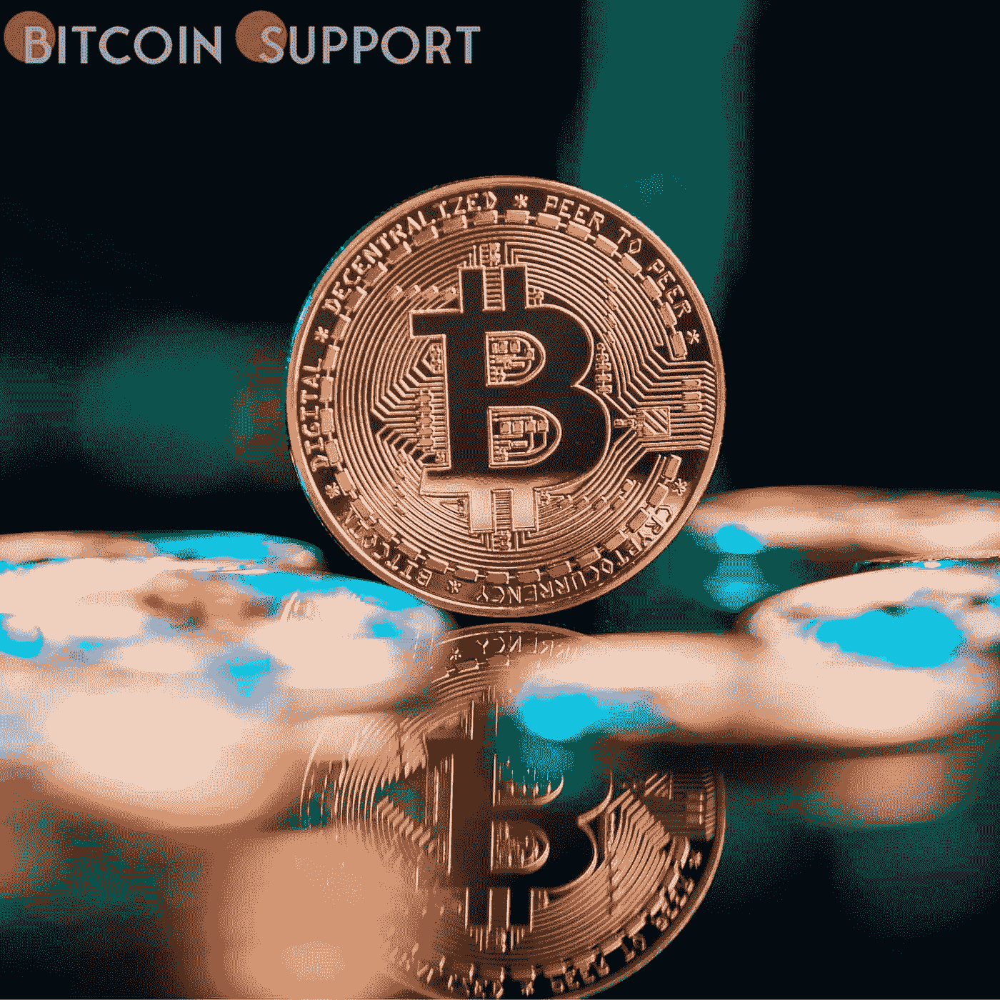
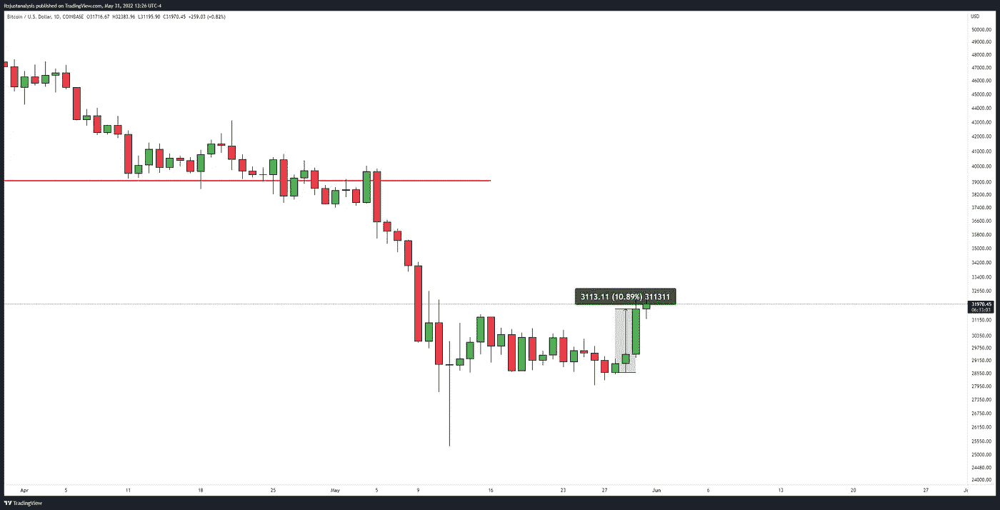
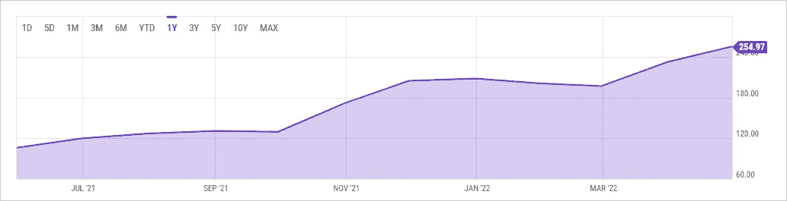
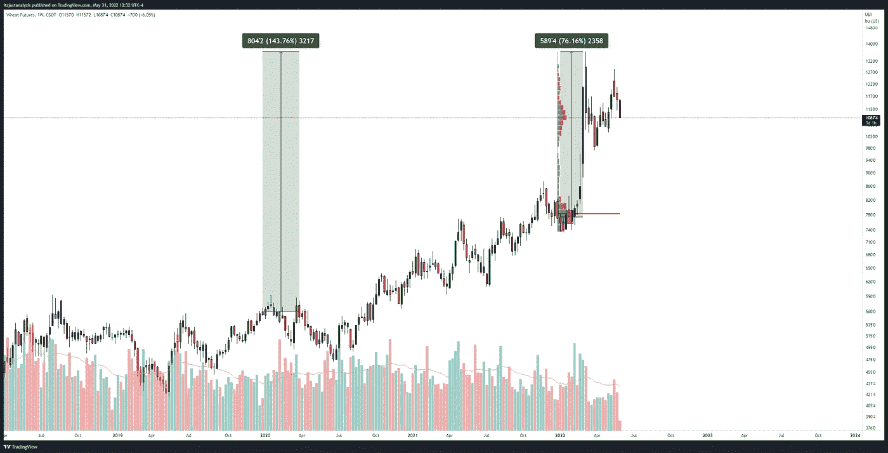
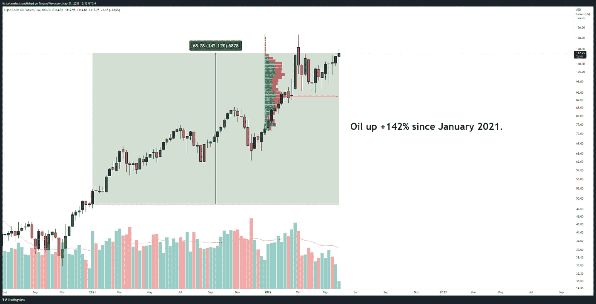
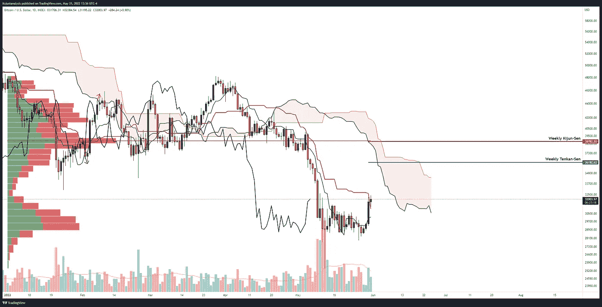

# 比特币的价格已经上涨到 32300 美元，但有三个因素可能会阻止它复苏

> 原文：<https://medium.com/coinmonks/the-price-of-bitcoin-has-risen-to-32-3k-but-three-factors-may-limit-its-recovery-9a04bcefb77f?source=collection_archive---------30----------------------->

## **比特币价格已升至 32.3 万美元，但三个因素可能会限制其复苏**

比特币多头将价格推高至 33，300 美元，但传统市场的显著逆风可能会使价格保持低位。

从 5 月 27 日开始，比特币(BTC)的价格出奇的看涨。周末，尤其是假日周末，是出了名的不稳定和优柔寡断，价格大幅波动是家常便饭。即使在牛市中，看跌价格行为也很常见，但 BTC 却逆势而为。

在 5 月 27 日至 5 月 30 日期间，比特币上涨了近 11%，突破了关键的 28，600 美元水平，回到 30，000 美元以上，达到 31，700 美元。本周收盘创下 20 天来的最高水平，为多头带来了两个多月来最好的三日表现。另一方面，对宏观经济的担忧可能会限制进一步上涨的潜力。

## **随着商品价格上涨，对全球食品短缺的担忧日益加剧**

世界粮食供应是比特币未来价格潜力的一个主要因素，但往往被忽视。自 COV-19 疫情开始以来，世界各国政府已经关闭了他们的海港和机场，有效地切断和中断了货物的流动。这次中断后，需要数年时间才能恢复正常，但这不是担忧的主要原因。在过去的 18 个月里，美国的化肥价格急剧上涨。化肥价格指数在 2021 年 1 月为 78.83 美元，现在为 254.97 美元，涨幅近+225%。供应链中断和持续短缺可能会进一步扰乱这个市场。

个别商品价格持续上涨，是通胀稳步上升的主要原因。特别是小麦(CBOT: ZW)在 2022 年 2 月达到历史新高，并继续在这些水平附近交易。在过去的 18 个月里，仅在 2022 年，小麦期货就上涨了 76%和 143%。

石油期货(NYMEX: CL)仍在上涨，目前处于 2008 年 7 月以来的最高水平。交易员和投资者担心，一旦中国的 COVID 关闭被解除，油价将升至每桶 150 美元。当这种情况发生时，需求几乎肯定会反弹，给石油带来更大压力。

## **对股市增长的担忧**

全球股票市场仍然面临很大压力。通胀压力、大宗商品价格上涨、供应链中断和乌克兰冲突让冒险的投资者和交易员处于守势。本周将会看到一系列影响深远的经济事件，这些事件可能会阻止股票和加密货币的任何重大价格波动。6 月 1 日，将公布欧盟的失业数据，以及日本央行的利率决定和制造业数据。6 月 3 日，美国失业率和非农就业数据将公布。为了给繁忙的一周画上句号，美国美联储的三名前成员定于 6 月 3 日发表演讲:约翰·威廉姆斯和詹姆斯·布拉德，6 月 1 日，莱尔·布雷纳德，6 月 3 日。

**Realted:-**[**据数据显示，自 2020 年 12 月**](https://bitcoinsupports.com/according-to-data-wealthy-coinbase-customers-have-been-hodling-bitcoin-since-december-2020/) 以来，富有的比特币基地客户一直在‘囤积’比特币

## **由于技术因素，比特币的回收可能被限制在 37000 美元**

比特币正在打破连续九周的新周亏损纪录。自当前的每周烛台开始以来，买家已经回归，推动 BTC 超过了前两周的整个交易区间，并远高于 2022 年 5 月 9 日闪电崩盘的 50%区间。

如果比特币能够收在日线 Kijun-Sen 以上 31350 美元或以上，那么它将有一条通往 37000 美元价值区域的清晰路径。此外，2022 年的数额很少，在 32，000 美元至 37，000 美元之间。然而，多头可能会在 37，000 美元再次面对卖家。

看涨者需要将比特币价格推高至每日收盘 44000 美元附近，以向市场发出新一轮涨势即将开始的信息。在这种情况下，BTC 将引发一个“理想的看涨一分突破”，为多头提供重新测试历史高点的路径。至少，在股价仍处于熊市、大宗商品仍处于历史高点的时候，可能会出现暂时的逆转。如果古老的技术分析格言“量先于价”成立，交易员应该预计食品和石油价格将下跌，而股票和比特币价格将上涨。

**免责声明:以上为作者观点，不应视为投资建议。读者应该自己做研究。**