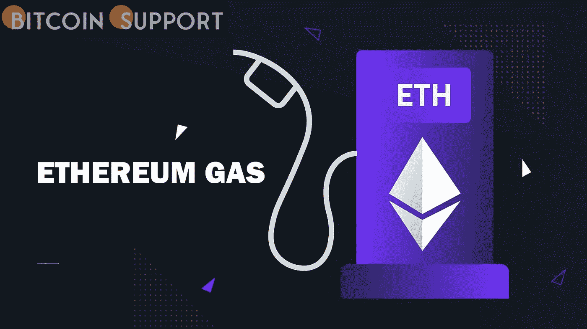
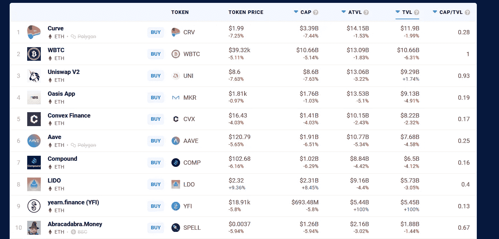

# 以太坊气的价格已经跌至 2021 年 8 月以来的最低点

> 原文：<https://medium.com/coinmonks/the-price-of-ethereum-gas-has-dropped-to-its-lowest-point-since-august-2021-b44b68fc8232?source=collection_archive---------68----------------------->

**Visit our website:-** [**https://bitcoinsupports.com/**](https://bitcoinsupports.com/)

自年初以来，以太坊的平均天然气价格一直在快速下降，从 1 月 10 日的 218 Gwei 降至 3 月 9 日的 40.82 Gwei。

以太坊(ETH)交易的燃气成本降至 8 月以来的最低水平。然而，它们并不便宜。

根据 CryptoRank 平台发布的 Coinmetrics 数据，截至 3 月 9 日，以太坊交易的七天移动平均成本为 11.14 美元，降至去年年中的水平，然后在 2021 年底飙升至 55 美元。

[https://Twitter . com/crypto rank _ io/status/1501541713155817475](https://twitter.com/CryptoRank_io/status/1501541713155817475)

在撰写本报告时，似乎存在最小的网络拥塞，Etherscan 统计数据预测天然气价格在 30 Gwei(＄1.53)至 32 Gwei(＄1.64)之间，用于低速确认，32 Gwei(＄1.64)用于高速确认。

根据 Ycharts 的统计，乙醚的平均气价自年初以来一直在明显下跌，从 1 月 10 日的 218 Gwei 暴跌至昨日的 40.82 Gwei。

尽管以太坊的不可兑现令牌(NFT)和去中心化金融(DeFi)部门预计将在 2021 年快速增长，但该网络已多次因其过高的天然气费用而受到指责。

与 2021 年末相比，今年年初拥堵和费用降低似乎与对 NFTs 和 DeFi 的投机或兴趣减少有关。

DappRadar 数据显示，在过去 30 天里，十大以太坊市场中有九个市场的交易量有所下降，排名第一的 LooksRare 和第二的 OpenSea 分别下跌了 78.27%和 34.75%。其他主要损失包括超级稀有和稀有分别损失 73.29%和 80.65%。基于以太坊(Ethereum)的 DeFi 也在苦苦挣扎，上个月，在锁定的总价值(TVL)和原生资产代币价格方面，十大项目中有八个项目出现亏损。

**访问我们的网站:-【https://bitcoinsupports.com/】**

****免责声明:以上为作者观点，不应视为投资建议。读者应该自己做研究。****