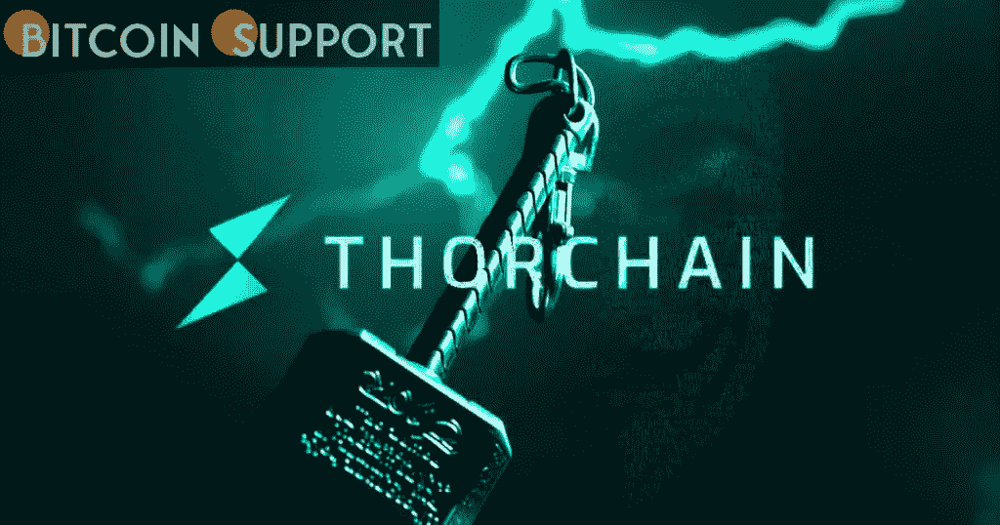

# 自合成资产激活以来，THORChain 的价格已经上涨了 34%

> 原文：<https://medium.com/coinmonks/the-price-of-thorchain-has-increased-by-34-since-the-activation-of-synthetic-assets-869576dd3f62?source=collection_archive---------50----------------------->

**Visit our website:-** [**https://bitcoinsupports.com/**](https://bitcoinsupports.com/)

“在 THORChain 上交易合成材料的交易费用是掉期交易费用的一半，这使得掉期交易更便宜，汽油费更低，交易速度更快。”开发者查德·巴拉福德评论道:“你可以在大量交易中进行近乎即时的交易。”

随着网络上合成资产的激活，跨链去中心化交易所 THORChain (RUNE)的原生资产价格在一天内上涨了 34%。在撰写本文时，价格已经回升到 5.27 美元，代表着在过去的 24 小时内上涨了 21%。

Crypto synthsesis，通常被称为 synth，是与基础担保资产价值挂钩的数字资产衍生令牌，如比特币(BTC)或以太网(ETH) (ETH)。THORChain 选择以 50%的基础资产和 50%的变体 RUNE 来支持其 synths。今天早些时候激活后，像 sBTC 和 sETH 这样的合成人现在可以在网络上交换了。在 3 月 10 日的一篇博客文章中，THORSwap Finance 强调了合成资产的好处，称“交易者和套利者从合成资产中获益，因为它们几乎可以立即交易，而且成本只是 L1 本地掉期的一小部分。”

“在未来，它将使 THORChads 能够通过金库获得 Synths 的收益，以及提供其他有趣的 THORFi 服务，”开发者说“在今天早些时候激活上线后，现在可以在网络上交换像 sBTC 和 sETH 这样的 post

合成的添加。RUNE 的价格上涨了 20%以上，达到 5.27 美元。本周早些时候，该团队宣布了其未来计划，承诺将“分散流动性”提高到集中流动性的 10 倍。在清单上的工具完成后，其他关键的未来里程碑包括分散金融(DeFi)——在这种情况下称为 THORFi 以及贷款和储蓄服务。

[https://Twitter . com/therruneranger/status/1501745579113820164](https://twitter.com/TheRuneRanger/status/1501745579113820164)

备受期待的 mainnet 在 THORChain 上的首次亮相，越来越接近现实，但仍缺乏一个坚定的推出日期，这将是另一个引人注目的主题。据 Cointelegraph 此前报道，RUNE 最近的上涨(在过去 14 天内上涨了 48.4%)可能与本月初 Terra (LUNA)全面整合到 THORChain 协议有关。THORChain 的核心开发者 Chad Barraford 今天早些时候也在 Twitter 上强调了新推出的 synths 的重要性，暗示网络上的交易量可能很快就会增加。"你可以在几秒钟之内做成大批量交易。"

**访问我们的网站:-**[**https://bitcoinsupports.com/**](https://bitcoinsupports.com/)

**免责声明:以上为作者观点，不应视为投资建议。读者应该自己做研究。**