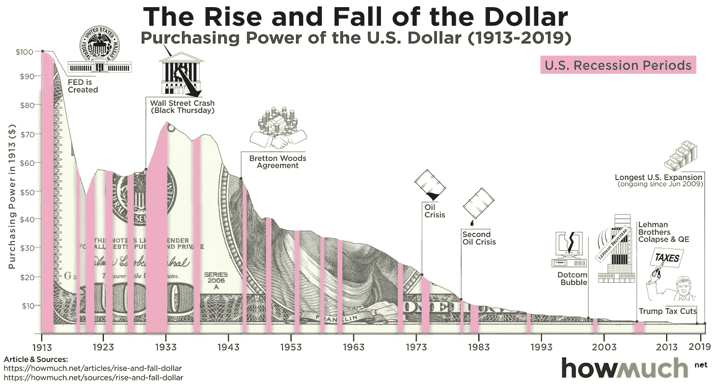

# 钱的问题

> 原文：<https://medium.com/coinmonks/the-problem-with-money-5cb3597a3681?source=collection_archive---------60----------------------->

比特币，金融货币机构的巨大挑战者。

要理解一个解决方案就必须理解这个问题。因此，菲亚特的问题将在本文中进行研究。

目的是通过概述其先例的弱点，促进对比特币优势的更好理解。

**法定货币** 
货币非常有用，这一点在历史上一直存在。已知的第一个例子是公元前 6 世纪的美索不达米亚谢克尔，第一张纸币记录是在公元 7 世纪的中国，1694 年英格兰银行成立，为对法国的战争筹集资金。

菲亚特是一个拉丁词，意思是应该，或者让它完成。因此，法定货币获得了内在价值，因为发行它们的政府保持了这一价值。它采用自上而下的方式，由政府决定货币政策，普通民众遵守既定的规则。

**它有三个核心功能:** ——它为个人提供了一种储存财富的方式；价值储存库
——它允许交易；交换媒介
——它有助于交流商品的价值；记账单位 T21 现代体系目前法定货币没有任何实物商品如黄金或白银的支持。它的价值仅仅来源于供求的经济关系和发行政府的稳定性。过去，货币是由贵重金属铸造的，或者是可以兑换成黄金的纸币。这被称为金本位制。货币的价值与黄金的价值直接相关，并且可以交换。现在情况不再是这样了。金本位制的消失发生在 20 世纪。

**关键历史日期** 
1913 年美联储法案
美联储体系于 1913 年诞生。美国引入了中央银行来监督货币政策。它有能力印刷钞票，以防止政府在不确定时期不得不依赖私人金融家。

英国 1931 年放弃金本位

美国 1933 年放弃金本位

尼克松总统时期关闭了黄金窗口 1971 年彻底断绝黄金与美元的联系

**为什么要放弃金本位？金本位赋予了货币价值，但也对政府施加了严格的约束。英国和美国放弃了金本位制，以阻止外国将货币兑换成黄金，但最重要的是，金本位制严重干扰了它们实施扩张性政策的能力。从这个时候起，特别是 1971 年，我们看到了美元购买力的崩溃。美元的真实价值每年都在下降，其购买力也越来越低。**

[https://howmuch.net/articles/rise-and-fall-dollar](https://howmuch.net/articles/rise-and-fall-dollar)

目前，法定货币的唯一支柱是人们对发行它的政府的信任。央行可以随时发行新的货币，它有无限的供应，因此他们可以在负资产的情况下操作。这种情况的危险性不能低估。

**2008 年全球金融危机** 
凸显了传统金融的弱点和不足。

首要原因是次级抵押贷款。这些是抵押贷款，发放给那些没有资格获得普通贷款的人，因为这些贷款人代表了更高的风险，这些贷款伴随着更高的利息支付。这些贷款随后被多次捆绑成复杂的衍生品。这些不良贷款，加上普遍的欺诈行为，给房地产泡沫带来了巨大压力。信贷危机是基于利率将持续保持在低位、房价将继续上涨的假设。当这些假设被证明是错误的，许多次级借款人无法偿还他们的抵押贷款，房屋被银行收回。这在整个经济中引起了连锁反应。

美国财政部开始量化宽松。这是一个不必要的复杂术语，说它开始大量印钞——它让货币贬值。并着手救助“大到不能倒”的银行。银行被认为是值得信赖的权威——保护普通人存在银行里的钱——管理着我们的货币体系的健康。被世人视为悲惨的失败。马克·吐温

**今天** 
过去两年，世界一直在与 2020 年开始的全球疫情角力。美联储(美联储)利用其权力，在疫情期间印刷了数万亿美元的刺激计划。在金本位制下，政府不可能做到这一点。但已经做到了，美元进一步贬值。由于低利率和政府为鼓励消费而提供的信贷，房价和股市持续快速上涨。本季度美国的通货膨胀率将达到 7.9%，英国将达到 8%。随着燃料和电力的增加，这些数字似乎会更高，特别是在英国。

通货膨胀会吃掉人们的工资，并大幅降低生活水平。

**各国政府都在做些什么来应对通货膨胀？** 
由于俄罗斯入侵乌克兰引发的全球不确定性，抑制通胀的进程被搁置一旁。

**结论**

货币政策一次又一次地将金融稳定置于通胀之上，结果只是恶化和延长了不可避免的经济衰退。另一场经济危机正在逼近，而那些承受不起这场危机的人将受到最沉重的打击。这场即将到来的崩盘将再次暴露出传统金融的脆弱性，我真诚地希望，这能让人们考虑其他选择。

> 加入 Coinmonks [电报频道](https://t.me/coincodecap)和 [Youtube 频道](https://www.youtube.com/c/coinmonks/videos)了解加密交易和投资

# 另外，阅读

*   [A-Ads 审查](https://coincodecap.com/a-ads-review) | [Bingbon 审查](https://coincodecap.com/bingbon-review) | [Mudrex 投资](https://coincodecap.com/mudrex-invest-review-the-best-way-to-invest-in-crypto)
*   [瓦济里克斯 NFT 评论](https://coincodecap.com/wazirx-nft-review)|[Bitsgap vs Pionex](https://coincodecap.com/bitsgap-vs-pionex)|[坦吉姆评论](https://coincodecap.com/tangem-wallet-review)
*   [如何使用 Solidity 在以太坊上创建 DApp？](https://coincodecap.com/create-a-dapp-on-ethereum-using-solidity)
*   [最好的卡达诺钱包](https://coincodecap.com/best-cardano-wallets) | [冰棒副本交易](https://coincodecap.com/bingbon-copy-trading)
*   [氹欞侊贸易评论](https://coincodecap.com/anny-trade-review) | [Paybis 评论](https://coincodecap.com/paybis-review) | [Keevo 钱包评论](https://coincodecap.com/keevo-wallet-review)