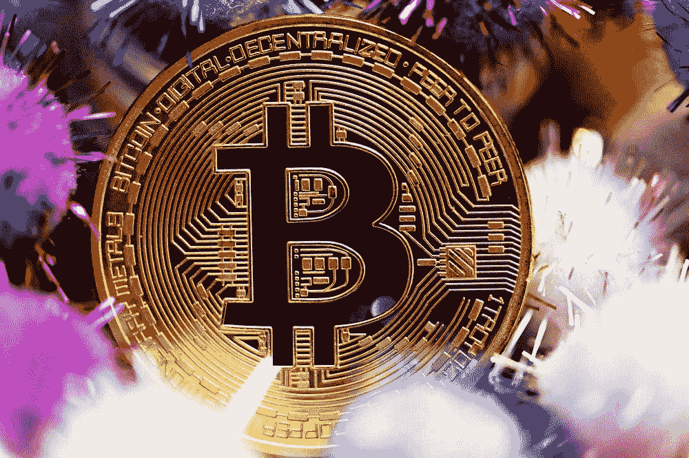

# 正确的入门方式。

> 原文：<https://medium.com/coinmonks/the-proper-way-to-get-started-in-crypto-8b02801b1e30?source=collection_archive---------25----------------------->

## 你可以学容易的，也可以学难的。

[source](https://unsplash.com/photos/WNLqXQwRGEk)

如果你正在阅读这些文字，你可能听说过加密货币这个术语。这是因为该行业在创新、发展和价格上涨方面的速度非常快。虽然后者没什么问题，但是，它对我们理解…的原理几乎没有帮助