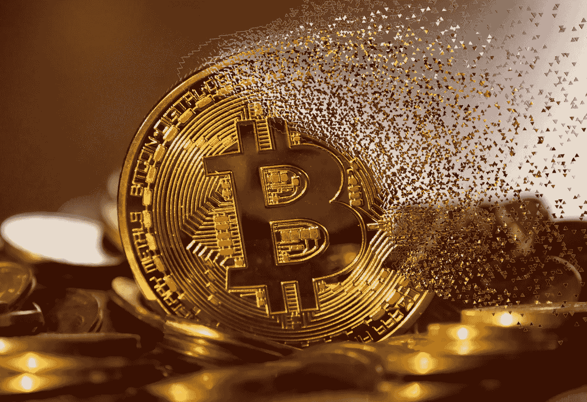

# 加密货币投资者的心理考试及如何保持自己的心理

> 原文：<https://medium.com/coinmonks/the-psychological-exam-of-the-cryptocurrency-investor-and-how-to-maintain-your-psychology-309a6e509354?source=collection_archive---------7----------------------->

在金融市场成功交易需要很多技巧。它包括评估公司基本面和确定股票趋势方向的能力。但是这些技术技巧都没有交易者的心态重要。调节情绪，快速思考，遵守纪律是我们所说的交易心理的组成部分。有两种主要的情绪需要理解和控制:恐惧和贪婪。

> 交易员；

交易员通常必须快速思考，快速决策，在短时间内进出股票。要做到这一点，他们需要有一定的镇定。他们还需要坚持自己的交易计划，知道何时分盈亏。情绪根本挡不住。

> 普通投资者

一般投资者情绪往往会推动市场表现朝着违背基本原则的方向发展。成功的投资者控制着恐惧和贪婪，这两种人类情感驱动着这种情感。理解这一点可以给你纪律和客观性来利用他人的感受。当交易员收到某只股票或整体经济的坏消息时，他们自然会感到害怕。他们可能反应过度，觉得必须清算他们的资产，坐拥现金，避免进一步的风险。如果他们这样做，他们可能会避免某些损失，但他们也可能会错过一些收益。投资者需要理解什么是恐惧:对感知到的威胁的自然反应。在这种情况下，这对他们的利润潜力是一个威胁。衡量恐惧会有所帮助。交易者应该考虑他们到底害怕什么，为什么害怕。但这种想法应该在之前就出现，而不是在坏消息中出现。恐惧和贪婪是两种本能的情绪，需要加以控制。华尔街有句老话叫“猪被宰”。这是指贪婪的交易者习惯于在赢利的位置上停留太久，以至于推高价格的最后一步。趋势迟早会逆转，贪婪的人会被抓住。贪婪是不容易克服的。它往往是基于本能的做得更好，得到更多一点。交易者必须学会识别这种本能，并基于理性思考制定交易计划，而不是一时兴起或本能。

> 加入 Coinmonks [电报频道](https://t.me/coincodecap)和 [Youtube 频道](https://www.youtube.com/c/coinmonks/videos)了解加密交易和投资

# 另外，阅读

*   [印度加密交易所](/coinmonks/bitcoin-exchange-in-india-7f1fe79715c9) | [比特币储蓄账户](/coinmonks/bitcoin-savings-account-e65b13f92451)
*   [OKEx vs KuCoin](https://coincodecap.com/okex-kucoin) | [摄氏替代度](https://coincodecap.com/celsius-alternatives) | [如何购买 VeChain](https://coincodecap.com/buy-vechain)
*   [币安期货交易](https://coincodecap.com/binance-futures-trading)|[3 commas vs Mudrex vs eToro](https://coincodecap.com/mudrex-3commas-etoro)
*   [如何购买 Monero](https://coincodecap.com/buy-monero) | [IDEX 评论](https://coincodecap.com/idex-review) | [BitKan 交易机器人](https://coincodecap.com/bitkan-trading-bot)
*   [CoinDCX 评论](/coinmonks/coindcx-review-8444db3621a2) | [加密保证金交易交易所](https://coincodecap.com/crypto-margin-trading-exchanges)
*   [红狗赌场评论](https://coincodecap.com/red-dog-casino-review) | [Swyftx 评论](https://coincodecap.com/swyftx-review) | [CoinGate 评论](https://coincodecap.com/coingate-review)