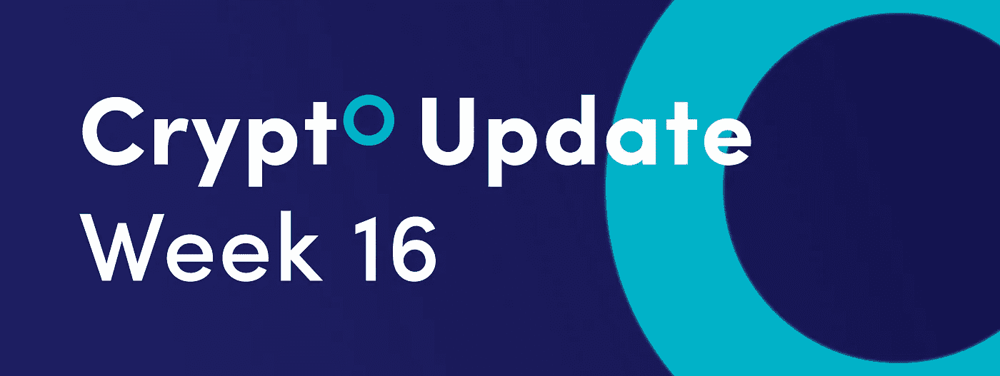
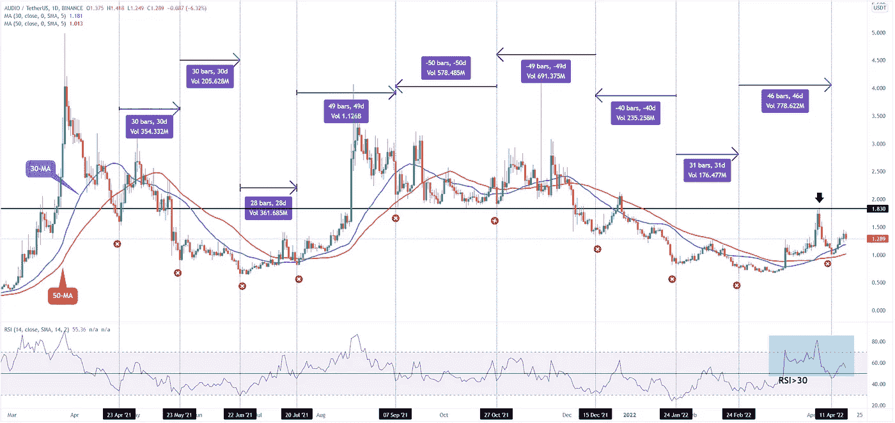
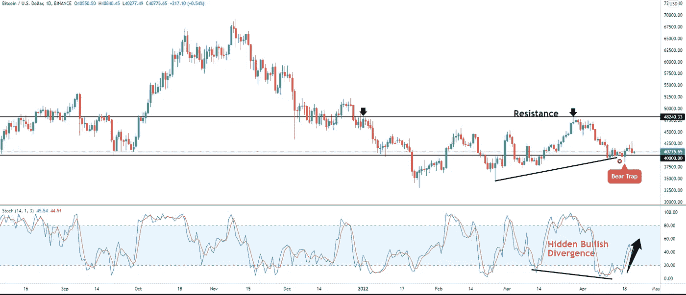
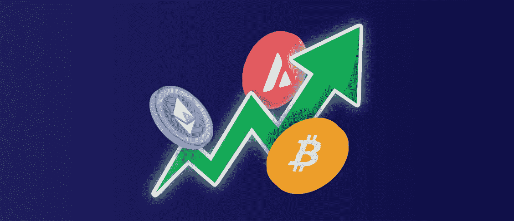

# 加密货币趋势的心理学|以及本周加密更新的更多内容。

> 原文：<https://medium.com/coinmonks/the-psychology-of-a-cryptocurrency-trend-124e51963501?source=collection_archive---------25----------------------->

*   这就是以太坊可以复试 2000 美元的原因
*   比特币跌破 4 万美元是终极熊市陷阱吗？
*   加密交易 101:加密货币趋势的心理学

## **这里是以太坊可以复试 2000 美元的原因**

经典的艾略特波浪理论要求以太坊的价格重新测试 2000 美元的心理水平。艾略特波浪概念告诉我们，从 2017 年 8 月到 2021 年 11 月，以太坊已经完成了一个 5 脉冲序列，自然应该跟随一个 3 波修正低点。

## 以太坊艾略特波浪分析

第一波以 2018 年 1 月的高点结束，随后的回调标志着第二波，以 81.79 美元的低点结束。最后，第三波的反弹以 2021 年 5 月的高点结束，加密货币在第四波朝着 1700 美元的低点继续走低。

第五浪的最后一波涨势以目前的历史最高价 4868 美元结束，完成了 5 浪价格结构。

从目前的历史高点下跌，我们有一个不完全的 ABC 修正。A 浪结束于 2159 美元的低点，B 浪中更高的反应可能结束于当前的波动高点 3580 美元。根据艾略特波浪理论，需要最后一波 C 来完成这个周期。

C 浪有可能在 A 浪的 0.618 和 0.786 斐波纳契延伸之间发展，相对于 b 浪的峰值来衡量。价格方面，C 浪可能在 1，906 美元和 1，451 美元之间结束，从这里可以出现新的牛市周期。

## 比特币跌破 4 万美元是终极熊市陷阱吗？

比特币的(BTC)价格突然跌破 40，000 美元的重要心理水平，但抛售是短暂的，跌势很快得到逆转。投资者现在在问，跌破整数倍是否是最终的熊市陷阱。

## 比特币熊陷阱？

在技术分析中，当市场抛售使交易者相信上涨趋势已经结束，反转可能正在发生时，熊市陷阱就出现了。在空头陷阱的情况下，价格通常会跌破支撑位或关键技术点。

空头突破了 40，000 美元的关键水平，但迄今为止，他们肯定因押注比特币价格暴跌而受到了损失。

技术面可以给我们更多线索来判断 BTC 能否守住 40，000 美元上方。

## 随机超卖

首先，随机振荡器从超卖读数反弹，它随着价格上涨而上涨。其次，我们在随机振荡器和价格之间有一个隐藏的看涨背离。隐藏的看涨背离是一个看涨反转信号，当价格创出更高的低点，而指标创出更低的低点时出现。

如果 BTC 价格继续从低点反弹，以下重要阻力位更接近 3 月份的高点 48，240 美元，随后是下一个重要里程碑 50，000 美元。

## 加密交易 101:加密货币趋势的心理学

众所周知，加密货币市场具有良好的趋势，但即使对于经验丰富的交易者来说，确定趋势的方向并由此建立偏差也是一项挑战。然而，如果你知道趋势是由什么组成的，那么确定趋势方向就会容易得多。

# 趋势心理学

从本质上讲，每个趋势都由两部分组成:

*   市场情绪
*   动力

这意味着，如果情绪，或者换句话说，如果许多市场参与者以同样的方式思考，并开始根据这些信念采取行动(买入和卖出)，他们的行动就会推动势头。这就是一个趋势的开始。

因此，看涨/看跌情绪可以转化为看涨/看跌动力。

现在，这种势头可以继续下去。换句话说，相当多的市场参与者可以继续以同样的方式思考足够长的时间，以至于动量有足够的燃料来保持它上涨或下跌，无论是哪种情况，这种运动最终会创造一种趋势。

市场基本面不断被贴现，在贴现过程中，我们得到了价格运动。然后在价格变动中，我们可以衡量市场心理。

对于大多数交易者来说，找到趋势通常需要实践和经验。通常，交易者使用日线图甚至周线图来寻找合适的趋势。移动平均线是一些可以帮助你识别当前趋势的指标，因为它们平滑了价格数据。

订阅我们的媒体每周博客和更新。
在[推特上关注我们](https://twitter.com/cryptohopper) | [脸书](https://www.facebook.com/cryptohopper)|[Reddit](https://www.reddit.com/r/CryptoHopper/)|[insta gram](https://www.instagram.com/cryptohopper/?hl=nl)

在 [Cryptohopper](https://www.cryptohopper.com/) 开始交易！

> 加入 Coinmonks [电报频道](https://t.me/coincodecap)和 [Youtube 频道](https://www.youtube.com/c/coinmonks/videos)了解加密交易和投资

# 另外，阅读

*   [WazirX vs CoinDCX vs bit bns](/coinmonks/wazirx-vs-coindcx-vs-bitbns-149f4f19a2f1)|[block fi vs coin loan vs Nexo](/coinmonks/blockfi-vs-coinloan-vs-nexo-cb624635230d)
*   [BlockFi 信用卡](https://coincodecap.com/blockfi-credit-card) | [如何在币安购买比特币](https://coincodecap.com/buy-bitcoin-binance)
*   [火币交易机器人](https://coincodecap.com/huobi-trading-bot) | [如何购买 ADA](https://coincodecap.com/buy-ada-cardano) | [Geco。一次复习](https://coincodecap.com/geco-one-review)
*   [加密复制交易平台](/coinmonks/top-10-crypto-copy-trading-platforms-for-beginners-d0c37c7d698c) | [五大 BlockFi 替代方案](https://coincodecap.com/blockfi-alternatives)
*   [CoinLoan 点评](https://coincodecap.com/coinloan-review)|[Crypto.com 点评](/coinmonks/crypto-com-review-f143dca1f74c) | [火币保证金交易](/coinmonks/huobi-margin-trading-b3b06cdc1519)