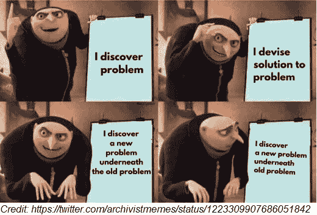
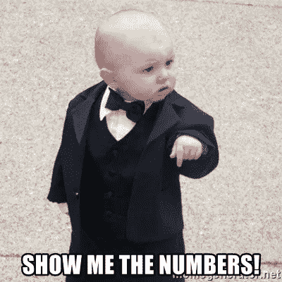
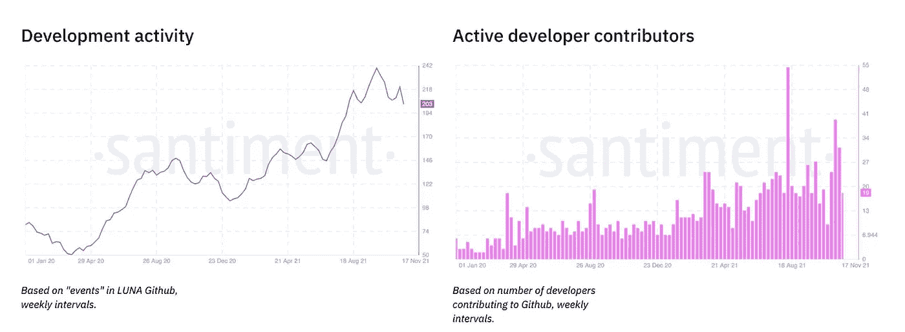

# 寻求分散世界主要货币的权力——它是如何开始的？

> 原文：<https://medium.com/coinmonks/the-quest-to-decentralize-major-world-currencies-how-did-it-start-919a1c36b5e3?source=collection_archive---------58----------------------->

你怎么知道你已经成功了呢？当政府来抓你并给你发传票的时候。马克·扎克伯格、桑德尔·皮帅、杰克·多西和蒂姆·库克等所有大型科技公司的首席执行官都遇到过这种情况。这件事发生在区块链大地的联合创始人权身上。

去年 9 月 20 日，Kwon 是纽约一个加密会议的演讲嘉宾。就在他即将走上舞台的时候，一个代表美国证券交易委员会(SEC)的人找到了他，并向他送达了一张传票，要求他提交一份建立在美国证券交易委员会不喜欢的区块链之上的金融应用程序。他的回应？[以传票送达不当为由起诉 SEC，并指出加密项目的分散性，即该项目由公众控制，这意味着它无法受到当前过时的监管框架的监管。](https://news.yahoo.com/crypto-founder-do-kwon-explains-why-hes-suing-the-sec-195945610.html)

无论你在这场辩论中支持哪个阵营，都必须承认，Terra 足够大，值得 SEC 关注，这也证明了它的广泛采用和成功。但是，Terra 是如何在区块链这个拥挤的市场中取得成功的呢？他们独特的价值主张是什么？他们如何能够在项目早期推动采用？这篇文章评估了 Terra 的上市策略，以回答所有这些问题，以及更多问题。

但首先，下面是一些快速入门的几个主题，将在这篇文章中使用。如果你已经知道所有关于 stablecoins 和 Terra 协议的基础知识，请随意跳过。

# 什么是 stablecoins？

加密的诱惑力很强。互联网与人们通过投资互联网赚到改变生活的钱的故事相冲突。但是正如每个密码爱好者/交易者会告诉你的，这不是一个有趣的旅程。即使是像比特币和以太坊这样的蓝筹资产也是高度不稳定的，这使得你很难将资金存放在其中。此外，这种波动性使它们成为糟糕的支付手段。有谁会比那个在 2010 年用 1 万个比特币买了两个披萨饼的人更了解这一点呢？这些比特币在今天价值 4 亿美元。哎哟！

对非易失性加密资产的需求导致了 stablecoins 的出现，这种资产可以存放你的资金，甚至可以用于支付。稳定货币是加密货币，旨在与现实生活中的货币(称为法定货币)挂钩。因此，与美元挂钩的稳定货币的价格将永远是 1 美元。但是这些人为创造的货币是如何确保它们的价格总是 1 美元的呢？主要有两种方法。

一种方法是用法定货币支持他们。因此，如果我在区块链上创造了 100 万美元的固定资产，我需要得到 100 万美元，并把它们存入银行。这样，如果有人想兑现他们的存款，他们可以很容易地用我银行里的钱来兑换。这种对每枚稳定币都有 1 美元支持的信任是稳定币价格得以维持的原因。

另一种方法是创建*算法*稳定点数。这些稳定的货币没有银行里的法定货币支持。相反，它们中的大多数都被设定为利用供求市场力量来保持价格稳定。这意味着，如果一种稳定的硬币开始在 1 美元以上交易，那么这些硬币的供应就会增加。供给的增加导致价格下降，将价格拉回到 1 美元。同样，如果它开始低于 1 美元交易，那么供应就会减少。供应减少导致价格上涨，使价格回到 1 美元。

# 这和 Terra 有什么关系？

Terra 是一种区块链(类似于比特币或以太坊)，其主要产品是一套与美元、英镑、韩元等许多世界主要货币挂钩的算法稳定币。他们有一个独特的机制来平衡上面提到的供求力量。如果我们分两部分来考虑，就更容易理解它们的稳定机制。

**第一部分。**就像比特币区块链有比特币，以太坊有以太，Terra 有自己的原生加密货币叫 Luna(这不是 stablecoin)。基于 Terra 区块链的使用方式，其原生加密货币 Luna 有许多需求驱动因素。

*   首先，在 Terra 上执行的任何交易都要收取少量费用，可以用 Luna 支付。所以，人们会买 Luna 来使用 Terra 生态系统。
*   第二，这笔费用与任何购买并*持有*露娜的人分享。因此，人们将继续持有 Luna 作为投资，以便从交易费用中分得一杯羹。
*   第三，Luna 的持有者也可以投票表决要求改变 Terra 的提议。因此，像开发者这样的利益相关者受到激励，让 Luna 在 Terra 生态系统如何演变的问题上有发言权。

总之，这些因素为 Luna 提供了价值，并刺激人们购买 Luna，从而导致其价格上涨(最近触及 100 美元)。

第二部分。知道了对露娜的持续需求，这种加密货币被用来维持 Terra 上稳定的货币价格。让我们以与美元挂钩的稳定货币 UST 为例。它的价格总是需要 1 美元，我们假设 Luna 目前的价格是 100 美元。

假设 UST 在公开市场的价格变成 1.5 美元。为了降低价格，需要增加 UST 的供应量。因此 Terra 协议激励人们来创造更多 UST，如下图所示。

同样，假设 UST 在公开市场的价格变成 0.5 美元。为了使其价格回升，需要减少 UST 的供应量。因此 Terra 协议激励人们去摧毁他们的 UST，如下所示。

如果你更喜欢视觉学习，这里有一条很棒的推文解释这一点。

如果上面的晦涩难懂的话，请记住——加密货币 Luna 的价值是根据区块链的使用情况提供的，这个 Luna 用于维持稳定的货币价格。UST 的价格波动转移到 Luna，这并不是一个真正值得关注的问题，因为 Luna 有其他方式来增加价值，如前所述。所以从长远来看，如果对 UST 的需求增加，卢娜的价格也会上涨。值得注意的是，人们编写程序来实时自动完成上述所有操作，因此稳定的硬币价格通常会很快回到其最初的挂钩水平。

最后要注意的一点。当我说卢娜在上述过程中被摧毁以换取 UST 时，我撒了谎。嗯，大部分都被破坏了，但是一小部分被转移到“国库”,用来帮助区块链的发展。我们将在后面看到这笔国库是如何真正使用的。

现在我们有希望理解 Terra 是什么以及它的算法是如何工作的，应该注意到 Terra 并不是镇上唯一的游戏。有许多不同的 stablecoin 项目，每个项目都有其独特的价格稳定方法和自己的价值主张。那么，Terra 是如何进入这个拥挤的市场的，他们的上市策略是什么？为了找到答案，我们将 Terra 的上市策略分解如下。

# Terra 的定位

Terra 着手解决的核心问题是创造一种“真正分散的、可以广泛使用的稳定货币”。这个问题的确定是通过对当时其他 stablecoin 项目的分析得到的，主要是 Tether、Circle、Gemini、Paxos 和 Dai。所有这些 stablecoins 都有这样或那样的问题，可能会阻碍 Terra 的长期发展和/或广泛采用。

由 Tether、Circle、Gemini 和 Paxos 提供的 Stablecoins 是完全**集中的**。这些稳定的货币由银行账户中等值的美元支持。这使得它们容易受到机构和政府的审查，违背了 web3 的精神。此外，对于其中一些稳定的货币，尤其是泰斯，有[报道](https://cryptowhale.medium.com/the-tether-scandal-the-biggest-threat-to-the-crypto-ecosystem-23a169003205)称，与他们的说法相反，他们在银行中实际上没有等值的美元来支持他们的稳定货币。鉴于传统银行服务的不透明性，在这种情况下很难找到真相。

然后是算法 stablecoins，戴是最受欢迎的，在那里人们被要求提供其他加密货币(如比特币，以太坊等。)作为抵押，以稳定的方式获得贷款。如果抵押品的价值下降到某个阈值，就会有**自动清算抵押品**，也就是说抵押品会自动出售。由于加密货币经常经历的波动性，这种情况存在非常真实的风险，这阻碍了个人和企业在戴贷款。毕竟，谁愿意因为短期波动而损失自己的资产，而这些资产在未来可能价值更高。

不管稳定币的设计如何，困扰它们的一个共同问题是它们通常都只与美元挂钩。这降低了这些稳定货币在其他国家的吸引力，因为这些国家的用户在将稳定货币兑换回本国货币时会受到国际汇率波动的影响。

确定了这些关键问题后，Terra 着手提出一个更好的解决方案，结果却遇到了另一个会对他们的解决方案设计产生重大影响的问题！

这个问题是区块链建造这个马厩的出发点。以太坊是唯一可行的候选，因为它足够分散，并且是当时唯一经过战斗考验的连锁店。然而，在以太坊上进行构建存在一定的**限制——由于当时以太坊缺乏可扩展性，依赖于以太坊自身的开发周期，以及跨不同链的有限互操作性，交易成本很高。这些限制可能会阻碍 Terra 的长期发展。**

有了这些信息和创造一个更好的解决方案的决心，Terra 决定是时候让这个世界获得一个新的稳定，它具有以下独特的特征:

*   通过在公共区块链上创建算法稳定中心来避免集中化。
*   通过采用一种不需要抵押品的新型价格稳定机制(在上一节中讨论过)来避免抵押品的自动清算。
*   不仅仅是美元，而是创造多种与世界主要货币挂钩的稳定货币，如英镑、韩元，甚至是特别提款权。
*   通过建造他们自己的区块链来避免困扰以太坊的限制，在此基础上，这些稳定的副本将被创建。

现在，仅仅因为你有一个独特的产品，具有与现有产品不同的特点，并不意味着它会在红地毯上受到世界的欢迎。确定谁是你的实际用户，并阐明这些用户的实际*价值*是至关重要的。Terra 的 stablecoin 主要有两组用户:

1.  *使用信用卡购买/投资的消费者*。
2.  开发人员使用 stablecoin 在 Terra 区块链上创建应用程序。

Terra 对这两个用户群的价值主张是:

1.  消费者可以避免通过传统银行。他们这样做可能是因为他们的经济阶层不符合条件，或者他们想避免银行和信用卡通常收取的 2-3%的交易费，或者他们只是想避免处理困扰当今银行系统的令人沮丧的令人望而却步的繁文缛节。
2.  *开发人员*接触到一个消费者生态系统，他们渴望新的应用程序，这些应用程序允许他们构建的应用程序被高度采用。

应该注意，这两个用户集相互依赖。随着消费者开始使用 Terra 的 stablecoins，它会激励开发者在 Terra 区块链上创建更多的应用程序，因为他们知道消费者已经在那里了。随着越来越多的应用程序被创建出来，这使得 Terra 对消费者更有吸引力，从而进一步推动了 stablecoins 的采用。

但是……这种看似良性的循环使得一开始很难将产品推出。毕竟，如果没有很多有用的应用程序，消费者为什么还要使用 stablecoins 呢？如果生态系统没有消费者来使用它们，为什么开发者要开发这些应用呢？经典的先有鸡还是先有蛋的问题。解决这个问题是让你的第一批 1000 个用户启动这个产品的第一步。

# 获得第一批 1000 名用户

确定了他们的两个关键用户群——消费者和开发者——Terra 需要想办法让他们参与进来。传统观点认为，首先在一个系统中招募供应商。优步首先说服豪华轿车公司注册，Etsy 首先通过去工艺品展销会招募销售人员，Doordash 首先说服餐馆加入。所以，你可能会想，Terra 会首先想办法激励开发者开发应用程序，然后开始吸引消费者。但是，他们决定首先追求消费者。

他们通过与一家名为 Chai 的移动支付服务合作来实现这一目标。Chai 是一个类似 Venmo 的应用程序，它允许人们轻松地向商店付款。它已经拥有约 1000 万用户，并与许多主要的当地银行建立了合作伙伴关系，以方便支付。此外，他们还与东南亚的许多大型电子商务平台合作，这些平台通过 4500 万用户共同创造了 250 亿美元的年交易额。事情是这样的:

所有与区块链的交互都在后台进行，整个过程对用户来说是无缝的。但是，为什么商家和消费者首先要使用柴应用程序呢？商家签约是因为他们可以选择使用收取 2-3%费用的 Visa/Mastercard。由于柴是在特拉经营，没有中间人，因此没有这样的费用。消费者受到了激励，因为他们可以通过使用柴获得很好的折扣。这些折扣是用我前面提到的 Terra“金库”中收集的钱资助的。下面是摘录再次刷新你的记忆。

> 最后要注意的一点。在上述过程中，当我说 Terra 摧毁 Luna 以换取 UST 时，我撒了谎。嗯，他们确实摧毁了大部分，但一小部分被转移到一个“国库”,这是用来帮助区块链增长。我们将在后面看到这笔国库是如何真正使用的。

注意:他们最终停止了用这种方法资助财政部。这只是帮助启动网络的早期机制。

依我拙见，这是一个绝妙的主意！去掉中间商来激励商人。并利用协议本身产生的资金为消费者提供折扣。这为他们赢得了第一批 1000 名消费者(更像是 300，000 名，我们将在指标部分看到)。

弄清楚了消费者之后，是时候关注开发者了。加入如此多的消费者，并启动稳定的货币经济，对于开发商来说是一个引起注意的好信号。然后，他们进一步受到激励，使用成熟的剧本在 Terra 上建造房屋。首先，Terra 被更新为支持任意智能合约——这意味着任何开发人员都可以在 Terra 上编写和部署应用程序。然后，他们宣布给予开发商在 Terra 上建房的补助金。最后，他们在生态系统中植入了一些自己的应用程序，如 Station——这是一个可以用来与 Terra backend 接口的钱包，Anchor——这是一个可以从您的存款中获得约 20%年回报的应用程序，等等。鉴于区块链应用程序是开放和可组合的，这意味着新开发人员可以很容易地与这些应用程序集成，并在他们自己的应用程序中使用它们。所有这些为他们带来了第一批 1000 名开发者。

# 度量 Terra 的发布成功吗？

让我们先来看看“消费者”用户群。与柴合作后的前三个月(2019 年 6 月至 8 月):

*   Terra 有 300，000 个独立用户，完成了 120 万笔交易。相比之下，PayPal 拥有 4 亿活跃用户，在三个月内完成了约 30 亿笔交易。我知道将 PayPal 这样的老牌巨头与一个三个月大的项目相提并论是不公平的，但它提供了一些视角，可以看出 Terra 在推出后的销量表明他们在获得首批消费者方面做得很好。
*   大约一半的消费者在这三个月内进行了大约 2-10 次交易。这意味着至少有一半的用户发现有足够的价值再次使用 Chai 购物。消费者交易产品(如 Airbnb、Lyft)的*高*留存率的行业[标准](https://www.lennysnewsletter.com/p/what-is-good-retention-issue-29?s=r)也是 50%。虽然三个月的时间很短，但 Terra 50%的回头客是留住客户的早期迹象。

现在，让我们来看看“开发人员”用户群。

*   从多面手[编辑的图表中可以看出，自 2020 年 5 月宣布拨款以来，Terra 上的开发者活动稳步增长。](https://www.readthegeneralist.com/briefing/terra)

*   自那以后，Terra 上的应用数量也增加到了 200 多个。虽然与以太坊和币安等巨头相比，这似乎微不足道，但 Terra 的总锁定价值(TVL)为 250 亿美元，这意味着 Terra 应用程序目前总共处理 250 亿美元的资产。这是巨大的，把 Terra 列为 TVL 排名前四的连锁店之一。

那么，Terra 的发射成功吗？响亮的是！正如人们所说，良好的开端是成功的一半。自那以后，Terra 发展壮大，拥有 200 多个应用程序的繁荣生态系统，UST 是最大的分散式 stablecoin。但是一个人不应该满足于他们的荣誉！那么，他们的下一步是什么？

# Terra 的下一步是什么？

Terra 的未来在很大程度上依赖于找到增加其 stablecoins 采用率的方法。其中一个方法是创建一个名为 Anchor 的应用程序。这是一个借贷协议，贷款人将 UST 存入一个资金池，借款人可以从这个资金池中贷款。借款人支付的利息归贷款人所有。虽然不是开创性的，但它能够向贷款人支付稳定的约 20%的 APY 回报，这与大多数竞争对手(和传统银行)相比是巨大的。此外，在 Terra 上构建的大多数其他金融应用程序也利用 Anchor 协议向其客户提供这种储蓄率。现在，这种回报率是不可持续的。虽然 Anchor 有一些独特的机制来帮助支付这种高回报，但这种回报的主要原因是它是一种大的营销游戏。Terra 正在烧钱提供如此高的收益率以推动采用。这一点至关重要，因为许多其他 Terra 应用程序都在使用 Anchor，当收益率下降时，用户也有离开这些其他应用程序的风险。然而，预先付费来获取用户是一种行之有效的策略。优步通过向初始司机承诺保证小时费率做到了这一点，不管他们做了什么旅行，Twitch/Youtube 通过向著名内容创作者承诺一定数量的钱做到了这一点，不管他们带来的收入如何。现在 Terra 这样做是希望通过其他应用程序提供足够的价值来留住这些客户，即使锚定回报下降，他们也会继续留下来。他们只需要确保生态系统为那个时刻的到来做好准备。

虽然他们的主要产品是稳定币和围绕它的金融生态系统，但 Terra 没有理由继续被困在其中。优步从豪华轿车开始，扩展到出租车和 uber eats，DoorDash 从湾区郊区开始，扩展到美国其他地区，亚马逊从书籍开始，扩展到——嗯，征服世界！现在，Terra 有了一个功能齐全的区块链，他们可以扩展到其他用例，如 NFTs、游戏、社交等数字资产。许多应用程序已经开始这样做，这对 Terra 生态系统来说是个好兆头。

随着越来越多的用户通过这些应用程序加入进来，Terra 需要追根溯源，复制它在 Chai 上的做法。如前所述，这是东南亚的一个简单的支付应用程序，它抽象出了使用区块链的所有复杂性。Terra 需要想办法鼓励项目在所有使用案例和地区复制这种体验。这是大规模采用的唯一途径，因为让我们面对它，使用区块链应用程序今天不是最容易的。

最后，法规的威胁无处不在。世界各国仍在研究如何监管加密空间。和所有其他的加密项目一样，Terra 需要监控这个项目，尤其是 Kwon 已经被美国证券交易委员会盯上了！

# 参考资料和附加读物

*   [April Dunford 的产品定位](https://www.lennysnewsletter.com/p/positioning)
*   [消费者应用如何获得首批 1000 名用户](https://www.lennysnewsletter.com/p/how-the-biggest-consumer-apps-got?utm_source=substack&utm_campaign=post_embed&utm_medium=web)
*   [Web3 走向市场](https://future.a16z.com/go-to-market-in-web3-new-mindsets-tactics-success-metrics/)作者:麦琪·许
*   Lenny Rachitsky:在网络市场中，是先关注供应商还是先关注消费者
*   [多面手](https://www.readthegeneralist.com/briefing/terra)覆盖 Terra
*   [泰拉-柴指标](/terra-money/what-do-terra-transactions-teach-us-fb15d0a4bd6c?source=collection_category---4------6-----------------------) —官方博文

如果你喜欢这篇文章，并且想在你的邮箱里直接收到未来的文章，你可以订阅下面的时事通讯。

[https://theleanblock.substack.com/](https://theleanblock.substack.com/)

*原载于 2022 年 3 月 15 日 https://theleanblock.substack.com***。**

> *加入 Coinmonks [电报频道](https://t.me/coincodecap)和 [Youtube 频道](https://www.youtube.com/c/coinmonks/videos)了解加密交易和投资*

# *另外，阅读*

*   *[Bybit 融资融券交易](/coinmonks/bybit-margin-trading-e5071676244e) | [币安融资融券交易](/coinmonks/binance-margin-trading-c9eb5e9d2116) | [Overbit 审核](/coinmonks/overbit-review-9446ed4f2188)*
*   *[有哪些交易信号？](https://coincodecap.com/trading-signal) | [Bitstamp vs 比特币基地](https://coincodecap.com/bitstamp-coinbase)*
*   *[10 本关于加密的最佳书籍](https://coincodecap.com/best-crypto-books) | [英国 5 个最佳加密机器人](https://coincodecap.com/uk-trading-bots)*
*   *[ko only Review](https://coincodecap.com/koinly-review)|[Binaryx Review](https://coincodecap.com/binaryx-review)|[Hodlnaut vs CakeDefi](https://coincodecap.com/hodlnaut-vs-cakedefi-vs-celsius)*
*   *[40 个最佳电报频道](https://coincodecap.com/best-telegram-channels) | [1xBit 评论](https://coincodecap.com/1xbit-review) | [Keevo 钱包评论](https://coincodecap.com/keevo-wallet-review)*