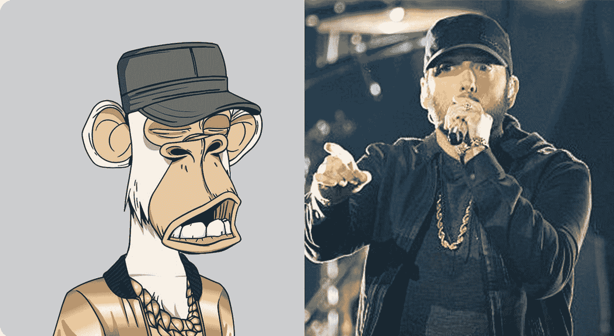

# 说唱歌手阿姆以 462 000 美元的价格卖给自己一只无聊的猿

> 原文：<https://medium.com/coinmonks/the-rapper-eminem-offered-himself-a-bored-ape-bayc-at-462-000-dollars-bae496741e68?source=collection_archive---------13----------------------->

这位底特律说唱歌手最近从 Bored Ape 游艇俱乐部花了 46.2 万美元(T1)购买了一个不可替代的令牌(NFT)。这件艺术品最初是根据这位说唱歌手在一场音乐会上的服装创作的。

## 阿姆加入了 BAYC 俱乐部