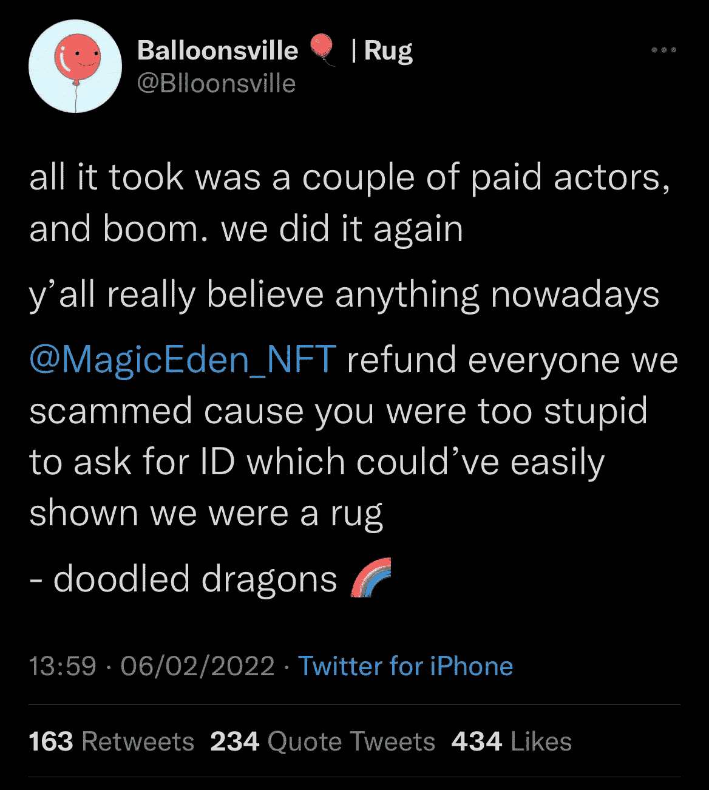

# 真正的风险

> 原文：<https://medium.com/coinmonks/the-real-risks-f1a91c8d3fcb?source=collection_archive---------10----------------------->

If **Balloonsville** got you…Jesus.

NFT 不是一个巨大的庞氏骗局，也不是一文不值的 JPEG——至少不是全部。我会把他们描述为网络开发和风险投资的蛮荒西部。所以，是的，我很乐观，并且充满了赞美的话语来描述这个生态系统。

只有两个突出的问题。

这是第一个多彩的英语:

这是骗子的春梦。

自从加入空间以来，我从未见过如此低的信任度。最后，在一片混乱中，许多人开始接受“去中心化”这个词的真实定义。

去中心化可以保证创造、交易和互动的自由。然而，如此迷恋这些概念，许多人忘记了这也适用于骗子。此外，人们偶尔会忘记，这意味着:

不存在消费者保护

(B)古老的格言“适者生存”非常适用。

这真的是狂野的西部。对于那些没有涉足这一资产类别的人来说，这是少数几个在经济背景下增长的资产之一&更有趣的是，加密熊市。例如，幻影钱包(在索拉纳区块链用于交易、交换和购买 NFT 的少数钱包之一)的日用户已经从 20 万增长到 200 万。

*八月以来*。

现在让我们来解释这个问题…地毯的问题。

# 什么是地毯/地毯拉手？

遇到“地毯”、“变得粗糙”和“有人拉地毯”都描述了在 NFTs 中被骗的相同过程。有两种典型的地毯。*缓慢的*拉动使大多数人和它的血淋淋的过山车的表亲，*硬*拉动。

**把*慢*拉。**

想象一下，当你分神跑去他当地的集市做买卖时，一个小偷慢慢地从你的脚边拉开地毯。

一个缓慢的项目——已经成功地销售了一个承诺(按照公布的路线图交付)——但交付不足，最终让一个“开发人员”团队带着你的一些钱跑了，直到一无所有。最终伪装会消失，并以光速消失。

很自然，这种发生的迹象创造了一个抛售狂潮，摧毁了 NFT 在二手市场(NFTs 的 eBays)的挂牌价格，毁掉了你的一个月和你的持有量。坦率地说，我要大胆地说，这占所有项目的 70%以上，并且还在增长，在 Solana 生态系统上启动。这里的每个人都非常熟悉它(不要说谎，它很重要)，这已经表现为对持有人不耐烦的总体趋势，许多人现在交易**量**而不是**项目**本身。

在这些方面给出我的经历对我来说似乎是不必要的，但是如果你想在评论中提到它们，请让我知道(我知道，很快就要热闹起来了！).它们如此普遍，令人沮丧，以至于包括我在内的许多人长期以来都倾向于在炒作的项目上采取翻转和倾斜的方式。

现在让我们来谈谈更有异国情调的东西。

***用力*拉。**

现在想象一下，一个小偷说服你站在上面，然后迅速拿走你脚上的一块地毯，让你一头撞在胶合板上。

这些看起来很搞笑，成为受害者会让人感到麻木和愤怒。

简而言之，硬地毯拉看到你误导相信一个项目是可行的，更糟糕的是，骗子突然使这一点非常清楚。

这是我见过的最好的，发生在不到一周前。我很幸运错过了这个。卖完之后不久，我就被告知路线图非常不可靠，“好像是一个孩子写的”…

这条精彩的推文紧随其后。

Doodled Dragons being another hard rug pull orchestrated by the same group of people, this group walked off with around half a million dollars. MagicEden, a secondary market that had some responsibility for advertising it, set out to refund those effected and contacted the FBI. No joke.

…

不出所料，新项目正在为这些不良行为者付出社会成本，其中许多项目不得不打消持有人对“Dox”或立即兑现数月计划的期望。

创伤后应激障碍患者。恐惧，不确定和怀疑。

调节一个由聪明而偏执(又英俊)的人组成的不和谐频道，现在是一个报酬颇丰的副业，也是理所应当的。

## 那么 Doxxing 是什么？

这里有一个半的故事，可以充分说明它的破坏力。

包括我在内，有一千人买《NFT X》。该 NFT 承诺资助一家企业对企业数据分析初创公司，该公司有效地帮助中小型企业以可承受的价格订阅和分析他们的销售、用户活动和其他数据跟踪，以做出明智的管理决策。

NFT X '还声称在 IPO 后可以合法地交换该公司的股票，折扣率对应于所购买的 NFT 的稀有程度。

最后，其中一个开发商是完全 Doxxed，即他的大致位置，他的名字和他过去的大学(一个众所周知的)都是附属于该项目，并完全可见的公众，不坏，对不对？。

这次错了。这个资本 M-Moron，开始在他的时间表上欠发，跳过 AMAs，取出 13 万美元，同时关闭了他的 LinkedIn，Twitter 的部分内容，最终导致所有持有人恐慌的整个不和谐。他还让一群自由工作者无偿工作了几个月。不开玩笑。

**那么我们能做些什么呢？**

通常你会被迫吞下愤怒，记下一些教训，然后继续前进。但是由于一些可爱的 doxxing，我有一个独特的特权选择。舔伤口或者报复。事后看来，这是显而易见的，我们闪电战了一些人的生命。

多亏了 LinkedIn，我和另外 4 个德根一起瞄准了他们的一份工作。他被解雇，并从公司网站(lmao)上撤下。除此之外，我还参与起草和发送了一些电子邮件，虚张声势地寻求法律行动和一份新闻稿，“要求大学发表声明”(lmfao 他们希望尽快解决)，他的个人社交媒体账户受到骚扰，他的朋友被发送了证明确实有一名配偶进行诈骗的文件。

几个人虚张声势，付了一个保加利亚自由侦探五块钱，然后，他回到了牌桌。

我设法成功地与这些白痴中的一个谈判解决，虽然没有帮助所有人，但让其他几个人和我离开了地狱，在我们这边的一些承诺后，我们的钱回来了。

不幸的是，事实证明这些承诺可能是一个伪 NDA(我们几乎握了手🤝)，所以为了安全起见，我将跳过发布一些有趣的截图或披露其创始人的身份。尽管给我发消息，如果你想要廉价的笑声，我会很高兴地模糊的名字。

唉，谁知道不和谐服务器上的书面协议会不会转化成新加坡的法律，更别说我所在的地方了…哇呜…

## **收尾**

宏观，我看到索拉纳舔伤口长大。越来越多的人亏本卖垃圾，根本不买垃圾，或者买更多优质项目。过去 60 天的歇斯底里——我将称之为“*轻率*”——正在降温，这个月为我们所有人敲响了警钟。

我认为解决方案已经浮出水面。社区需要自己做更深入的研究。

被骗是不可避免的，这是狂野的西部，记得吗？

但是，如果你能让你的赢变得有力，让你的输变得不痛不痒，那么从数学上来说，这个生态系统肯定会让你的钱包充满秘密的祝福。

而且不像这个空间的 70+%,数学从不说谎。

附注:我会就第二个突出的问题做单独的文章。

这里有一个提示:“这是另一种意大利面……”

> 加入 Coinmonks [电报频道](https://t.me/coincodecap)和 [Youtube 频道](https://www.youtube.com/c/coinmonks/videos)了解加密交易和投资

# 另外，阅读

*   [德国最佳加密交易所](https://coincodecap.com/crypto-exchanges-in-germany) | [Arbitrum:第二层解决方案](https://coincodecap.com/arbitrum)
*   [币安交易机器人](/coinmonks/binance-trading-bots-d0d57bb62c4c) | [OKEx 评论](/coinmonks/okex-review-6b369304110f) | [Atani 评论](https://coincodecap.com/atani-review)
*   [最佳加密交易信号电报](/coinmonks/best-crypto-signals-telegram-5785cdbc4b2b) | [MoonXBT 评论](/coinmonks/moonxbt-review-6e4ab26d037)
*   [如何在 Bitbns 上购买柴犬(SHIB)币？](https://coincodecap.com/buy-shiba-bitbns) | [买弗洛基](https://coincodecap.com/buy-floki-inu-token)
*   [CoinFLEX 评论](https://coincodecap.com/coinflex-review) | [AEX 交易所评论](https://coincodecap.com/aex-exchange-review) | [UPbit 评论](https://coincodecap.com/upbit-review)
*   [十大最佳加密货币博客](https://coincodecap.com/best-cryptocurrency-blogs) | [YouHodler 评论](https://coincodecap.com/youhodler-review)
*   [AscendEx 保证金交易](https://coincodecap.com/ascendex-margin-trading) | [Bitfinex 赌注](https://coincodecap.com/bitfinex-staking)
*   [最好的卡达诺钱包](https://coincodecap.com/best-cardano-wallets) | [Bingbon 副本交易](https://coincodecap.com/bingbon-copy-trading)
*   [印度最佳 P2P 加密交易所](https://coincodecap.com/p2p-crypto-exchanges-in-india) | [柴犬钱包](https://coincodecap.com/baby-shiba-inu-wallets)