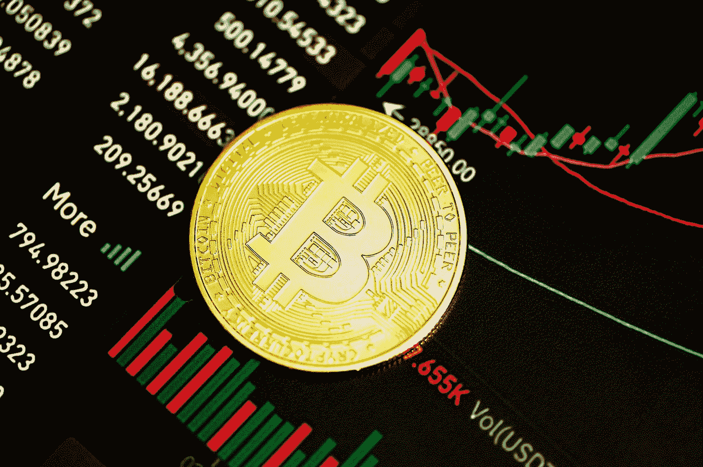

# 比特币可能永远不会突破 100 万美元大关的原因

> 原文：<https://medium.com/coinmonks/the-reason-why-bitcoin-may-never-hit-the-1-million-mark-76a08681aae7?source=collection_archive---------27----------------------->

2019 年初，一位被称为 B 计划的荷兰分析师推广了一个用于预测资产未来价值的概念。这个概念被称为库存-流动模型。基于这一模型，比特币将在 2025 年 7 月达到 100 万美元大关。

S2F 模式有稀缺性和供给性作为基础。根据该模型，当比特币这样的资产类别的供应量减少时，其价值不可避免地会呈指数级上升。

Photo by [Kanchanara](https://unsplash.com/@kanchanara?utm_source=medium&utm_medium=referral) on [Unsplash](https://unsplash.com?utm_source=medium&utm_medium=referral)

# 库存-流量公式

确定资产的 S2F 的公式非常简单，比火箭科学容易得多。S2F 值是 BTC 的流通供应量(存量)除以每年的产量(流量)的结果。根据这一概念，比特币的价值将不断增加，有一天可能会达到 100 万美元。

目前流通供应量为 1890 万，每年开采 328500 个比特币，BTC 的 S2F 值目前为 57.7。按照这个数值，按照目前的开采速度，生产 1890 万 BTC 大约需要 57.7 年。

更有甚者，比特币每四年减半一次。最终减半将在 2024 年左右进行。减半意味着可开采的比特币数量减少到之前的一半。因此，在这种情况下，预计在减半后，BTC 的年产量将仅为 164250 BTC，而不是 328500 BTC。这将助长比特币的稀缺性。

# **库存到流量模型的局限性**

有趣的是，在过去的两年里，S2F 模型已经被用来对 BTC 的价值进行近乎精确的预测。然而，这个模型有一些局限性，在某些情况下不够准确。该模型也没有考虑影响比特币价格的其他几个因素。

**需求和供给还是只有供给？**

基础经济学认为，需求和供给决定了资产的价格。当一项资产需求高而供给低时，价值就会“波动”然而，S2F 模型并没有解释比特币的需求。它仅仅依赖于数字资产的有限供应。

大约十年前，比特币是唯一现存的加密货币。然而，今天有成千上万的其他加密资产。这些加密资产中有许多比比特币有更好的使用案例。因此，比特币的预期未来需求受到了质疑。如果存在解决比特币所解决的同样问题的其他资产，顶级数字货币的需求还会很高吗？毫无疑问，稀缺性本身并不足以成为一项资产被高价的理由。一件没人要的稀缺物品，和没用一样。

**极端波动和黑天鹅事件**

S2F 模型没有考虑极端波动和不可预见的不利事件。例如，当新冠肺炎疫情在 2020 年 3 月变得激烈时，股票市场崩溃了，比特币的价格也崩溃了。像这样的严重事件通常会导致负面波动，导致 BTC 和类似资产的价值大幅下跌。使用 S2F 模型做出的预测没有给出这些的空间。

# **另类模式？**

S2F 模型预测，到 2021 年，比特币的价值将达到 10 万美元。另一个被称为基于时间的模型的模型预测到 2021 年 12 月 BTC 会有 3 万美元。有趣的是，这些预测都没有准确实现。去年 12 月，比特币的交易价格从 4.7 万美元左右升至 5.6 万美元。

没有任何模型可以用来准确确定比特币或任何其他金融资产的未来价格。分析师在进行价值预测时，将两个或三个模型结合起来会更安全。也许，在未来几年内，比特币最终会达到 10 万美元的里程碑。

> 加入 Coinmonks [电报频道](https://t.me/coincodecap)和 [Youtube 频道](https://www.youtube.com/c/coinmonks/videos)了解加密交易和投资

# 另外，阅读

*   [加密复制交易平台](/coinmonks/top-10-crypto-copy-trading-platforms-for-beginners-d0c37c7d698c) | [Coinmama 审核](/coinmonks/coinmama-review-ace5641bde6e)
*   [印度的加密交易所](/coinmonks/bitcoin-exchange-in-india-7f1fe79715c9) | [比特币储蓄账户](/coinmonks/bitcoin-savings-account-e65b13f92451)
*   [OKEx vs KuCoin](https://coincodecap.com/okex-kucoin) | [摄氏替代品](https://coincodecap.com/celsius-alternatives) | [如何购买 VeChain](https://coincodecap.com/buy-vechain)
*   [币安期货交易](https://coincodecap.com/binance-futures-trading)|[3 comas vs Mudrex vs eToro](https://coincodecap.com/mudrex-3commas-etoro)
*   [如何购买 Monero](https://coincodecap.com/buy-monero) | [IDEX 评论](https://coincodecap.com/idex-review) | [BitKan 交易机器人](https://coincodecap.com/bitkan-trading-bot)