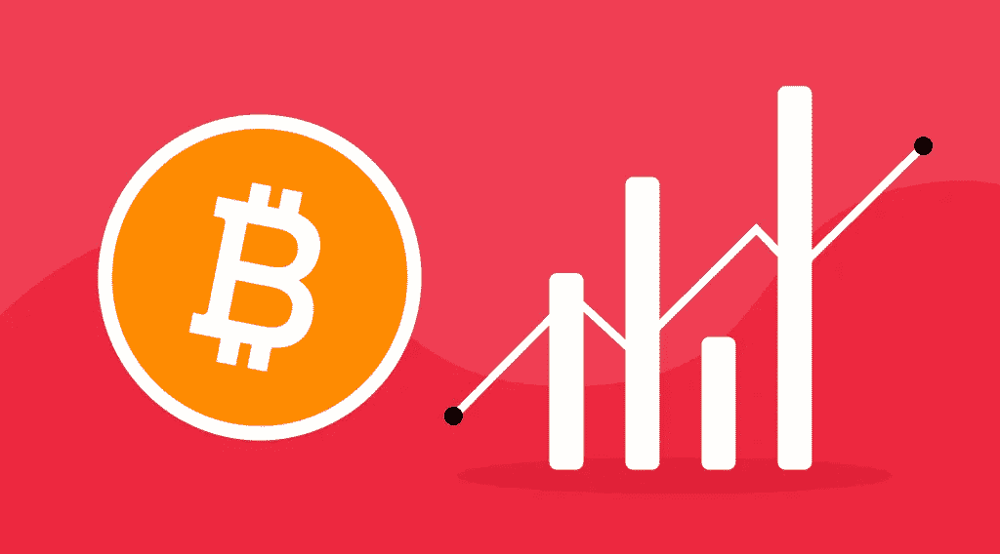
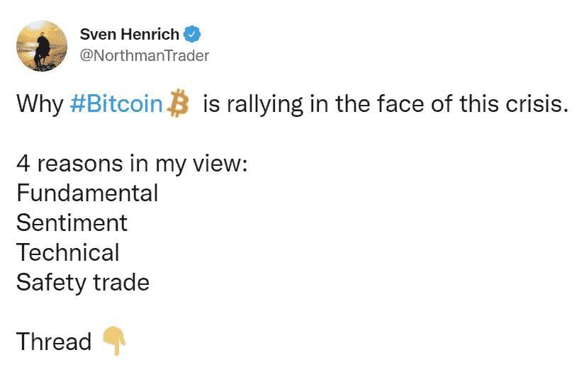

# 加密货币汇率增长的原因

> 原文：<https://medium.com/coinmonks/the-reasons-for-the-growth-of-the-cryptocurrency-rates-7a951102c3a8?source=collection_archive---------82----------------------->

尽管金融市场不稳定，但比特币社区在危机面前重整旗鼓。分析公司 NorthmanTrader Sven Henrich 的创始人兼主要市场策略师在推特上表示:“这是因为战争、加密与传统金融的相关性降低、比特币在世界上的接受程度以及区块链的匿名原则。”。

他认为这种趋势有四个主要原因:

1.  根本原因是比特币的全球采用将继续扩大。亨利克举了在线零售商易贝愿意开始接受加密货币支付的例子，以及机构主义者的兴趣。此外，在这个方向上没有倒退。
2.  “感性”原因:乌克兰战争表明，在传统金融不可用的环境下，比特币如何能够充当筹款的辅助机制。因此，区块链和分散融资变得越来越重要。
3.  技术原因:在 2 月份，比特币价格达到的最低值高于股票价格，从而表现出积极的背离和对关键趋势的保护。"相关性下降的开始？"专家问道。
4.  第四个原因是安全交易。受制裁的投资者可以将比特币作为“避风港”，尽管其他分析师认为，借助加密货币避免制裁的破坏性影响将是不可能的。

“从更大的角度来看，我们发现比特币仍然存在。它存在的理由越来越得到证实，而法定货币的世界需要越来越多的干预才能维持下去，”斯文·海因里希总结道。

# 制裁和加密货币

对加密货币将避免制裁的破坏性影响的担忧是没有根据的。俄罗斯经济已经受到美国、欧盟、英国、加拿大和其他国家的打击。在这种背景下，俄罗斯联邦中央银行将其关键利率提高到 20%，莫斯科证券交易所关闭。

专家认为，俄罗斯的立场不同于伊朗、委内瑞拉和朝鲜，这些国家在一定程度上成功避免了制裁。由于经济打击的规模和虚拟资产的引入有限，回旋的余地要小得多。

“移动大量加密货币并将其转换为合适的货币非常困难。区块链公司 TRM Labs 的法律和政府事务主管阿里·雷德博德(Ari Redbord)表示:“俄罗斯将无法使用加密货币来取代可能被冻结或冻结的数千亿美元。”。

将采取措施打击借助加密货币规避制裁的行为，这进一步加剧了这种情况。Bieda 表示，由于所有交易都被永久记录在区块链上，任何可疑账户的活动都可以被跟踪。

## 重点转向加密挖掘

如果加强对能源部门的制裁，我们可能会预计过剩的石油和天然气将被用于生产加密货币。分析公司 Elliptic 的创始人汤姆·罗宾逊并不排斥这种选择。

“加密货币采矿将允许他们在全球市场上货币化他们的能源储备，而不用把它们带到国外，”罗宾逊说。但是对于这样一个大国来说，这只是沧海一粟。

# 世界经济去美元化？

总的来说，乌克兰战争可能会永远改变金融世界——它将刺激人们转向加密货币和国家货币。在未来，这将导致世界经济的去美元化。

投资公司银河数字控股[的董事迈克·诺沃格拉茨向彭博表达了这样的观点。他认为，比特币与卢布和格里夫纳成对交易的激增，证实了在传统银行服务有限的情况下，去中心化的货币可以成为金融避风港。](https://www.bloomberg.com/news/articles/2022-03-02/-why-bitcoin-was-created-novogratz-sees-war-blunting-dollar)

根据彭博的数据，到 3 月 1 日，比特币与标准普尔 500 股指的相关性从 2022 年初的 0.7 降至 0.55。这表明主要的加密货币已经摆脱了风险资产的地位，现在是一种与广阔市场无关的价值储存手段。

一些分析师认为，西方国家对俄罗斯银行、公司和寡头的制裁，以及随后的经济危机，将刺激虚拟资产的快速增长。

此外，这位美国亿万富翁认为，中国可以从对美元的依赖中吸取教训。值得注意的是，北京支持乌克兰的主权、独立和领土完整。

> *“我要告诉你一件事:在你入侵台湾之前，你需要卖掉你的储备。这在很多方面都非常重要。这将开始加速世界的去美元化”*

# 比特币汇率要变了

“空头”认为，来自俄罗斯的进一步升级将导致贬值。随着抛售势头减弱，多头预计会出现新一轮反弹。但除了地缘政治形势，美国美联储加息也可能对加密行业造成打击。

一些投资者表示，美国上调基准利率的风险被低估了。他们坚持认为，美联储可以做出艰难的决定。

其他人认为，美联储官员有回旋余地，可以做出软决定。在此背景下，降低加息预期将对包括加密货币在内的风险资产产生积极影响。

策略师注意到市场上弥漫着看跌情绪——在新冠肺炎疫情开始时也观察到了类似的情况。对此，怀疑者不排除情况恶化，继续销售。

专家认为，高风险资产市场在入侵乌克兰前不久触底，但不认为美俄之间会开始全面冷战。因此，投资者(包括加密货币)更有可能看到新的反弹。

专家指出，对于长期投资者来说，即使是提款也可能是一个好兆头，因为这类资产的高波动性将导致它们的增长。

最后，如果你决定加入加密社区，你可以开始在[即时加密交易所 StealthEX](https://stealthex.io/) 购买自己的硬币。这项服务免注册，不将用户的资金存放在平台上。

去[偷 X](https://stealthex.io/?from=btc&to=eth&amount=0.1) 就行了。打开[“购买”密码](https://stealthex.io/?amount=100&from=usd&to=btc)窗口，而不是自动加载的“兑换”。

1.  然后选择法定货币，并选择您想要购买的加密货币。比如，美元兑 [BTC 兑](https://stealthex.io/coin/btc)。
2.  输入您的加密钱包地址。
3.  同意 StealthEX 的服务条款。首次购买 crypto 时，您需要确认您的身份并输入 Mercuryo 系统要求的数据。一旦所有提供的信息将被确认，您将能够购买加密，而无需通过这一程序了。
4.  就是这样！您的交易将开始！

在 [Medium](https://stealthex-io.medium.com/) 、 [Twitter](https://twitter.com/Stealthex_io) 、 [Telegram](https://t.me/StealthEX) 、 [YouTube](https://www.youtube.com/channel/UCeES_XBesX76ge7xf1meuSw) 和 [Reddit](https://www.reddit.com/user/Stealthex_io) 上关注我们，获取 [StealthEX.io](https://stealthex.io/) 更新和关于加密世界的最新消息。

此处表达的观点和意见仅代表作者个人。每一次投资和交易都有风险。做决定时，你应该进行自己的研究。

非常欢迎您访问 [**StealthEX 交易所**](https://stealthex.io/) **，看看它有多快多方便**。

*原载于 2022 年 3 月 9 日*[*https://stealthex . io*](https://stealthex.io/blog/2022/03/09/the-reasons-for-the-growth-of-the-cryptocurrency-rates/)*。*

> 加入 Coinmonks [电报频道](https://t.me/coincodecap)和 [Youtube 频道](https://www.youtube.com/c/coinmonks/videos)了解加密交易和投资

# 另外，阅读

*   [火币的加密交易信号](https://coincodecap.com/huobi-crypto-trading-signals) | [HitBTC 审查](/coinmonks/hitbtc-review-c5143c5d53c2)
*   [如何在 FTX 交易所交易期货](https://coincodecap.com/ftx-futures-trading) | [OKEx vs 币安](https://coincodecap.com/okex-vs-binance)
*   [OKEx vs KuCoin](https://coincodecap.com/okex-kucoin) | [摄氏替代品](https://coincodecap.com/celsius-alternatives) | [如何购买 VeChain](https://coincodecap.com/buy-vechain)
*   [ProfitFarmers 回顾](https://coincodecap.com/profitfarmers-review) | [如何使用 Cornix Trading Bot](https://coincodecap.com/cornix-trading-bot)
*   [如何匿名购买比特币](https://coincodecap.com/buy-bitcoin-anonymously) | [比特币现金钱包](https://coincodecap.com/bitcoin-cash-wallets)