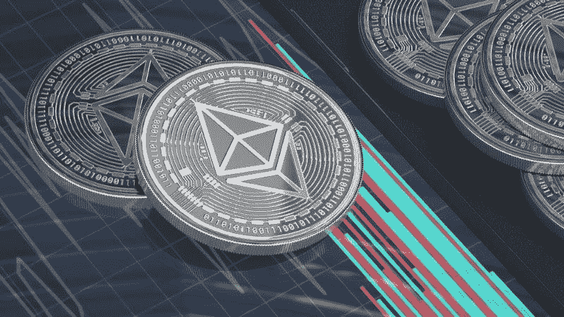
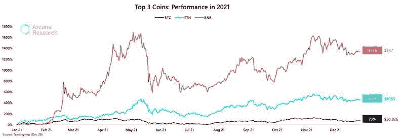
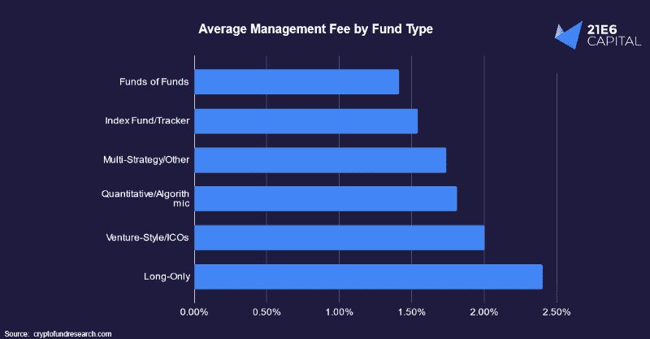

# 基金的基金的重生

> 原文：<https://medium.com/coinmonks/the-rebirth-of-the-fund-of-funds-fff4a526ecb0?source=collection_archive---------9----------------------->

作为一种投资和任何投资组合的有效补充，比特币的话题现在比以往任何时候都更有意义。问题是，一个人是否已经通过纯比特币投资获得了足够的加密敞口，从而充分利用了这一新资产类别的潜力。以太坊作为第二大加密资产，2021 年显著跑赢比特币；性能差距接近 400%[1]。本文的目的是简要介绍以太坊，并解释投资者如何以最多样化、最节省成本和风险最小化的方式投资其他加密资产，同时又不损失高回报。

*作者:马克西米利安·布鲁克纳教授，菲利普·桑德纳博士*

# 以太坊胜过比特币！以太坊是什么？

以太坊的市值超过 3800 亿欧元，是世界上第二大加密资产，比第三名高出约 3000 亿欧元。都在 20221 年跑赢了比特币(图 1)。

Figure 1: Ethereum (blue) and Binance Coin (red) clearly outperformed Bitcoin (black) in 2021 (Source: Arcane Research)

但是以太坊到底是什么呢？以太坊区块链的基本架构与比特币非常相似，但有一个关键的区别:“Solidity”等专有编程语言允许开发人员编写所谓的“智能合约”，并在以太坊区块链上运行。智能合同是一种软件形式的合同，只要满足程序中规定的条件，它就会自动执行合同协议。这消除了传统合同中经常出现的一些成本和延迟，因为不需要中间人来验证合同条款的合规性，这要归功于编程的规则集和区块链技术。但是以太坊的可编程性并没有就此结束。**就像智能手机的操作系统(如苹果的 iOS 或谷歌的 Android)，以太坊是一个操作系统，应用程序(apps)可以建立在这个操作系统的基础上。以太坊是此类应用的生态系统，可用于为这些应用创建新的特定于应用的加密货币。**在排名前 200 的加密货币中，有 92 种是基于以太坊的[2]。

# 该市场与比特币和以太坊相关

这在一定程度上是因为比特币和以太坊合起来约占加密市场总资本的 60%。**一个比特币和以太坊的牛市影响整个密码市场，前 20 名的皮尔逊相关系数往往在 0.60 以上** [3]。面对比特币挤兑，低市值加密资产的收益通常要高得多。它们在几天(或几小时)内达到 50%，有时达到 100%或更多。这里没有上限。但这些高回报也伴随着高风险——飞得越高，摔得越低。如果比特币价格下跌几个百分点，这些低市值的加密资产也会下跌得更快。由于市场与比特币和以太坊价格的强烈相关性，乍一看，投资比特币和以太坊的权重为 50/50，而忽略其他权重似乎是一个不错的策略，因为它们反正是相关的。然而，这种策略存在一些问题。首先，直接向比特币和以太网投入更多资金并不容易。有一些监管障碍需要克服，人们必须获得非常具体的法律知识。尽管从法律、税收和监管角度来看，各种证书、etp 和 ETF 允许更容易的进入，但投资者以高于平均水平的高费用为这种容易进入付出了沉重代价。其次，在纯比特币-以太坊策略中，人们会将自己暴露在特定于加密的系统风险中。第三，我们不应该忘记比特币和以太坊继续表现出高波动性。

# 加密基金以一种熟悉的形式提供了新的机会

通过密集的内部研究和对加密资产的严格关注，专业基金可以克服和避免前面提到的一些障碍和风险。**比如，通过分散投资，他们可以规避纯比特币——以太坊策略的系统性风险，降低波动性。**此外，与通过上一段提到的金融工具进行的直接投资相比，加密基金可以提供更好的 ESG 余额(例如通过直接碳抵消)。由于比特币的环境影响最近成为一个主要的批评点，这对许多投资者来说很重要。加密基金还处理这些资产的复杂托管，对基金等知名工具的投资过程不需要特殊的法律或税务专业知识，例如直接购买比特币和以太币。

# 加密基金领域目前由大约 1000 只基金组成

这些基金中有一半是非流动性风险投资基金。根据投资目标，这些非流动性策略应该被忽略，以利于剩余的 500 个流动性基金。其余基金的市场敞口、风险状况和成本结构也各不相同。主动管理型基金在这种早期市场环境中具有一些优势，如果管理得当，它们通常会遵循独特的策略。因此，投资者应该寻找真正有价值的基金，而不是投资于高成本的一般策略。例如，对于持续大量投资比特币和以太网的基金，投资者不应接受每年 2%的高成本以及高达 20%的绩效费。与比特币或以太网的直接投资相比，这类基金实际上没有提供多少附加值。相反，投资范围广、策略清晰的基金值得一看。此外，还有一些采用风险最小化策略的秘密基金，它们利用市场的低效率而不承担方向性风险。例如，在 2021 年，一些基金能够利用一些投资者的高风险偏好，通过现货市场出售杠杆衍生品和对冲风险。这是可能的，因为投资者仍然愿意为加密市场中的杠杆产品支付巨额溢价，这造成了专业基金可以利用的市场低效率。在这样一个年轻的市场，这些基金提供了在股票市场很难找到的风险回报概况[4]。

# 基金中的秘密基金呈现出一种中间立场

分析 500 个流动加密基金需要深入的金融和加密知识。在这种情况下，聘请外部机构来帮助选择加密基金是有意义的。出于这个原因，基金的基金正在经历复兴。它们为专业投资者提供相对保守的风险状况，并通过事先筛选重要的 IT 和其他风险来保护投资者免受违约，这些风险是 crypto 特有的，因此对大多数投资者来说仍然是陌生的。**一些基金实现了类似于股票投资的风险组合，同时仍承诺更好的回报。**此外，基金的基金有能力以低成本为专业投资者提供出色的分散投资，即使投资贡献相对较低。由于同样的低投资贡献，这种多样化不能通过投资个别基金来实现，因为它们的最低认购额。此外，基金中的基金通常会获得有利于投资者的特殊条件，至少部分补偿了基金中的基金结构的额外成本。

Figure 2: Crypto fund of funds have the lowest average management fee amongst all types of crypto funds.

**结论:**从投资者的角度来看，基金中的加密基金——由于其诱人的风险调整后回报，尤其是由于其通过策略多样化更好地控制最大损失的可能性——应得到更多关注。

# 关于 21e6 Capital AG

21e6 Capital 是一家瑞士投资顾问公司，为专业投资者提供最佳加密投资产品。21e6 Capital 已经分析了全球 1000 多只加密基金，并将其浓缩为一个精选，可以在最大限度降低下行风险的情况下产生加密风险。21e6 Capital 拥有一支经验丰富的加密和金融专家团队，他们在数字资产和 DLT 方面有着深入的知识，在此团队的支持下，21e 6 Capital 创建了一个独特的量化策略，旨在实现类似加密的回报，同时将全球股票水平的风险和波动性降至最低。21e6 资本团队建立在强大的学术基础之上，拥有领先的加密资产和分散金融出版物和研究的记录，确保为金融行业专业人士提供最先进的加密投资解决方案。

# 关于作者

***马克西米利安·布鲁克纳*** *在*[*21e 6 Capital AG*](https://assets.21e6.io/)*担任营销&销售主管。在此之前，他被聘为国际令牌标准化协会 e . V .**的执行理事。在那里，他根据国际令牌分类框架专注于加密资产的深入研究和分类。他积极参与创建了世界上最大的代币分类数据库。Maximilian 毕业于法兰克福金融与管理学院，在 Philipp Sandner 教授的指导下撰写了关于“令牌数据库的用例”的论文。您可以通过电子邮件联系 Maximilian，电子邮件地址为*[*Maximilian . bruckner @ 21e6 . io*](mailto:maximilian.bruckner@21e6.io)*，索取更多关于 21e 6 的信息或询问有关本文的任何问题。也可以在*[*LinkedIn*](https://www.linkedin.com/in/max-bruckner/)*(*[*https://www.linkedin.com/in/max-bruckner/*](https://www.linkedin.com/in/max-bruckner/)*)上关注马克西米利安，保持最新状态。*

***Philipp Sandner 博士*** *教授创办了法兰克福学派区块链中心(***)。2018-2021 年，被德国主要报纸《法兰克福汇报》(Frankfurter Allgemeine Zeitung，FAZ)评为*[*【30 强】经济学家*](https://t.sidekickopen87.com/s3t/c/5/f18dQhb0S7kF8cpmrkVr4RpG59hl3kW7_k2841CX6NGW36PLkb1DWFGZN1Dh2LLg4ZcWf197v5Y04?te=W3R5hFj4cm2zwW4mKLS-3M0j6bW41RkwN3zcKSrW3K6jCB4mCWPMW4cHc2t3M84zZW3T30bh3F7xMzW4fNrs_4cPTnzW1Lxc331GLryyW3K5Wql43T9x2W49HS6G3T1k6SW1S1nmr1GznmZW1GJ1g23K6jDBW41nX311Y-gRrF1--VSgS6TW1&si=8000000020483768&pi=8ade3d9e-01b0-4158-de77-3df023d454ee) *。此外，他属于“40 岁以下前 40 名”——德国商业杂志《资本》的排名。他曾是德国联邦财政部*[*fin tech Council*](https://www.haufe.de/finance/steuern-finanzen/bmf-gruendet-fintechrat_190_409208.html)*和* [*数字金融论坛*](https://t.sidekickopen87.com/s3t/c/5/f18dQhb0S7kF8cpmrkVr4RpG59hl3kW7_k2841CX6NGW36PLkb1DWFGZN1Dh2LLg4ZcWf197v5Y04?te=W3R5hFj4cm2zwW4mKLS-3Cgqz8W3K9cqD41PG6bW3_VrpL4cQgTgW3T4d-K3H4Mr9W43TDjD41YsBvW2xwpn03zdYT5W49K3q24fJfGLW3ZsK4M3K6KvbW1Ljf0j3K8QFNW4fJg0T3zd5_XW3t_cjv3zd-PDW3zgDn81Lg8bcW3T3Qtl1GkW7dW3zdYNr1GkWGMW4hJmP-3S-q0dW3zd14b3T1jDCW3F6bN843Whj1W1GF6FW3P3pmLW3H4Tjq3R5h120&si=8000000020483768&pi=8ade3d9e-01b0-4158-de77-3df023d454ee) *的成员。他也是*[*FiveT fin tech Fund*](https://t.sidekickopen87.com/s3t/c/5/f18dQhb0S7kF8cpmrkVr4RpG59hl3kW7_k2841CX6NGW36PLkb1DWFGZN1Dh2LLg4ZcWf197v5Y04?te=W3R5hFj4cm2zwW3M3DBh4fdHZSW3_rh9h4kCJycF3M3CVFQs4J1&si=8000000020483768&pi=8ade3d9e-01b0-4158-de77-3df023d454ee)*、*[*21e 6 Capital*](https://t.sidekickopen87.com/s3t/c/5/f18dQhb0S7kF8cpmrkVr4RpG59hl3kW7_k2841CX6NGW36PLkb1DWFGZN1Dh2LLg4ZcWf197v5Y04?te=W3R5hFj4cm2zwW3zh2yr4fNk1WF1QsWmxmM4N1&si=8000000020483768&pi=8ade3d9e-01b0-4158-de77-3df023d454ee)*和*[*block chain Founders Group*](https://t.sidekickopen87.com/s3t/c/5/f18dQhb0S7kF8cpmrkVr4RpG59hl3kW7_k2841CX6NGW36PLkb1DWFGZN1Dh2LLg4ZcWf197v5Y04?te=W3R5hFj4cm2zwW3K726T3ZZmPcW3F7xMD41n_LkW4hJTXV49Rd2y348V2&si=8000000020483768&pi=8ade3d9e-01b0-4158-de77-3df023d454ee)*的董事会成员，这些公司积极参与区块链初创公司的风险投资融资和加密资产投资管理。**

## *参考资料:*

*[1] [彭博，2021](https://www.bloomberg.com/news/articles/2021-11-30/ethereum-outperforms-bitcoin-by-the-most-since-its-inception)
【2】[国际代币标准化协会 e.V .，2020](https://my.itsa.global/)
【3】[比特币瑞士研究，2020；](https://www.bitcoinsuisse.com/research/decrypt/shifts-in-cryptocurrency-markets) [Cryptowat.ch，2021](https://cryptowat.ch/)
【4】[21e 6 Capital AG，2021](https://assets.21e6.io/)；[cryptofundresearch.com，2021 年](https://cryptofundresearch.com/)*

> **加入 Coinmonks* [*电报频道*](https://t.me/coincodecap) *和* [*Youtube 频道*](https://www.youtube.com/c/coinmonks/videos) *了解加密交易和投资**

# *另外，阅读*

*   *[Bookmap 评论](https://coincodecap.com/bookmap-review-2021-best-trading-software) | [美国 5 大最佳加密交易所](https://coincodecap.com/crypto-exchange-usa)*
*   *最佳加密[硬件钱包](/coinmonks/hardware-wallets-dfa1211730c6) | [Bitbns 评论](/coinmonks/bitbns-review-38256a07e161)*
*   *[新加坡十大最佳加密交易所](https://coincodecap.com/crypto-exchange-in-singapore) | [购买 AXS](https://coincodecap.com/buy-axs-token)*
*   *[红狗赌场评论](https://coincodecap.com/red-dog-casino-review) | [Swyftx 评论](https://coincodecap.com/swyftx-review) | [CoinGate 评论](https://coincodecap.com/coingate-review)*
*   *[投资印度的最佳密码](https://coincodecap.com/best-crypto-to-invest-in-india-in-2021)|[WazirX P2P](https://coincodecap.com/wazirx-p2p)|[Hi Dollar Review](https://coincodecap.com/hi-dollar-review)*