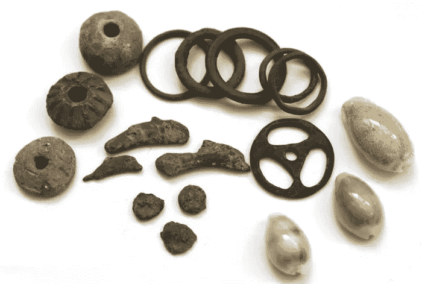

# 第五部分:回归定理和原始货币悖论

> 原文：<https://medium.com/coinmonks/the-regression-theorem-and-proto-money-paradox-9747550392f5?source=collection_archive---------41----------------------->

这是我的系列文章的第 5 部分，我从奥地利经济学的角度来审视比特币。在他的部分，我探讨了米塞斯的回归定理和原始货币之间的悖论。在这里阅读其他部分:

*第一部分:* [*奥地利经济学简介*](https://satoshibaggins.medium.com/introduction-to-austrian-economics-54adae65d38b?source=your_stories_page-------------------------------------) *第二部分:* [*货币的起源*](https://satoshibaggins.medium.com/origin-of-money-e04e756578e7) *第三部分:* [*货币的功能和性质*](https://satoshibaggins.medium.com/the-function-and-properties-of-money-975c8f52857)

*第四部分:* [*透过奥地利经济学的镜头看比特币的出现*](https://satoshibaggins.medium.com/the-emergence-of-bitcoin-through-the-lens-of-austrian-economics-36cf7bcd09ff)

*第五部分:* [*回归定理和原型货币悖论*](http://the%20regression%20theorem%20and%20proto%20money%20paradox/)

*第六部分:* [*比特币与回归定理*](https://satoshibaggins.medium.com/bitcoin-and-the-regression-theorem-2d290167ccf1) *第七部分:* [*比特币的畅销*](https://satoshibaggins.medium.com/salability-of-bitcoin-845f393ec844)

—

在米塞斯将价值的主观理论应用于货币之前，奥地利经济学家在解释货币价值的尝试中经历了循环:货币之所以有价值，是因为你可以用它交换商品，你可以用它交换商品，是因为它有价值。

米塞斯在门格尔的最畅销商品理论的基础上，引入了他的回归定理。该定理解释说，货币的价值可以用它未来的购买力来解释，个人可以推测它的购买力，因为他们昨天观察了它的购买力。

回归定理解释了商品如何作为交换媒介获得原始需求。根据这个定理，在积累交换媒介需求之前，一件商品必须有一个优先的产生价值的直接用途。简而言之，该定理表明货币商品的购买力回归到直接使用需求。

这种回归会一直持续到商品因直接消费而被估价的那一天，也就是说，为商品本身而估价的那一天。Guido Hülsmann 解释说，最初为商品的非货币用途支付的价格使购买者能够估计这些商品的未来销售价格。在不知道商品过去价格的情况下购买商品进行间接交易是非常危险的，因此，当缺乏这方面的知识时，交易媒介就无法出现。

值得注意的是，交换媒介之所以成为货币，不是因为它们的直接效用(消费)，而是因为它们的可销售性(流动性)。许多商品被用作货币，直到它们被停止流通，因为一种新的、更畅销的、交易成本更低的货币出现了。构成畅销商品的属性将在后面的文章中讨论

# 古代原始货币

历史告诉我们，一些看似无用的物品被用作货币职能，就像具有直接效用的消费品一样。这些对象通常具有包括稀缺性、可分性和持久性在内的特征。这些物品的一些共同特征是漂亮、耐用、稀有和便于携带。Szabo 指出，它们的安全特征是它们经常被穿着，小偷很难偷到。这些物品可以被携带、掩埋，而且它们可以延续几代人的财富转移。这些商品似乎缺乏任何消费用途，出于装饰的原因而受到欢迎。

虽然它本身不能被认为是货币，但它们具有一些与交换媒介相同的货币功能:几代人之间的长期交换，有时也是不太友好的部落之间的交易。这些原始货币后来获得了更多的采用，它们作为主要的长期交换媒介的用途得到了进一步的发展。门格尔自己也想知道这些看不到用途的小圆盘的本质是什么，尽管如此，它们还是在个人之间被用来交换消费品。

# 悖论

回归定理的上述解释和观察到的历史之间似乎有一个内在的悖论。如果没有直接使用的价值，商品就不可能以货币的形式出现。我们有三个选择，要么:

*   米塞斯定理是错误的
*   米塞斯定理被解读错误
*   原始货币的历史是不准确的

*在* [*第六部分*](https://satoshibaggins.medium.com/bitcoin-and-the-regression-theorem-2d290167ccf1) *中，我将考察自由市场货币比特币的出现如何符合回归定理。*

> 加入 Coinmonks [电报频道](https://t.me/coincodecap)和 [Youtube 频道](https://www.youtube.com/c/coinmonks/videos)了解加密交易和投资

# 另外，阅读

*   [最佳加密交换平台](https://coincodecap.com/best-crypto-swap-platforms) | [最佳加密交易所](https://coincodecap.com/crypto-exchange)
*   [购买比特币印度](/coinmonks/buy-bitcoin-in-india-feb50ddfef94) | [Pionex 评论](/coinmonks/pionex-review-exchange-with-crypto-trading-bot-1e459d0191ea) | [加密交易机器人](/coinmonks/crypto-trading-bot-c2ffce8acb2a)
*   [n 平均零点评审](/coinmonks/ngrave-zero-review-c465cf8307fc) | [Phemex 评审](/coinmonks/phemex-review-4cfba0b49e28) | [PrimeXBT 评审](/coinmonks/primexbt-review-88e0815be858)
*   最佳[区块链分析](https://bitquery.io/blog/best-blockchain-analysis-tools-and-software)工具| [赚比特币](/coinmonks/earn-bitcoin-6e8bd3c592d9)
*   [Cloudbet 赌场评论](https://coincodecap.com/cloudbet-casino-review) | [点火赌场评论](https://coincodecap.com/ignition-casino-review)