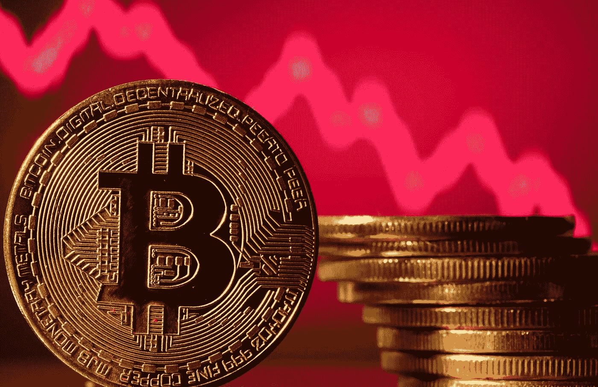
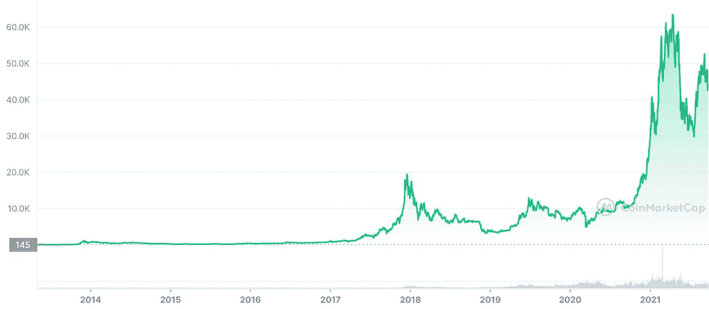
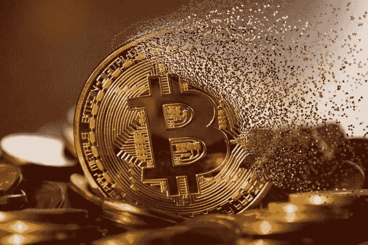

# 加密货币的崛起和不可避免的衰落

> 原文：<https://medium.com/coinmonks/the-rise-and-inevitable-fall-of-cryptocurrency-70e6e988de26?source=collection_archive---------28----------------------->

“加密货币会崩溃”是我讨厌听到的说法。总体而言，我是加密货币的狂热粉丝。所以我为什么要这么说呢？让我们坦诚一会儿，一切终将结束。我相信加密最终会取代现代美元，但在未来，我相信某种东西取代加密是不可避免的。我将强调加密货币的兴起和不可避免的衰落

# 密码领域的发展

加密货币早在 2009 年就发明了！第一个“币”(比特币)是 2009 年发明的。发明者不为人知，但被称为中本聪。Satoshi 的钱包里有超过 100 万个比特币(大约 420 亿美元)。我相信这就是为什么这么多人声称自己是聪，为了得到那未被触及的宝藏。比特币推出几年后开始流行起来。要想知道比特币增长了多少，如果你在 2011 年只买了 100 美元，今天你会有大约 13531800 美元！那绝对是胡说八道！这足以说明比特币的真实增长。在加密领域还有很多其他的成功案例，比如以太坊、Cardano、SHIBA、DogeCoin 和 Litecoin。我相信 crypto 还有更大的发展空间，我个人投资了比特币、以太坊和 Solana。

# **一切是如何崩溃的**

乔·罗根(Joe Rogan)完美地表示，“加密货币要么成功并取代美元，要么失败并崩溃”。我百分之百同意。这个简单而真实的陈述总结了这里的目标。目前，比特币和以太坊等加密货币是一种投资。它非常不稳定，价值经常波动。在某种程度上，我也同意 crypto 是一个泡沫。不是人们所说的规模，而是一个泡沫，这个泡沫可能会比他们今天的价值更大。我坚持长期利润，而不是短期，这就是为什么我不那么担心。另一件可能终结 crypto 的事情是它目前的声誉。如果你看看现在正在发生的事情，你会看到一篇又一篇的文章谈论诈骗硬币。这可能会导致严厉的监管，加大监管难度，降低对投资者的吸引力。这也可能导致恐慌，所有顶级密码可能会在瞬间下跌。不管 crypto 最终会倒下，它不会不战而降。crypto 有一个强大的粉丝群，所以如果一切都失败了，它会很快变得丑陋！

# **总之**

是的，以太坊，卡尔达诺，甚至比特币最终都会崩溃，所有的事情都是如此。我确实认为加密技术将会接管并崛起，但是要使这个概念成为主流货币还有很多需要改变的地方。例如，大多数密码的交易时间都很慢。这就是我期待以太坊 2.0 的原因！不管 crypto 现在跌还是以后跌，我都会一直买，直到它跌。感谢您从头到尾的阅读！如果你喜欢，一定要留下掌声和评论。祝你愉快，我的朋友！

> *加入 Coinmonks* [*电报频道*](https://t.me/coincodecap) *和* [*Youtube 频道*](https://www.youtube.com/c/coinmonks/videos) *了解加密交易和投资*

# 另外，阅读

*   [Bookmap 评论](https://coincodecap.com/bookmap-review-2021-best-trading-software) | [美国 5 大最佳加密交易所](https://coincodecap.com/crypto-exchange-usa)
*   最佳加密[硬件钱包](/coinmonks/hardware-wallets-dfa1211730c6) | [Bitbns 评论](/coinmonks/bitbns-review-38256a07e161)
*   [新加坡十大最佳加密交易所](https://coincodecap.com/crypto-exchange-in-singapore) | [购买 AXS](https://coincodecap.com/buy-axs-token)
*   [红狗赌场评论](https://coincodecap.com/red-dog-casino-review) | [Swyftx 评论](https://coincodecap.com/swyftx-review) | [CoinGate 评论](https://coincodecap.com/coingate-review)
*   [投资印度的最佳密码](https://coincodecap.com/best-crypto-to-invest-in-india-in-2021)|[WazirX P2P](https://coincodecap.com/wazirx-p2p)|[Hi Dollar Review](https://coincodecap.com/hi-dollar-review)
*   [加拿大最佳加密交易机器人](https://coincodecap.com/5-best-crypto-trading-bots-in-canada) | [库币评论](https://coincodecap.com/kucoin-review)
*   [用于 Huobi 的加密交易信号](https://coincodecap.com/huobi-crypto-trading-signals) | [HitBTC 审查](/coinmonks/hitbtc-review-c5143c5d53c2)