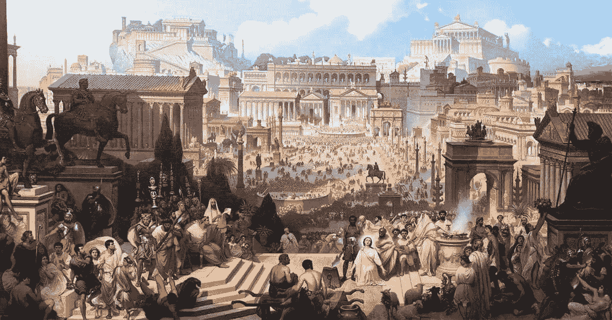

# 奥林匹克的兴衰

> 原文：<https://medium.com/coinmonks/the-rise-fall-of-the-ohmpires-4dc5f8a9041f?source=collection_archive---------38----------------------->

不到一年前，奥林匹斯岛被发现，许多叉子从区块链的深处冒出来。许多人只是希望的勺子，其他人则是贪婪的刀子。

奥林巴斯开创的技术开创了一个新时代。许多人变得充满贪婪，寻求最高的 APYs，许多劣质的欧姆叉要么是地毯，要么就像充斥着“欧姆叉”这个词的零售地精一样贪婪。这个巨大的 APY 泡沫开始迅速呈抛物线状。像所有泡沫一样迅速破裂:(

这个特别的名字是“欧姆叉”,它创造了一个曼荼罗效应类型的东西，奥林匹斯成为它的名字。
因此，元宇宙经济每经历一次不好的经历，奥林巴斯就会背上一个坏名声。最终，伤害协议和它的愿景，但很快

**所有关于欧姆福克斯的坏消息对元宇宙的后代来说都成了因祸得福**

在所有这些伴随欧姆·福克斯宝藏而来的骗局、阴谋和可怕事件中，许多有趣的想法诞生了。

这些想法会引起人们对基本面的真正关注。不仅仅是疯狂的 APYs——尽管这仍然是一个很好的激励去寻找协议的真正观众。全元宇宙的市民都被一些有趣的“欧姆叉”的景象所吸引，新的协议诞生并受到称赞。

通过这一切，这些代币没有集中的方式让你得到它们。

有一种说法，如“代币越容易购买，就越容易发展”，因为大众和后来者只需将他们的 IRL 卡放入交易所，然后立即购买代币。奥林巴斯和欧姆·福克斯只能通过分散的交易所连锁购买，这是一场区块链革命，是走向分散的又一步。
不要误解我的意思，所有的集中交易在这一过程中创造了什么，在过去这是好的，但对于比特币的“真实愿景”,他们有点迷失了方向，很久以前就偏离了这条道路……你同意吗？

这是奥运经济的开始。

从帝国机制中衍生出来的新技术，比如修订版卡特尔，獾城堡等等。
更多的技术将从绑定机制中产生，以支持资产来发展这些协议，实现 DAO 的真正途径是通过 OHmpire。

Olympus 充当 DEFI 的储备货币，这些协议集成了 OHM 风格的机制，甚至 Dao2Dao 每个协议 3，3 的伙伴关系，使用彼此的令牌，同时它们都同时将价值捕获到它们的国库中，以向令牌持有者提供更多的价值。这将会是一个真正的故事。别让它褪色，阿农。

如果你喜欢这个故事，并想了解我对 defi 世界的想法，请在 twitter 上关注我:)谢谢！
[https://twitter.com/](https://twitter.com/PythagorOhm)埃瑟派尔

