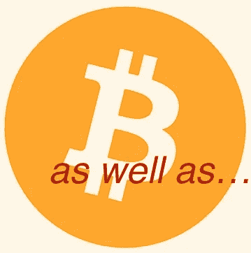

# 比特币最大化主义的兴起:只见树木不见森林

> 原文：<https://medium.com/coinmonks/the-rise-of-bitcoin-maximalism-missing-the-forest-for-the-trees-5cb4aa004990?source=collection_archive---------52----------------------->

将所有其他加密项目排除在外的比特币最大化主义是只见树木不见森林。比特币是世界历史上无与伦比的成功，但它不是区块链潜力的巅峰实现。

在去年的万圣节聚会上从一个熟人那里听到“比特币最大化者”这个词之前，我并不知道这个词。现在这个术语和情绪无处不在。

过去几个月的大规模抛售让许多人灰心丧气，赤膊上阵，这是肯定的，但随之而来的将是新的谨慎。Twitter 和 Reddit [上越来越多的比特币狂热主义者寻求全面加强监管](https://www.omfif.org/2022/06/crypto-margin-call-must-wake-up-regulators/)，但他们已经准备好把婴儿和洗澡水一起倒掉。

尚未建立(或许还未被设想)的 Dao(去中心化自治组织)的影响力甚至将超过比特币。最近的一个例子是[乌克兰道在短短三个月内筹集了 1 . 35 亿美元](https://www.coindesk.com/layer2/2022/06/10/where-the-coins-go-inside-ukraines-125m-wartime-fundraise/)来资助一场*战争*。就在本周，数字社区 Afropolitan 因其筹款努力和在物理空间实现的长期目标而成为新闻。

DeFi 项目也将找到自己的立足点。未来可能会有更多的崩溃和不诚实的演员，但改善我们现状的巨大潜力太大了，不容错过。有什么选择？事情现在的样子？华尔街和政客的勾结，以及损害所有人的累退税？货币需要脱离国家政府。

路不直，地图也不画。区块链和分散网络的真正潜力是在我们今天笨拙的系统之外组织力量。当然，谨慎的投资符合每个人的利益。但加密货币的使用不会是区块链的巅峰成就。比特币真的只是冰山一角。

> 加入 Coinmonks [电报频道](https://t.me/coincodecap)和 [Youtube 频道](https://www.youtube.com/c/coinmonks/videos)了解加密交易和投资

# 另外，阅读

*   [Bookmap 点评](https://coincodecap.com/bookmap-review-2021-best-trading-software) | [美国 5 大最佳加密交易所](https://coincodecap.com/crypto-exchange-usa)
*   [密码交易机器人](/coinmonks/crypto-trading-bot-c2ffce8acb2a) | [造币评论](https://coincodecap.com/coingate-review)
*   最佳加密[硬件钱包](/coinmonks/hardware-wallets-dfa1211730c6) | [Bitbns 评论](/coinmonks/bitbns-review-38256a07e161)
*   [新加坡十大最佳加密交易所](https://coincodecap.com/crypto-exchange-in-singapore) | [购买 AXS](https://coincodecap.com/buy-axs-token)
*   [红狗赌场评论](https://coincodecap.com/red-dog-casino-review) | [Swyftx 评论](https://coincodecap.com/swyftx-review)
*   [投资印度的最佳密码](https://coincodecap.com/best-crypto-to-invest-in-india-in-2021)|[WazirX P2P](https://coincodecap.com/wazirx-p2p)|[Hi Dollar Review](https://coincodecap.com/hi-dollar-review)