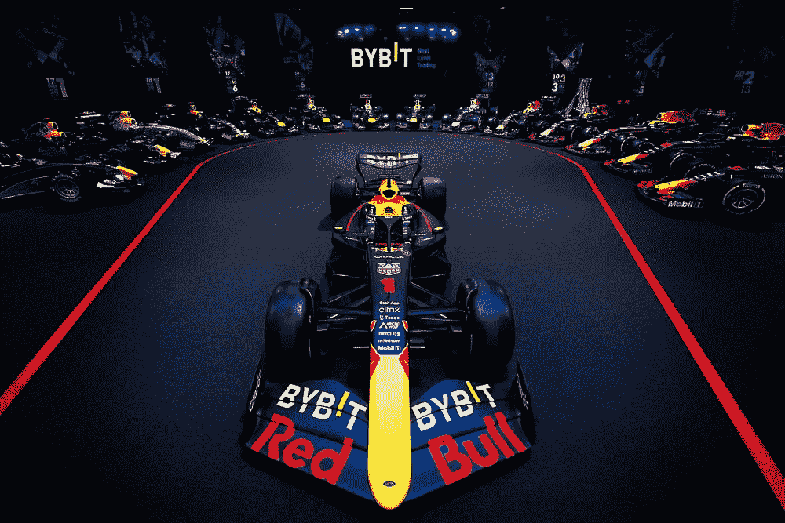

# 一级方程式赛车中加密技术的崛起

> 原文：<https://medium.com/coinmonks/the-rise-of-crypto-in-formula-1-bfe464be7fac?source=collection_archive---------29----------------------->

在过去的 15 个月里，大量加密相关公司涌入竞争激烈的 F1 赞助交易领域。

这里是团队的快速列表，每个团队都有自己的加密货币/区块链合作伙伴:

*   梅赛德斯 AMG 马来西亚国家石油公司— FTX
*   甲骨文红牛车队— ByBit
*   法拉利车队——Velas
*   迈凯轮 F1 — Tezos
*   BWT 阿尔卑斯 F1 —币安
*   阿尔法陶里车队
*   阿斯顿·马丁认知—Crypto.com
*   阿尔法·罗密欧·奥伦—弗洛基·伊努(是啊，真的)

更不用说 f1 和 Crypto.com 之间价值 1 亿美元的系列全球合作协议了。

这是 10 个团队中的 8 个，并且该系列本身涉及加密货币和区块链。

# 那么，为什么是 F1 呢？

虽然上述所有加密公司的结构不同，但它们都有一个确保其相关性和增长的基本要求:获得更多用户。

一级方程式是公司、行动主义、体育和科技的巨大广告牌。这是一场全球巡演，吸引了成千上万的观众和数百万的观众。

为了让你了解这个系列的媒体影响:F1 的媒体团队最近比较了 2021 年 NFL 超级碗(预计将是地球上观看人数最多的年度赛事)和阿布扎比 F1 决赛的收视率。

NFL 的数字是 1.01 亿，而一级方程式赛车的数字高达 1.08 亿——就一场比赛而言。

2022 年，将有 23 场这样的比赛吸引类似的观众人数。

这种品牌曝光对任何公司、加密公司或其他公司都有吸引力。

# 社交媒体和目标品牌

除了这些品牌受益于电视和赛道旁曝光，F1 车队合作伙伴还可以获得营销和广告中最有价值的资产之一:经过验证的追随者群体。

所有 F1 车队和车手都有强大的社交媒体，粉丝们每天都可以在上面互动。

作为这些团队的品牌和合作伙伴，您可以直接利用这些人口统计数据，并向响应的个人推送优惠、促销和信息。

这里存在着对密码相关公司最重要的意义(在我看来):突破被社区接受的第一个障碍。

尽管越来越多的人采用和认可 Crypto，但它仍然是一个需要扩展的利基市场。因此，用一个帖子来处理数十万个符合营销条件的潜在客户具有不可估量的价值。

但是，当然，这些公司决定推出的信息会有不同程度的成功，这给我们带来了以下几点:了解受众。

# 小心行事

仅仅因为你能接触到人群并不意味着他们会买你卖的东西。即使 F1 的历史像加密货币一样年轻，我们也有成功和失败的策略的例子。

一个赛车迷希望他最喜欢的球队的赞助商也是一个赛车迷。最好是比以前更大的。

人们明白，团队和公司合作会带来商业利益，因此，除了金钱之外，展示对这项运动的热情也是至关重要的。

大多数密码赞助商都在努力展示他们对赛车的热爱。然而，有些人的不足之处在于，他们从合作本身中获得的产品背后的信息。

以阿尔卑斯 F1 粉丝代币为例。该令牌使粉丝能够参与团队投票投票，搜索数字收藏品，购买 NFT，并享受与粉丝奖励或精彩体验相关的游戏化功能。这个想法让粉丝更接近球队，同时让他们熟悉币安的平台。

总而言之，这听起来很甜蜜——那么问题出在哪里呢？

我们花了一些时间搜索阿尔卑斯和币安的社交媒体页面，寻找关于这次合作的信息。

两个追随者群体的反应差异是惊人的。每次有粉蓝赛车的照片，币安夏令营都会庆祝。另一方面，高山阵营对此深感不满，称粉丝代币为所有 shitcoins 之王，导致人们损失惨重。这显然不是赞扬币安和阿尔卑斯 F1 之间的伙伴关系。

这里有一个沟通问题，F1 粉丝将代币视为投机性的加密资产，而不是粉丝的参与工具。

虽然这种合作关系为车队和公司带来了极好的机会和强烈的激情，但车迷们需要更好地理解他们如何从这种合作关系中受益，以及为什么它属于 F1 世界。

# 看到更大的画面

在 5 年的大部分时间里，一个人可能会很快忘记这个星球上超过 95%的人不熟悉这个领域。一旦你深入到大量的 discord、telegram、WhatsApp 和 Twitter 群组中，你就会相信所有人谈论的都是加密。

由于这些伙伴关系而启动的许多项目都处于非常早期的阶段。在这种环境下，效用并不明显，这就带来了人们变得不耐烦的风险。

F1(和其他赛车)品牌的公关团队必须了解他们的粉丝的学习曲线，如果他们真的想兑现他们拥有的巨大商业资产。我们看到了加密和赛车运动的光明未来——只有在真正理解这些合作伙伴关系的双赢的情况下。

–––––––––––

AEW Motorsport 是赛车运动商业开发和交流领域的专家。如果您对如何将加密技术整合到您的业务中有任何疑问，请联系我们:alex@aew-communications.com

–––––––––––

> 加入 Coinmonks [电报频道](https://t.me/coincodecap)和 [Youtube 频道](https://www.youtube.com/c/coinmonks/videos)了解加密交易和投资

# 另外，阅读

*   [3 商业评论](/coinmonks/3commas-review-an-excellent-crypto-trading-bot-2020-1313a58bec92) | [Pionex 评论](https://coincodecap.com/pionex-review-exchange-with-crypto-trading-bot) | [Coinrule 评论](/coinmonks/coinrule-review-2021-a-beginner-friendly-crypto-trading-bot-daf0504848ba)
*   [莱杰 vs n rave](/coinmonks/ledger-vs-ngrave-zero-7e40f0c1d694)|[莱杰 nano s vs x](/coinmonks/ledger-nano-s-vs-x-battery-hardware-price-storage-59a6663fe3b0) | [币安评论](/coinmonks/binance-review-ee10d3bf3b6e)
*   [Bybit Exchange 审查](/coinmonks/bybit-exchange-review-dbd570019b71) | [Bityard 审查](https://coincodecap.com/bityard-reivew) | [Jet-Bot 审查](https://coincodecap.com/jet-bot-review)
*   [3 commas vs crypto hopper](/coinmonks/3commas-vs-pionex-vs-cryptohopper-best-crypto-bot-6a98d2baa203)|[赚取加密利息](/coinmonks/earn-crypto-interest-b10b810fdda3)
*   最好的比特币[硬件钱包](/coinmonks/hardware-wallets-dfa1211730c6) | [BitBox02 回顾](/coinmonks/bitbox02-review-your-swiss-bitcoin-hardware-wallet-c36c88fff29)