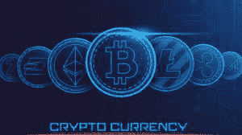
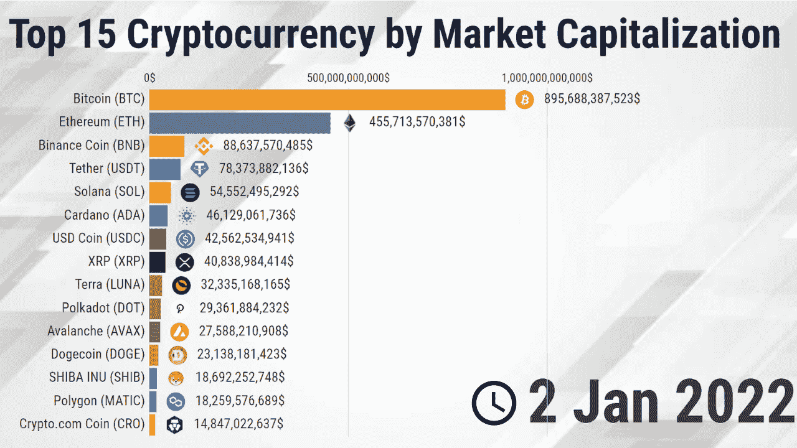
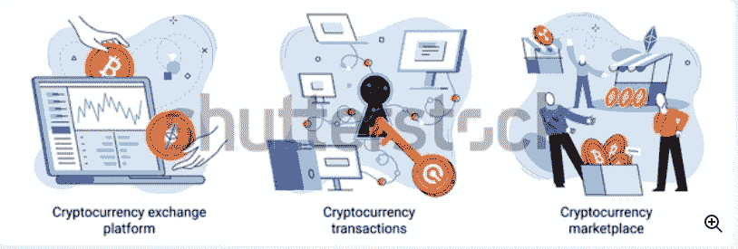

# 商业世界中加密货币的崛起

> 原文：<https://medium.com/coinmonks/the-rise-of-cryptocurrency-in-the-business-world-ef1b0d087e1?source=collection_archive---------32----------------------->

随着加密话题的流行，你可能会问为什么到处都是这种货币？在这一点上，你可能对它感到恐慌，但我们更希望你坚持住，我们让你马上进入这个话题。

加密货币在许多方面一直存在争议，然而最近的忽视宣布它可能会成为金融民主化。加密货币的崛起正在威胁着社会、政治和经济的方方面面，企业出于各种投资、运营和交易目的使用比特币和其他数字资产推动了已经在崛起的加密货币比特币。

**什么是加密货币？**

如果我们在这里讨论加密，你可能会知道它是什么？它会对未来产生怎样的影响？

因此，加密货币是加密的数字货币，虚拟存在，这意味着它们不能像真实货币一样与任何黄金或纸币交换。这些货币没有政府的支持(去中心化)，也不是合法发行的，然而市场上一半的比特币是用于投资目的。研究表明，目前有 1000 万比特币持有者。

现在你一定在想什么是比特币？嘿，伙计，别担心，我们是来讨论这个的。

比特币是引领加密货币发展到全新水平的标志。加密热潮始于 2008 年金融危机期间。更倾向于这些钱的精通技术的个人群体发起了[数字货币](https://en.wikipedia.org/wiki/Digital_currency#:~:text=Digital%20currency%20(digital%20money%2C%20electronic,systems%2C%20especially%20over%20the%20internet.)运动，该运动很快成为最受欢迎的运动之一。大约 15%的美国人积极使用加密货币

**加密货币的崛起**

目前，有 16000 种加密货币在运行，而比特币是所有加密货币中的佼佼者。一些加密货币，包括比特币、比特币现金、LTC、LINK、tether 和其他货币，是建立在分散式网络上的，如区块链技术，这是一种由各种网络节点执行的分布式账本(存储每次交易的历史)。

加密货币并没有减少危机的麻烦，但它也消除了第三方交易者，例如银行，并限制了政府的干预。这一条款帮助了那些试图匿名交易而不用为他们交易的钱负责的人，但它也暗示了几个安全问题。

**加密货币的先驱**

加密货币的主要游戏始于 MicroStrategy 首席执行官迈克尔·塞勒(Michael Saylor)首次公开支持比特币。他称之为“优于现金”

像著名的“技术大王”塞勒一样，[埃隆马斯克](https://www.forbes.com/profile/elon-musk/?sh=64034e177999)最近购买了价值 15 亿美元的比特币，并宣布可以用它购买车辆。他推出了一款名为 Dogecoin 的“meme coin ”,并于 2013 年 12 月投入市场。

没有空手而归， [Paypal](https://www.paypal.com/pk/home) (一个在线支付系统)也已经跃入加密世界，成为通过加密货币进行交易和购买的先锋。Visa 和 Mastercard 也在随波逐流，因为它们已经允许在以太坊区块链用稳定币进行交易。

有了这些经济巨头，加密货币市场很快就会大放异彩，这是毫无疑问的。

不，我要说的是，跨境交易的便捷性是除了加密货币之外其他货币无法提供的关键优势之一。这将最终让你不用为货币兑换支付巨额税款。

**目前著名的加密货币:**

**比特币**

我几乎不认识不了解比特币的人。是的，非常著名的比特币总是在桌面上。它于 2009 年开始运营，现在已经成为最受欢迎的一家。由于高度安全，比特币有一个私钥，只给所有者，而其他用户只能看到交易，而不能加密。这里的救世主是区块链，它作为一个账本来保护和加密。

**以太坊(ETH)**

以太坊是去中心化的，始于 2015 年支持智能合约的开源区块链。以太是平台的原生加密货币。从[市值](https://en.wikipedia.org/wiki/Market_capitalization)来看，以太坊仅次于比特币。

**比特币现金**

比特币现金是比特币的升级版，拥有比特币没有的更多功能。它始于 2018 年 11 月，是一个分拆或 altcoin。与比特币相比，比特币现金的块大小更大，这允许比比特币更大的交易。

**莱特币**

由于是去中心化的，开源的莱特币于 2011 年建立，作为比特币的替代品。从莱特币的好处来看，它有更大的交易能力，高达 8400 万美元，上涨速度很快。根据莱特币组织的说法，“莱特币是一种强大的政治和经济工具，任何人、任何地方都可以使用它与世界上任何其他人进行交易，并参与真正的全球经济。”

**链环**

2017 年 6 月推出的 Chainlink 旨在激励全球计算机网络向在区块链之上运行的智能合约(在特定情况下执行的协议)提供重要的外部数据。

**购买任何加密货币时要看什么:**

1.  如果你打算单独购买硬币，那么你应该选择 stablecoin。现在你一定在想什么是稳定币？稳定币是一种由法定货币如欧元、日元、白银和黄金支持的货币，以避免波动，是一种无风险的投资。
2.  研究每个项目的白皮书，并对你正在寻找的硬币进行充分的研究。
3.  仔细调查市场，观察特定硬币的涨跌。
4.  如果你是一家投资公司，那么你可能会冒一次险，玩玩你的运气与硬币快速上涨，但是，仍然要在购买前让自己清楚，因为你会交易，一个巨大的下跌可能会给你留下巨大的损失。
5.  了解区块链技术的工作原理。
6.  加入加密货币的在线社区，以便更好地查看。
7.  向已经投资的人询问你打算购买的硬币。
8.  在最好的时间打出最好的球。

**2022 年哪种加密货币会崛起**

随着加密货币的兴起，公司、机构和加密投资者正在尽一切可能从已经动荡的市场中获利。每天都有数以千计的新货币出现，但如果你打算进入市场，那么你需要准确地知道在哪里投资以及如何在任何可能的地方获利。

上面列出的加密货币已经是市场的游戏规则改变者，但进一步来说，让我们讨论一下 2022 年将崛起的加密货币。

**幸运块** -彩票玩家

幸运块是一种新兴货币，可能是最好的投资对象。如果你是投资者，那么这就是你的机会。你知道幸运街区给你一个在家喝茶的时候赌一把运气的机会吗？是的，这里的幸运区块给出了一个关键的想法，即任何人都可以在自己舒适的家中玩彩票游戏，而不需要通过集中的管理员。建立在币安智能链基础上的幸运区块提供了更好的透明度和公平性，同时提高了每个参赛者获胜的可能性。

您只需点击一下鼠标，就能成为幸运街区的主人

[立即购买幸运块](https://luckyblock.com/?utm_source=parasites&utm_medium=article&utm_campaign=Presale&utm_content=indiatimes)

**柴叶-INU**

柴犬-Inu 于 2020 年 8 月推出，据说是发展最快的加密货币之一。在 dogecoin 作为“迷因币”获得成功后，柴犬-伊努也作为另一种迷因币推出。统计数据显示，它在 12 个月内从 0.00000000078 美元降到 0.0000312 美元，这是一个巨大的成功。

购买柴犬犬可以通过 ShibaSwap，UniSwap，以及一个不断增长的 CEX 列表。该社区还在 2021 年建立了 NFT 项目，增加了对投资者的吸引力。

[现在购买 INU 柴叶](https://www.shibatoken.com/)

**PANCAKESWAP**

在 2022 年你可以投资的硬币列表中，出现了 2020 年出现的 PancakeSwap。PancakeSwap 的概念是，它允许候选人在没有第三方参与的情况下进行交易。

它在 2021 年年中达到顶峰，但到了年底，它从 44 美元降至 12 美元。

到目前为止，PancakeSwap 足够幸运地吸引了数百万交易者到它的平台上，我建议如果你是一个初学者，那么你应该从 PancakeSwap 开始。

[立即购买 PANCAKESWAP】](https://pancakeswap.finance/)

**币安币:**

在高度不稳定的投资领域，币安有自己的位置。该公司在 2021 年推出了这种硬币，不可否认，根据 CoinMarketCap 的数据，该公司是最大的加密交易所。币安硬币有助于大幅降低交易费用。最初的硬币从 2021 年 1 月的 38 美元开始，到 2021 年 5 月超过 683 美元。然而，它在 2022 年 3 月有所下降，为 382.91 美元。

[现在购买币安硬币](https://www.binance.com/en)

**系绳:**

2022 年投资的一个好主意也适用于系绳。Tether 在 2014 年开始作为一枚真正的硬币，到 2015 年分发了第一枚代币。它是一种基于区块链的货币，也是一种稳定的硬币。因此，如果你准备长期投资，那么系绳是你的选择。

[立即购买系绳](https://tether.to/)

> 加入 Coinmonks [电报频道](https://t.me/coincodecap)和 [Youtube 频道](https://www.youtube.com/c/coinmonks/videos)了解加密交易和投资

# 另外，阅读

*   [CoinDCX 评论](/coinmonks/coindcx-review-8444db3621a2) | [加密保证金交易交易所](https://coincodecap.com/crypto-margin-trading-exchanges)
*   [红狗赌场评论](https://coincodecap.com/red-dog-casino-review) | [Swyftx 评论](https://coincodecap.com/swyftx-review) | [CoinGate 评论](https://coincodecap.com/coingate-review)
*   [Bookmap 评论](https://coincodecap.com/bookmap-review-2021-best-trading-software) | [美国 5 大最佳加密交易所](https://coincodecap.com/crypto-exchange-usa)
*   [如何在 FTX 交易所交易期货](https://coincodecap.com/ftx-futures-trading) | [OKEx vs 币安](https://coincodecap.com/okex-vs-binance)
*   [CoinLoan 评论](https://coincodecap.com/coinloan-review) | [YouHodler 评论](/coinmonks/youhodler-4-easy-ways-to-make-money-98969b9689f2) | [BlockFi 评论](https://coincodecap.com/blockfi-review)