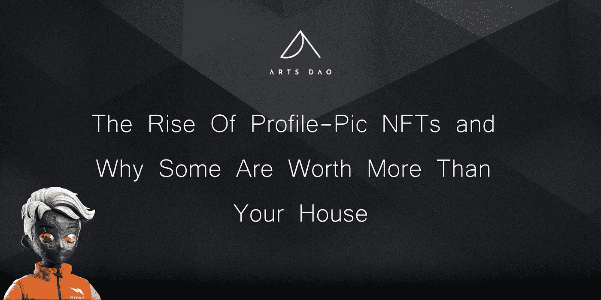
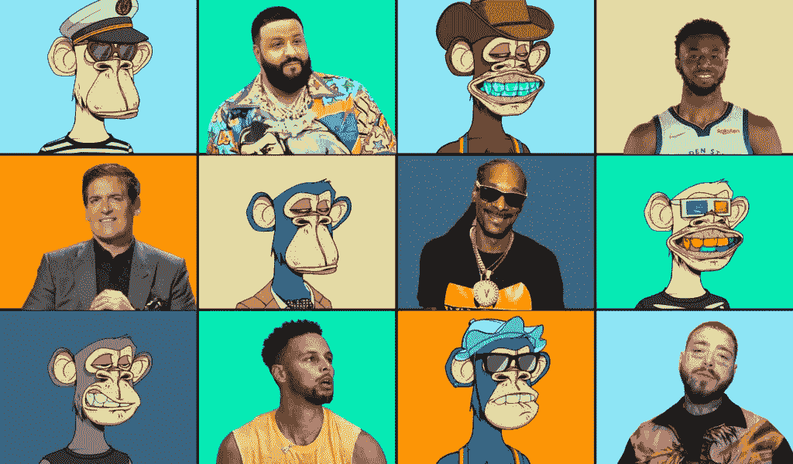
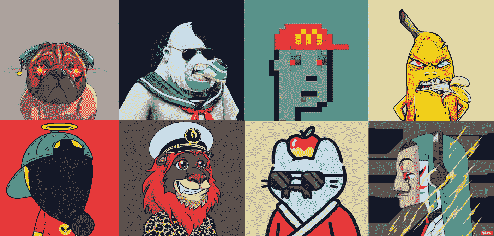
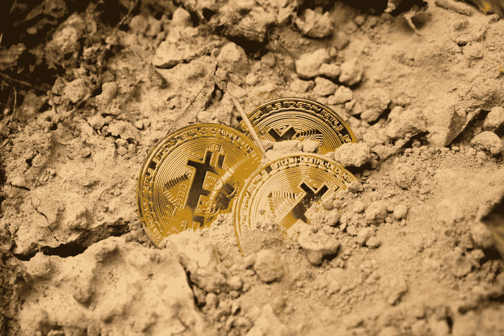
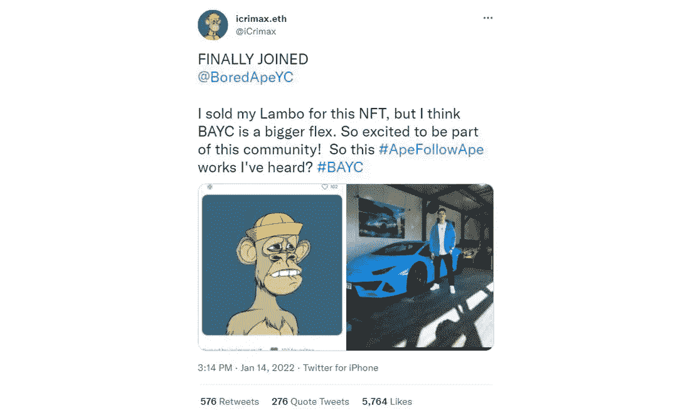
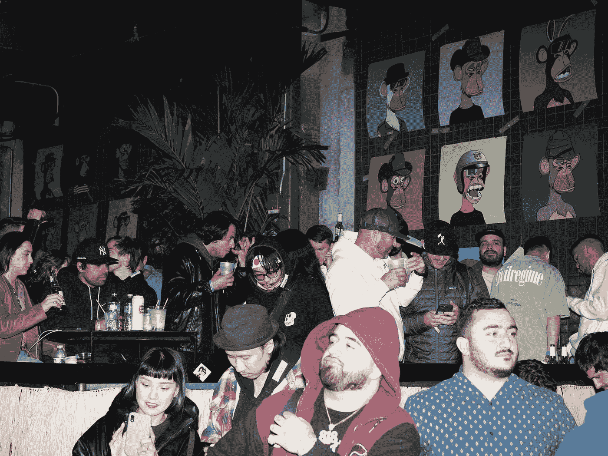

# 简介照片 NFT 的兴起以及为什么有些比你的房子更值钱

> 原文：<https://medium.com/coinmonks/the-rise-of-profile-pic-nfts-and-why-some-are-worth-more-than-your-house-a676fdf2625a?source=collection_archive---------11----------------------->

## 有没有想过为什么有些人会疯狂到在 jpeg 上花掉六位数？以下是那些人知道而你不知道的。

# 介绍

有没有想过为什么艾米纳姆、斯蒂芬·库里、内马尔甚至吉米·法伦等名人会在 Twitter 或 Instagram 等应用程序上用石头砸猴子的照片作为他们的个人资料照片？

到现在为止，你可能知道什么是 NFT，以及它们如何成为万维网发展的下一个阶段，一线名人和有影响力的人正在通过社交媒体将其带入主流。

[Source](https://boardroom.tv/wp-content/uploads/2021/12/CENTER-ALL-SUBJECTS-10-1-1024x601.png)

这些被石头砸死的灵长类动物的个人资料照片实际上是无聊猿游艇俱乐部(BAYC)的个人资料照片(PFP)NFT，该俱乐部收集了 1 万只独特的猿类，是世界上最排外的社区之一的成员。举个例子，opensea 市场上最便宜的 ape 目前标价为 111 ETH(372，685 美元)。对于互联网上的 jpeg 来说，这是一个惊人的数字，然而百万富翁每天都满足于在这些 NFT 上花费相当于一栋房子的钱。此外，尽管 NFT 圈子里的一些人认为这是一项完全合理的投资，但仍有许多新来者在挠头，不明白为什么人们如此愚蠢。但他们真的是吗？

这篇文章将解释你需要知道的关于 PFP NFTs 的一切，以及为什么每个人最终都可能拥有一个。

# NFT 个人资料图片解释道

[Source](https://blogs.airdropalert.com/wp-content/uploads/2021/09/pfp-nfts-2.png)

一开始，PFP NFTs 并不是一个大趋势，因为人们仍然习惯于为数字艺术花费数字钱。然而，它们自 2017 年以来一直存在。例如，幼虫实验室的“密码朋克”NFT 收藏是 NFTs 子类别中首批收集 1 万幅具有不同属性和稀有性的生殖画像的作品之一，为未来的项目设定了基准。[最初，这些朋克是免费发放的，任何有以太坊钱包的人都可以收集它们](https://www.artnews.com/art-news/news/pfp-nfts-future-market-1234602384/)，但如果你今天想得到一个，它会花费你大约 68 ETH(224，760 美元)。

直到 2021 年第二季度，这些亲民党项目才获得了大众和名人的关注。2021 年，BAYC、Meebits、Pudgy Penguins 和 Lazy Lions 等蓝筹项目将承担 Opensea 等市场的大部分交易量。

有意思的是，一年后的今天，PFP NFTs 的风潮并没有偃旗息鼓。事实上，对它们的需求只是增加了。作为投资者，那一年为世界提供了这个行业如何运作的大量数据，每次都流行的中心主题是，NFT 空间因害怕错过(FOMO)而繁荣。如果有足够多的人相信炒作，创造一种稀缺和排他性的感觉可以推动需求飙升。此外，在今天的市场上，仅仅拥有滑稽的动物园动物艺术已经不足以吸引买家，因为人们希望看到传达长期持有的未来效用的路线图。

然而，在 PFP NFTs 的核心，在所有金钱和平庸艺术的表面之下，隐藏着一些人类的基本东西，加里·维称之为“社会货币”。此外，区分成功的和失败的亲民党 NFT 收藏的是一件简单的事情:理解人类心理的作用。

# 人类心理学的作用

让我们现实一点，PFP NFTs 除了看起来有点酷，可以让你偶尔参加游艇派对之外，没有内在的物理价值。真正的价值在别处——你的社会货币。

在过去的 12 个月里，世界看到的 NFT 炒作和 FOMO 揭示了三个主要的行为心理学概念:稀缺、社会证明和部落主义，理解如何满足人类这三个基本方面是在这个领域建立一个成功项目的关键。让我们更详细地看一下每一个。

## 稀缺

[Source](https://www.valueofstocks.com/wp-content/uploads/2022/02/dmitry-demidko-xZJpKskRdOg-unsplash-scaled.jpg)

任何了解经济学基础的人都知道，随着有价值的东西的供应减少，需求通常会增加。人类在生理上天生就能识别稀缺，并珍视别人不容易得到的东西。正是因为这个原因，伟大的 NFT 项目明白如何利用人为的稀缺性来获得优势，并限制他们的供应和进入白名单，以在 NFTs 中创造一种稀缺性。有趣的是，可能由于自我们的狩猎采集时代以来，人类大脑缺乏进化，人们不一定能区分人为稀缺和实际稀缺之间的差异，因此在做出购买决定时，认识到 NFT 的这一方面很重要。

## 社会证明/信号

[人类天生是群居动物](https://www.ncbi.nlm.nih.gov/pmc/articles/PMC2527715/)，这意味着我们很容易受到他人行为的影响，并感到需要不断地与他人进行口头和非口头交流。如果你想一想你穿的衣服，你购买的品牌，你有多少社交媒体关注者，这些都是向他人传达你是什么样的人的信息的渠道。

系列企业家和 VeeFriends 的创始人 Gary Vee 将 NFTs 称为一种新形式的[“社会货币](https://www.youtube.com/watch?v=amWRwwJ9suY)”，它被用作人类传递社会信号的一种方式，比如地位、财富、个性和品味。在这个意义上，PFP NFTs 可以类比于您驾驶的汽车。例如，如果你有一个价值约 0.5 ETH 的项目的 PFP NFT，这就像开着一辆 2006 年的丰田雅力士来到俱乐部，而拥有价值 111 ETH 的无聊猿猴 PFP 的人则以数字方式向其他人传达他开着一辆兰博基尼。

[Source](https://nftnewspro.com/wp-content/uploads/2022/01/A_guy_sold_his_Lamborghini_for_an_NFT_believing_BAYC_keeps_its.jpg)

从这个角度来看，为什么名人和想在网上传递高社会证明的人愿意花几十万美元买一个 jpeg，这就更有意义了。

## 数字部落主义

[BAYC Holders Party](https://pbs.twimg.com/media/FEbO1FlWQAw_FA6?format=jpg&name=large)

NFT 项目所吸引的心理学的最后一个方面是数字部落主义的想法。[人类天生喜欢在部落中狩猎](https://journals.sagepub.com/doi/10.1177/0963721419862289)并生活在一个家庭中，而不是独自生活，因为拥有一个强大的部落通常意味着我们祖先更有可能生存。

在 NFT 的背景下，通过持有某个 NFT 项目形成的社区和内部团体可以被视为等同于一个数字部落。此外，部落越是排外和有选择性，成为这个群体的一部分就越有价值。例如，要成为 BAYC 的一员，您需要至少拥有 110 ETH(353，000 美元)以上的净资产，才能购买最便宜的 BAYC。不是每个人都有 110 ETH，所以成为这个社区的一员向其他人表明你可能很富有。从这个意义上说，你的社交媒体上的 NFT PFP 会立即向其他人传达你属于哪个部落，这对人类有很大的吸引力。

# 结束语

希望，到目前为止，人们已经清楚为什么个人资料图片 NFT 项目现在如此火爆，以及为什么有些人选择出售他们的有形财产来购买没有内在有形价值的数字财产。从心理学的角度来看，这是完全合乎逻辑的，这也是本文的重点。拥有一个坚实的 PFP NFT 项目的真正价值在于它如何减少我们对社会认可、地位和部落主义的根深蒂固的心理需求。正是由于这些原因，艺术水平低于标准的项目可以以几十万美元的价格出售，因为这不是购买 NFT 的目的。

最后要考虑的是 NFT 亲民党对元宇宙意味着什么。当人们生活在数字领域时，使用他们的真实面孔是非常不可能的。更有可能发生的是，人们将会使用从他们目前拥有的 PFP NFTs 衍生而来的 NFT 头像。从这个意义上来说，一旦我们都搬到元宇宙，你们所拥有的亲民党的 NFT 就是你们能够进入的不同的生活和身份。

所以明智地选择吧。

# 与我们联系

在这里关注我们，在 [**Twitter**](https://twitter.com/arts_dao?ref_src=twsrc%5Egoogle%7Ctwcamp%5Eserp%7Ctwgr%5Eauthor) 上获取新闻，并关注我们的 [**不和**](https://discord.gg/ZXJH5zfC) 与我们聚集在一起的未来主义者、艺术家、收藏家和创作者社区的更深层次的联系。

*   **阿纳斯**:[twitter.com/ananasbrb](https://twitter.com/ananasbrb)
*   **达诺斯奇**:[twitter.com/thecryptosheikh](https://twitter.com/thecryptosheikh)
*   拉希姆:[twitter.com/rahim_mahtab](https://twitter.com/rahim_mahtab)
*   **扎亚恩**:[twitter.com/thenftpenguin](https://twitter.com/thenftpenguin)
*   **山姆 Z:**twitter.com/zuckerswag
*   克里斯特尔:[twitter.com/atelier_kristel](https://twitter.com/atelier_kristel)

# 谢谢你

感谢您及早参与道艺术之旅。我们每时每刻都在致力于建设并成为区块链技术、NFT 空间以及更广泛的艺术发展的一部分。我们期待在现实生活中或元宇宙的其他地方与您见面！

> 加入 Coinmonks [电报频道](https://t.me/coincodecap)和 [Youtube 频道](https://www.youtube.com/c/coinmonks/videos)了解加密交易和投资

# 另外，阅读

*   [Bookmap 评论](https://coincodecap.com/bookmap-review-2021-best-trading-software) | [美国 5 大最佳加密交易所](https://coincodecap.com/crypto-exchange-usa)
*   最佳加密[硬件钱包](/coinmonks/hardware-wallets-dfa1211730c6) | [Bitbns 评论](/coinmonks/bitbns-review-38256a07e161)
*   [新加坡十大最佳密码交易所](https://coincodecap.com/crypto-exchange-in-singapore) | [收购 AXS](https://coincodecap.com/buy-axs-token)
*   [红狗赌场评论](https://coincodecap.com/red-dog-casino-review) | [Swyftx 评论](https://coincodecap.com/swyftx-review) | [CoinGate 评论](https://coincodecap.com/coingate-review)
*   [投资印度的最佳加密软件](https://coincodecap.com/best-crypto-to-invest-in-india-in-2021)|[WazirX P2P](https://coincodecap.com/wazirx-p2p)|[Hi Dollar Review](https://coincodecap.com/hi-dollar-review)