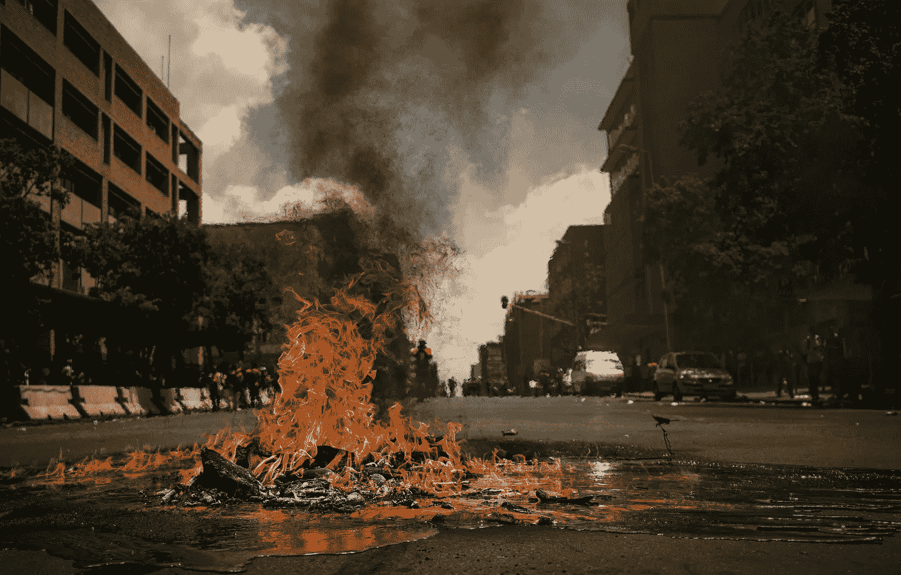

# 社会动荡的加剧——为什么你需要关注

> 原文：<https://medium.com/coinmonks/the-rise-of-social-unrest-why-you-need-to-be-concerned-98da201dc8a4?source=collection_archive---------33----------------------->

source: [Pawel Janiak](https://unsplash.com/@pawelj)

## 当政府失败时，人民会愤怒

我们只要看看斯里兰卡，看看当政府滥用和不恰当地管理政府为人民提供的资金时会发生什么。通常会有全岛范围的不安和绝望！这个 2192 万人口的岛屿上的许多人没有必要的汽油和粮食…