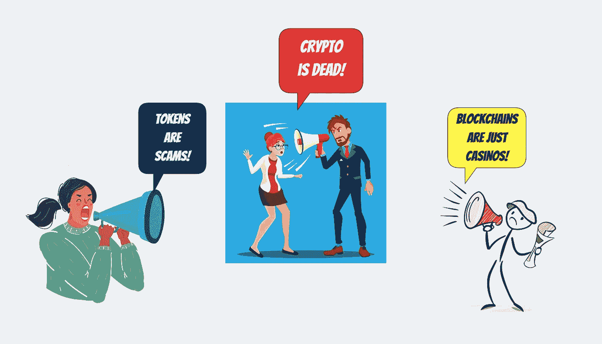
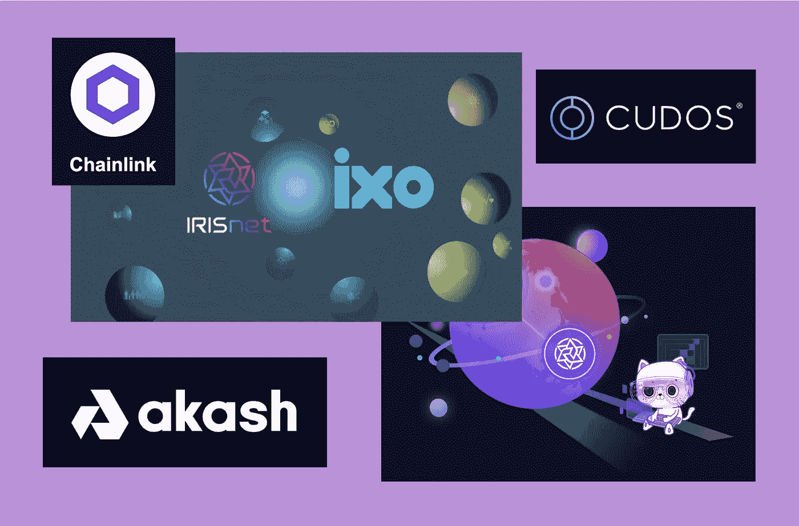
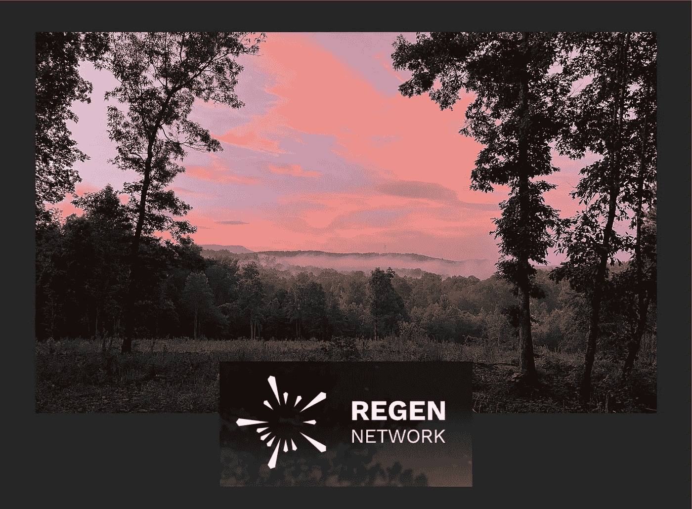
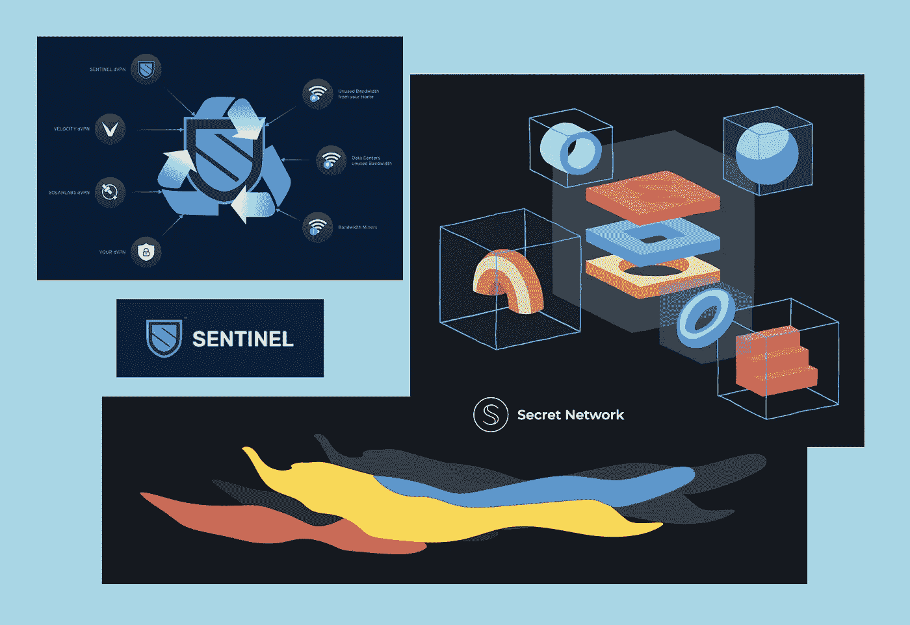
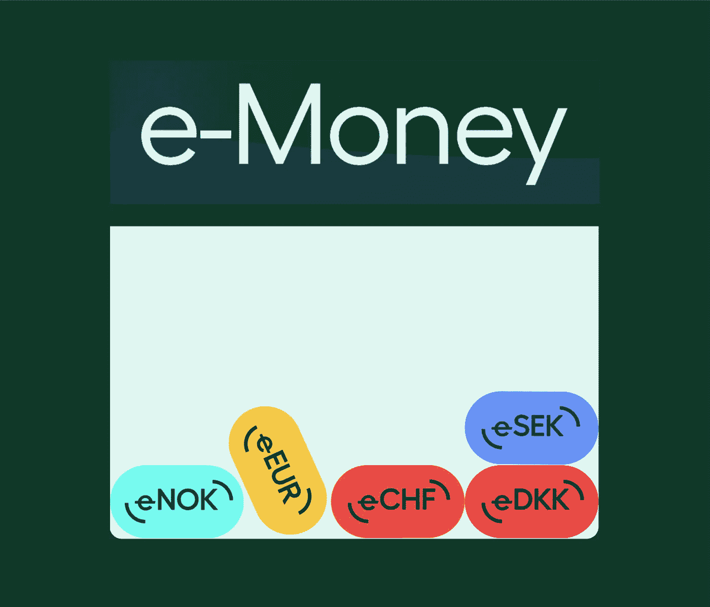
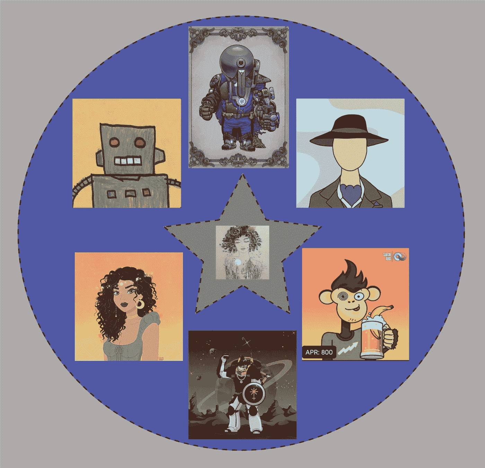
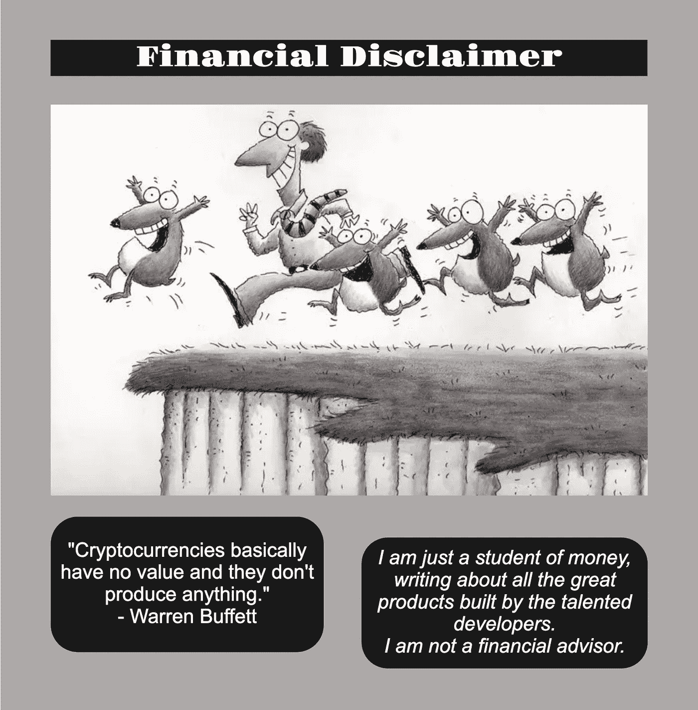

# 旅鼠的崛起

> 原文：<https://medium.com/coinmonks/the-rise-of-the-lemmings-251e845761a2?source=collection_archive---------19----------------------->

## **Crypto 是一个庞氏骗局**

怀疑者和不信者横行！他们无处不在！当我打开晚间新闻，打开我的新闻应用程序，听我的播客，浏览我最喜欢的博客和社交媒体网站时，我不可能避开他们，他们的智慧喷涌而出。

显然，当市场下跌到他们所拥有的程度时，这对旅鼠来说是一个把一切都剥光的机会。毫无疑问，你也会被这些标题和评论轰炸:

*   Crypto 是一个庞氏骗局📉
*   区块链只是赌场🎰
*   密码已经死了，🧟‍♂️
*   代币是骗局🦹

## **真实世界用例**

我觉得有必要挑战行业终结宣言的浪潮，并为我非常钦佩的、近一年来一直备受关注的开发者辩护。在这段时间里，我已经了解了更大的宇宙生态系统，我将重点介绍这些区块链、协议和 dApps 的一个小集合。首先也是最重要的，这些是解决现实世界问题的公司，它们正在用令人敬畏的技术解决方案颠覆传统行业或使其现代化。其次，它们是艺术家、创作者和企业家加入草根微观经济的地方。

下一次，当有人再次大声说出他们的疑问时，你可以转发这个宇宙中所有伟大而有用的技术的总结。另外，下面的资源部分将会提供这里讨论的所有内容的链接。它是为那些怀疑者和非信仰者量身定做的，他们确实想了解更多。😉

## **云服务和数据完整性**

当你停止在手机上滚动和在电脑上打字一会儿，思考你正在访问和存储的所有信息都保存在哪里时，你会很快意识到云计算产业有多大。阿卡什网络是这个行业集中力量的分散答案。Akash 以世界上最大的提供商的一小部分成本提供云服务，为他们的云服务创造了一个新的市场。

云计算领域另一个崭露头角的区块链是 Cudos。基于利用闲置计算能力的前提，Cudos 正在构建一个去中心化的网络，以相对于主导该行业的传统集中式公司的一小部分成本来提供云存储服务。经过多年的开发和大量的测试网工作，区块链刚刚将他们的 mainnet 投入生产。

Chainlink 在 IRIS 网络上运行一个 oracle 模块，支持智能合同的跨链集成。凭借其分散式网络，它支持具有真实世界数据和离线计算的智能合约。链环神谕被运行在大量区块链和 dApps 上的智能契约所使用，包括宇宙中的卡瓦、阿卡什、Umee、CosmosHub、IRISnet 和 Crypto.com，还有更多在以太坊主网、第二层、雪崩和索拉纳上运行。应用使用案例随着网络部署位置的不同而不同，包括保险、分散金融、游戏和 NFT。

## **关爱地球🌍**

*“农民是我们全球景观的管理者。”*

Regen Network 与全球各地的农民合作，旨在实现生态系统的再生。农民们对农田、牧场、湿地和森林是如何受到自然现象和人为因素的影响有着详细的了解。认识到这一点，Regen Network 正在激励农民收集这些数据，并在此过程中采用可持续的做法。

通过一个名为 Regen Ledger 的公共区块链，开发人员、验证人员和科学家一起朝着一个共同的目标努力。目标包括创造和提供一个更有效、透明和经济的解决方案，以解决我们这个时代最大的挑战:保护地球的未来。

## **关爱我们的健康**

MediBloc 于 2017 年推出，最近庆祝了成立五周年，并为未来几年制定了一系列充满希望的目标。Medibloc 创建了一个集成平台，为患者、医疗专业人员、医疗组织和保险公司创建高效的数据共享和隐私保护。dApps 以患者为中心，旨在将零散的数据整合到一组易于访问的健康记录中。总部位于首尔，专注于韩国市场，这种创新型区块链的未来使用案例和可能性是巨大的。🤒

## **隐私第一**

虚拟专用网络(VPN)解决方案传统上由拥有大型数据中心的大公司控制和营销。通过巧妙的分散部署，Sentinel Network 彻底改变了这种模式，并提供了成本更低的解决方案。有了来自多个合作伙伴的移动应用，使用 VPN 变得简单、不受限制且便宜。

Secret Network 正在其区块链上构建一个完整的隐私优先应用生态系统。通过查看密钥，用户可以决定谁可以查看他们的数据和交易。这些应用侧重于实际使用案例，范围从云存储、文件共享、消息传递和分散金融，到 NFT 的数字艺术、电影、游戏和媒体。

## **电子货币**

e-Money 开拓了一个利基市场，完全专注于欧洲市场，开发了一系列稳定的产品。这些包括:

*   eEUR
*   埃塞克
*   伊诺
*   eCHF
*   eDKK。

电子货币战略的中心焦点是建立一座从基于菲亚特的支付系统到区块链的桥梁。它通过向欧洲银行和企业提供对其支付网络的安全访问来做到这一点。交易结算速度快，交易成本低。它们可以从银行账户和信用卡中提取。

网络由它的验证器保护，标记它的 NGM 令牌。e-Money 与商业银行建立了合作伙伴关系，持有支持其数字资产的抵押品。安永会计师事务所(Ernst & Young)对其进行了资金证明审计，证明其完全合规。

## **庆祝所有制经济中的创造者**

IRISnet 创建了一个不可替代的令牌(NFT)应用框架。有了 Uptick，创建、转移和 NFT 市场活动可以在区块链全国范围内按照兼容性和互操作性标准进行整合。这向许多现有行业、企业家和创作者开放了 NFT 数字资产，包括数字艺术和收藏品、虚拟商品、音乐、视频和电子出版物。

通过 Andromeda 数字对象(ADO)库，Andromeda 协议开发了一个模块化框架，该框架利用了内部区块链通信(IBC)架构。来自宇宙各地的团队可以使用这项技术在 DeFi 和 NFT 的部门建立应用程序，同时在 IBC 各地相互交流。

通过 Bitsong，让艺术家独立拥有自己的音乐创作几乎成为现实。创作者将可以出版 NFT 的音乐，并在 Bitsong 的 Music DEX 上交易。正在开发 Fantoken 模块和 NFT 模块。Music DEX 和 NFT 市场将允许从 NFT 音乐到商品、门票和粉丝代币的一切成为 Bitsong 交易和娱乐体验的一部分。

数字艺术家已经完全能够在宇宙中创造、铸造和交易他们的作品。👩‍🎨以下 NFT 市场是一些全面运营的热门市场:

*   星际地带
*   Passage3D
*   Omniflix
*   斯塔什
*   知道在哪里
*   塔利斯。

几个令人兴奋的新应用程序正在开发中，旨在庆祝所有权经济中的创造者，预计将很快推出:

*   被资产托管所取代
*   NFT 环路市场

## **无限科技**

通过他们的负面宣传，密码怀疑者和不相信者显然只关注区块链、协议和 dApps 中相对较小的一部分，这些协议和 dApps 已经陷入困境。然而，企业和项目的管理不善在每个行业都会发生。为什么？因为，有真正的人推动所有这些公司和组织的存在。不幸的是，每个行业都有一些人，他们不是行业的好管家，过于自信，不诚实，不必要的傲慢，或者仅仅是无能。到目前为止，相对于所有开发令人难以置信的技术的伟大团队，这些个人组成了这样一个小团体。

相反，我选择庆祝这个新兴行业所能提供的最好的东西，并果断地远离反对者。下一波伟大的技术就在这里，我不能停止学习和实验，以挤出它所提供的所有潜力！🧑‍💻

更重要的是，我邀请非信徒和怀疑者加入我。对于区块链技术和加密货币的广阔宇宙中的一个生态系统，我已经为您提供了一套精心策划的工具，让您自己开始了解真实世界的案例。宇宙的扩张已经到来，我们都可以成为这个奇妙旅程的一部分。很明显，crypto 没有死！

不要害怕，我的生命。

## **来源、参考资料和进一步阅读**

阿卡什网络— [https://akash.network/](https://akash.network/)

https://www.cudos.org/库多斯—

虹膜网络—[https://www.irisnet.org/mainnet](https://www.irisnet.org/mainnet)

链环—[https://chain.link/](https://chain.link/)

Regen 网络—[https://www . regen . Network/](https://www.regen.network/)

医疗集团—[https://medibloc.co.kr/en/](https://medibloc.co.kr/en/)

秘密网络—[https://scrt . Network/](https://scrt.network/)

哨兵网络—[https://sentinel.co/](https://sentinel.co/)

电子货币—[https://e-money.com/](https://e-money.com/)

上涨网—[https://www.uptickproject.com/](https://www.uptickproject.com/)

仙女座—[https://andromedaprotocol.io/](https://andromedaprotocol.io/)

bitsong—[https://bitsong.io/](https://bitsong.io/)

https://app.stargaze.zone/marketplace

passage 3d—【https://market.passage3d.com/ 

omniflix—[https://omniflix.market/home](https://omniflix.market/home)

斯塔什—[https://stashh.io/collections](https://stashh.io/collections)

know here—[https://knowhere.art/](https://knowhere.art/)

塔利斯—[https://talis.art/](https://talis.art/)

mantle place—[https://marketplace.assetmantle.one/](https://marketplace.assetmantle.one/)

循环—[https://nft.loop.markets/](https://nft.loop.markets/)

> 加入 Coinmonks [电报频道](https://t.me/coincodecap)和 [Youtube 频道](https://www.youtube.com/c/coinmonks/videos)了解加密交易和投资

# 另外，阅读

*   [Pionex 双重投资](https://coincodecap.com/pionex-dual-investment) | [AdvCash 审查](https://coincodecap.com/advcash-review) | [支持审查](https://coincodecap.com/uphold-review)
*   [面向开发者的 8 个最佳加密货币 API](https://coincodecap.com/best-cryptocurrency-apis)
*   [7 个最佳零费用加密交易平台](https://coincodecap.com/zero-fee-crypto-exchanges)
*   [最佳网上赌场](https://coincodecap.com/best-online-casinos) | [期货交易机器人](/coinmonks/futures-trading-bots-5a282ccee3f5)
*   [分散交易所](https://coincodecap.com/what-are-decentralized-exchanges) | [比特 FIP](https://coincodecap.com/bitbns-fip)
*   [用信用卡购买密码的 10 个最佳地点](https://coincodecap.com/buy-crypto-with-credit-card)