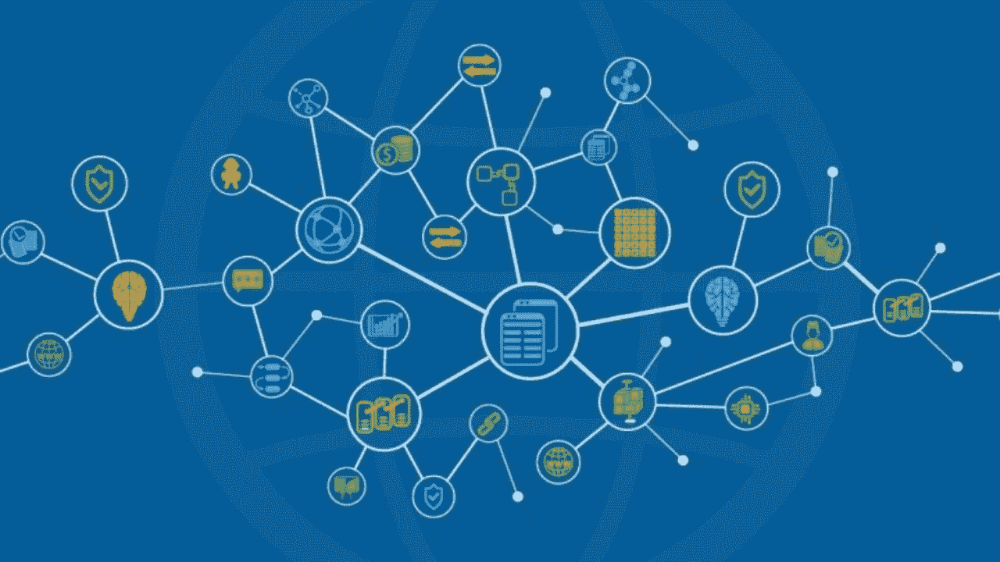

# 主权/多 dApp 链理论的兴起

> 原文：<https://medium.com/coinmonks/the-rise-of-the-sovereign-multi-dapp-chain-thesis-d7b8d6f4e0af?source=collection_archive---------6----------------------->

> “在 DYDX，我们接受技术上的彻底变革，这些变革有可能极大地改善协议”——DYDX 的创始人安东尼奥·尤利亚诺

dYdX 是以太坊 og。他们离开 stark ware(L2 联邦理工学院)的消息引发了许多关于以太坊及其第二层的未来的问题和担忧。一个旗舰 DeFi 产品，如 dYdX，选择离开以太坊，转而支持主权区块链，这是加密史上的一个关键时刻，可能会对未来几年产生影响。这一决定的影响可能会开始以太坊失去其作为智能合约平台黄金标准的地位的趋势，这可能会导致统治地位、使用和主权区块链的增加，从而导致多 dApp 链世界的崛起。

# **dYdX 的历史**

dYdX 由安东尼奥·尤利亚诺于 2017 年创立，是第一个基于以太坊的分散式永久、保证金和现货交易应用程序。当时，保证金交易越来越受欢迎，尤其是在 Bitfinex 这样的集中式交易所。到 2021 年，dYdx 通过其独特的订单系统成为 DeFi 的旗舰产品，最终成为主导的分散式 perps 交易所。2021 年，在 C 轮融资中，他们筹集了 65，000，000 美元，对他们的估值为 2.15 亿美元。然而，通往 2.15 亿美元估值的道路并不容易。

# **以太坊主网→StarkWare→dYdX 链**

dYdX 最初是建立在以太坊主网上的。直到 DeFi 夏天，一切都很好。以太坊上 DeFi 受欢迎程度的上升绝对是汽油费暴涨。当每笔交易的天然气价格在几美分左右时，dYdX 正在补贴其用户。然而，当单笔交易的成本在 50-100 美元时，dYdX 的烧钱速度惊人。最终，这导致了一个激进的决定。dYdX 将最低交易金额提高到 10，000 美元，扼杀了交易量和协议采用率。

这是一个重大问题。安东尼奥一直以产品为导向。产品。产品。产品。Antonio 对 dyDx 的愿景从一开始就很明确:一个分散的产品，具有令人惊叹的 UX，安全且极具可扩展性。

2021 年 4 月，dYdX 在以太坊第二层扩展解决方案 StarkWare 上正式上线。dYdx 建立在 StarkWare 的缩放引擎 StarkEx 上，现在能够提供零汽油交易，降低交易费用，并缩小交易规模。理论上，这满足了 Antonio 对 dYdX 的所有标准:去中心化、安全性、可伸缩性和 UX。在公众眼中，一切都一帆风顺。不知从哪里，dYdX 宣布他们要离开 StarkWare 去一个主权区块链，dYdX 连锁店。这一重大决定引发了许多关于以太坊及其第二层的未来的有效问题和担忧。

# 【dYdX 为什么离开 StarkWare？

斯塔克怀特应该已经解决了安东尼奥面临的困境，对吗？嗯，没那么多。StarkWare 最大的问题是集中化。让 dYdX 如此独特的是他们的外链订单。dYdx 不使用 mainnet 来完成交易，而是在链外执行交易，这允许更高的吞吐量和更好的匹配。Starkware 的集中化对 dYdX 来说是个问题，原因有两个:封闭的源代码和集中的汇总排序。

第一个集中化问题是封闭源代码。StarkWare 使用一种不同的编程语言，叫做 Cairo。Cairo 是 Starknet 和 StarkWare 的本地智能合同语言，允许零知识汇总。dYdX 和 StarkWare 之间的一个问题是，dYdX 本质上是使用 stark 技术(StarkEx)“作为服务”。他们会向 StarkWare 团队支付离线费用，StarkWare 开发人员编写所有代码。

第二，定序器的集中化。所有以太坊 L2 的一个突出问题是集中式测序仪，这只是暂时的。我不是开发者，所以我会尽力解释。为了理解卷起技术，我们将使用测试的心理模型。

假设以太坊主网是你要上交的选择题考试。L2 的诸如 Arbitrum、乐观主义和 StarkWare 是你做所有“脏活”的草稿纸。你在草稿纸上做所有的工作，找到答案，然后在你上交的试卷上圈出正确答案。L2 积累了一堆交易(交易、批准智能合约、下注等。)合并到一个包中，并将其发送到 mainnet 以完成该包事务。

集中化问题源于定序器，定序器是将事务汇总从 L2 发送到 mainnet 的设备。恶意行为者可以伪造交易。

# **dYdX 离开以太坊的意义**

这一举动让 crypto twitter 上充满了对以太坊未来的猜测。这是以太坊 maxis 的巨大损失，也是 Cosmos 的巨大胜利。Cosmos“挖走”以太坊的旗舰产品，可能只是以太坊失去其作为区块链“黄金标准”的头衔以及主权链/多 dApp 链论点崛起的开始。

# **以太坊仍然是区块链的黄金标准吗？**

不。在 dYdX 离开以太坊之前，我的论点是以太坊不再是黄金标准。目前有比以太坊更好的区块链和生态系统吗？号码

成为最好的和成为黄金标准是有区别的。从 2017 年推出到 2021 年的牛市，毫无疑问，以太坊是区块链的黄金标准。他们是第一个智能合约平台。所有的创新都在以太坊。最有才华的开发者建立在以太坊之上。去中心化的世界是以太坊。我认为情况不再是这样了。

以太坊网络的拥塞，伴随着 alt layer 1 的出现，绝对扼杀了以太坊的采用。在高峰拥挤时(汽油大约 50-100 美元),以太坊对普通加密用户来说是不可用的；尤其是新的。

每天都有新用户选择使用 Solana、Avalanche 和 Luna 等替代 L1，因为用户体验更愉快(听起来熟悉吗？).这些区块链允许用户在他们蓬勃发展的生态系统中进行交易，而不是支付 50 美元的交易费用。创新不仅仅发生在以太坊。最好的开发者不仅仅建立在以太坊之上。智能合约平台市场的竞争空前激烈。

# **以太坊第二层怎么样？**

CT 上最大的一个问题是，“这反映了谁的更多，斯塔克威尔还是全 L2？“我相信这是对以太坊的反思。现在，以太坊比以往任何时候都面临着从 Pow 到 Pos 合并的压力。在一篇关于分片的博客文章中，Vitalik 说，

> “分片是以太坊可扩展性的未来，它将是帮助生态系统支持每秒成千上万次交易的关键，并允许世界上大部分地区以可承受的成本定期使用该平台。”

等到碎片化可用的时候，以太坊将已经切换到信标链。关于以太坊的统治地位，我总是说，“仅仅因为你是第一，并不意味着你将永远是最好的”。创新总是赢家。

我们正处于产品最重要的加密应用阶段。不幸的是，新闻用户将更倾向于简单、更快的吞吐量和廉价的交易，以去中心化为代价。合并到 Pos 不会立即解决可伸缩性问题。这可能会缓解其中一些问题，但有资金充足的区块链，有才华的开发人员，将有更愉快的用户体验。

那么这对第二层意味着什么呢？我怀疑它们对我接下来的论文的实用性。

# **主权链理论和多 dApp 链世界**

加密社区的成员，包括我自己，相信 dYdX 离开以太坊去宇宙上的主权区块链是趋势转变的开始，主权链/多 dApp 链论题。

主权链/多 dApp 链理论认为，建立在协议层上的应用将选择离开它们所在的现有区块链，支持主权区块链，这将导致多 dApp 链世界。他们将选择开始自己的连锁，以最大限度地分散、安全和可伸缩性。

安东尼奥的这条推特说明了一切。我相信我们会看到越来越多的开发者不再强调具体的区块链，而是更注重产品质量。这场竞赛是为了新用户。你如何吸引用户？通过推出最好的产品。你听过杰夫·贝索斯谈论亚马逊吗？有一个反复出现的主题。顾客。为了让顾客满意，一个人的产品或服务必须提供价值。

为了让 dApps 为客户提供最好的体验，去中心化(不是每个开发人员都高度重视去中心化)、可伸缩性和安全性是必须的。主权区块链允许可定制的、分散的、可扩展的和安全的协议，这将为客户提供最佳体验，导致多 dApp 链世界。

# **我对多 dApp 链世界的看法**

首先也是最重要的，我想声明这篇博文的意图并不是盲目推广 Cosmos。就我个人而言，我还没有深入研究过他们的区块链，所以我的了解很少。然而，在这次 dYdX 事件之后，以及我对多 dApp 链世界论题的信念，我将最确定地研究宇宙。执行一个多 dApp 链的世界说起来容易做起来难。为了验证这个论点，需要解决的最重要的问题是区块链互操作性/通信。

至少可以说，桥梁是粗略的。太多次了，我们已经看到桥梁由于开发而被抽干。区块链通信的另一个优势是总账系统。就我个人而言，我不喜欢总账系统的“集中化”。例如，宇宙生态系统完全依赖于宇宙中心。假设，如果集中的故障点发生故障，系统的分散程度如何？

我对区块链互操作性的理想愿景是一个与区块链无关的通信系统，每个区块链人都可以并将使用它。我知道该如何实现吗？一点线索都没有。说起来容易做起来难。

# **精神食粮**

在写作过程中，我思考了一些关于去中心化的问题:

*建立在协议上的应用程序真的可以去中心化吗？*

我们能实现真正的去中心化吗？

*如何在保持分散化的同时最大化用户体验？*

*短期来看，新用户确实和大多数用户一样看重去中心化。在我们的有生之年，我们会看到一个事件“唤醒”大众政府对个人自由的侵犯，导致自我主权的全球趋势转变吗？*

该死的，我对未来感到兴奋。如果你喜欢这个，请给我一个关注！

本(男子名)

***推特:****@ Ben _ Kaplan 23*

***Tiktok:***@ crypto _ Kaplan

***信标:****[beacons.ai/cryptokaplan](https://www.tiktok.com/link/v2?aid=1988&lang=en&scene=bio_url&target=http%3A%2F%2Fbeacons.ai%2Fcryptokaplan)*

> *加入 Coinmonks [电报频道](https://t.me/coincodecap)和 [Youtube 频道](https://www.youtube.com/c/coinmonks/videos)了解加密交易和投资*

# *另外，阅读*

*   *[如何匿名购买比特币](https://coincodecap.com/buy-bitcoin-anonymously) | [比特币现金钱包](https://coincodecap.com/bitcoin-cash-wallets)*
*   *[币安 vs FTX](https://coincodecap.com/binance-vs-ftx) | [最佳(SOL)索拉纳钱包](https://coincodecap.com/solana-wallets)*
*   *[比诺莫评论](https://coincodecap.com/binomo-review) | [斯多葛派 vs 3Commas vs TradeSanta](https://coincodecap.com/stoic-vs-3commas-vs-tradesanta)*
*   *[Capital.com 评论](https://coincodecap.com/capital-com-review) | [香港的加密借贷平台](https://coincodecap.com/crypto-lending-hong-kong)*
*   *如何在 Uniswap 上交换加密？ | [A-Ads 评论](https://coincodecap.com/a-ads-review)*
*   *[WazirX vs coin dcx vs bit bns](/coinmonks/wazirx-vs-coindcx-vs-bitbns-149f4f19a2f1)|[block fi vs coin loan vs Nexo](/coinmonks/blockfi-vs-coinloan-vs-nexo-cb624635230d)*