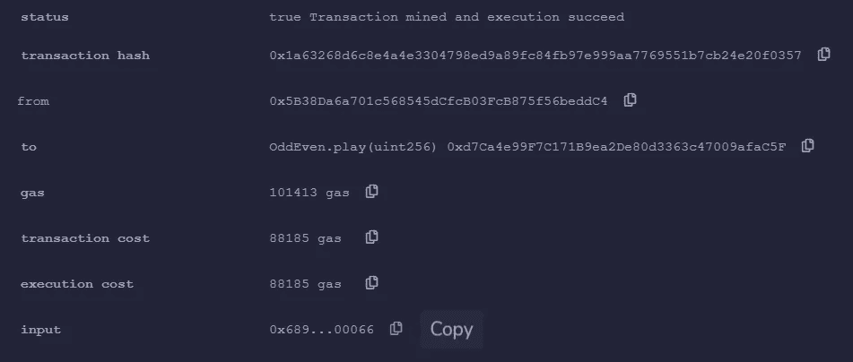
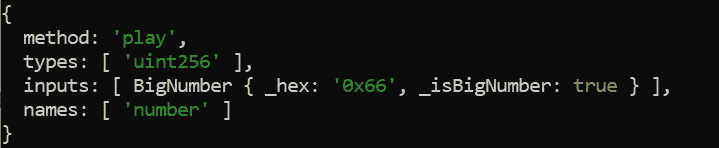

# 在以太坊中存储敏感数据的风险

> 原文：<https://medium.com/coinmonks/the-risks-of-storing-sensitive-data-in-ethereum-a39bb5fb444c?source=collection_archive---------5----------------------->

## 攻击者视角


Photo by [Nenad Novaković](https://unsplash.com/@dvlden?utm_source=medium&utm_medium=referral) on [Unsplash](https://unsplash.com?utm_source=medium&utm_medium=referral)

以太坊于 2015 年初首次推出，我们大多数人现在都知道它是一个公共的区块链网络，任何拥有网络访问权限的人都可以查看其他人进行的交易。出于同样的原因，在以太坊中存储敏感数据会带来很大的风险。但是，以太坊上的私人数据是如何公开的呢？攻击者如何从以太坊交易中获取信息？本博客的主要关注领域将是这些，并展示攻击者如何可能接近以太坊交易，以提取敏感数据。

用一个示例场景来讨论概念总是更好。以下代码片段摘自 [SWC 注册中心的未加密私有数据链](https://swcregistry.io/docs/SWC-136)。

```
pragma solidity ^0.5.0; **contract** **OddEven** { 
**struct** Player { 
**address** addr; 
**uint** number; 
} Player[2] **private** players; 
**uint** count = 0; **function** **play**(**uint** number) **public** **payable** { 
**require**(msg.value == 1 ether, ‘msg.value must be 1 eth’); players[count] = Player(msg.sender, number); 
count++; 
**if** (count == 2) selectWinner(); 
} **function** **selectWinner**() **private** { 
**uint** n = players[0].number + players[1].number;
(**bool** success, ) = players[n%2].addr.call.value(**address**(this).balance)(“”); **require**(success, ‘transfer failed’); 
**delete** players; count = 0; 
} 
}
```

以上是一个猜谜游戏的合同。两个用户可以每人猜一个数字，如果这些数字的总和是偶数，那么第一个玩家获胜，否则第二个玩家获胜。为了成为游戏的一部分并猜测号码，用户必须转移/下注 1 ETH 到合同，并且获胜的用户将获得该游戏的全部下注金额。

合同乍一看挺好的吧？函数 **selectWinner()** 和**玩家结构**被声明为**私有**，用户只能调用 play(unit)函数。以下是功能和状态变量上**私有**可见性级别的[正式定义。](https://docs.soliditylang.org/en/latest/contracts.html)

> 函数:私有函数类似于内部函数，但是它们在派生契约中是不可见的。
> 
> 状态变量:私有状态变量类似于内部变量，但它们在派生契约中不可见。

现在我们已经讨论了契约逻辑，让我们继续讨论用户事务，我们可以利用 [Remix online IDE](https://remix.ethereum.org/) 。复制-粘贴上面的合同代码来重新混合和部署合同。假设用户 1 是普通用户，用户 2 是攻击者。攻击者会等待用户 1 先行动。在这种情况下，攻击者有什么优势？为了理解这一点，让我们假设用户 1 已经猜出了一个数字，并通过下面的交易将其与 1 ETH 一起输入到智能合同中。



## 从用户事务中提取私有数据

让我们仔细看看上面 user1 的事务中的输入参数(事务数据),看看攻击者是如何理解它的。

```
0x6898f82b0000000000000000000000000000000000000000000000000000000000000066
```

这个十六进制值由两部分组成。前四个字节 **(6898f82b)** 指定调用哪个函数。它是使用函数名和参数的 Keccak-256 哈希生成的，也称为函数签名，即 **play(uint256)** 。如果你有一个 Keccak-256 散列，有时可以使用[以太坊签名数据库](https://www.4byte.directory/signatures/)来识别函数签名。要确认 6898f82b 是 Keccak-256 hash of play(uint256)，可以利用 [Keccak-256 online hasher](https://emn178.github.io/online-tools/keccak_256.html) 。

从上述十六进制值的第五个字节开始，接下来是编码的参数。即用户作为参数传递给函数“play”的内容。每个参数由填充到 32 字节的输入的十六进制值表示。在我们的例子中，它是“0x 0000000000000000000000000000000000000000000000066”，因为它是对应于 user1 输入“102”的十六进制值。有关参数编码的更多信息，请参考[编码的可靠性正式规范](https://docs.soliditylang.org/en/latest/abi-spec.html#formal-specification-of-the-encoding)。

现在，作为攻击者的用户 2 知道用户 1 的输入是 102。因此，为了赢得游戏，攻击者只需输入一个数字，该数字将使用户 1 输入和用户 2 输入的总和成为奇数。因此，用户 2(攻击者)将赢得猜谜游戏并获得全部下注金额。


Photo by [Jefferson Santos](https://unsplash.com/@jefflssantos?utm_source=medium&utm_medium=referral) on [Unsplash](https://unsplash.com?utm_source=medium&utm_medium=referral)

## 如果是复函数签名会怎样？

复杂函数签名可以由长度可变的输入字符串组成，该长度取决于所调用的特定函数和所需的参数等。没有问题，我们有合同的应用程序二进制接口(ABI)和 Nodejs 的救援。ABI 是以太坊生态系统中与合同交互的标准接口，包括来自区块链之外的和合同之间的。ABI 的可以在像 [EtherScan](https://etherscan.io/) 这样的探索者上找到，或者可以在 [Remix online IDE](https://remix.ethereum.org/) 中编译后复制。下面是猜谜游戏合同的 ABI。

```
[
  {
    "constant": false,
    "inputs": [
      {
        "name": "number",
        "type": "uint256"
      }
    ],
    "name": "play",
    "outputs": [],
    "payable": true,
    "stateMutability": "payable",
    "type": "function"
  }
]
```

将上述 ABI 保存在 abi.json 文件中。接下来，通过 npm 安装“[以太坊-输入-数据-解码器](https://www.npmjs.com/package/ethereum-input-data-decoder)”模块。

```
npm install ethereum-input-data-decoder
```

将下面的代码保存在 Nodejs 文件中。确保将正确的**文件路径**提到 abi.json 文件，并在代码中插入正确的**交易数据**。

```
const InputDataDecoder = require('ethereum-input-data-decoder');
const decoder = new InputDataDecoder(`${__dirname}/abi.json`);const data = `0x6898f82b0000000000000000000000000000000000000000000000000000000000000066`;const result = decoder.decodeData(data);
console.log(result);
```

运行上面的 Nodejs 脚本，观察解码的用户输入和用户调用的函数的详细信息，如下所示。



## 结论

的确，使用 EtherScan 或 Remix，任何人都可以从以太坊交易中提取人类可读格式的用户输入。然而，阅读这篇博客将帮助您理解事务数据(txdata)的复杂性，它将是以太坊中用于许多目的的众多自动化工具的主要输出之一。我希望这篇博客能揭示在以太网中保存敏感数据的风险，即使是在私有状态变量/函数中。任何私人数据要么离线存储，要么仔细加密。

> 加入 Coinmonks [电报频道](https://t.me/coincodecap)和 [Youtube 频道](https://www.youtube.com/c/coinmonks/videos)了解加密交易和投资

# 另外，阅读

*   [3 商业评论](/coinmonks/3commas-review-an-excellent-crypto-trading-bot-2020-1313a58bec92) | [Pionex 评论](https://coincodecap.com/pionex-review-exchange-with-crypto-trading-bot) | [Coinrule 评论](/coinmonks/coinrule-review-2021-a-beginner-friendly-crypto-trading-bot-daf0504848ba)
*   [莱杰 vs n rave](/coinmonks/ledger-vs-ngrave-zero-7e40f0c1d694)|[莱杰 nano s vs x](/coinmonks/ledger-nano-s-vs-x-battery-hardware-price-storage-59a6663fe3b0) | [币安评论](/coinmonks/binance-review-ee10d3bf3b6e)
*   [Bybit Exchange 审查](/coinmonks/bybit-exchange-review-dbd570019b71) | [Bityard 审查](https://coincodecap.com/bityard-reivew) | [Jet-Bot 审查](https://coincodecap.com/jet-bot-review)
*   [3 commas vs crypto hopper](/coinmonks/3commas-vs-pionex-vs-cryptohopper-best-crypto-bot-6a98d2baa203)|[赚取加密利息](/coinmonks/earn-crypto-interest-b10b810fdda3)
*   最好的比特币[硬件钱包](/coinmonks/hardware-wallets-dfa1211730c6) | [BitBox02 回顾](/coinmonks/bitbox02-review-your-swiss-bitcoin-hardware-wallet-c36c88fff29)
*   [BlockFi vs Celsius](/coinmonks/blockfi-vs-celsius-vs-hodlnaut-8a1cc8c26630)|[Hodlnaut 点评](/coinmonks/hodlnaut-review-best-way-to-hodl-is-to-earn-interest-on-your-bitcoin-6658a8c19edf) | [KuCoin 点评](https://coincodecap.com/kucoin-review)
*   [Bitsgap 审查](/coinmonks/bitsgap-review-a-crypto-trading-bot-that-makes-easy-money-a5d88a336df2) | [Quadency 审查](/coinmonks/quadency-review-a-crypto-trading-automation-platform-3068eaa374e1) | [Bitbns 审查](/coinmonks/bitbns-review-38256a07e161)