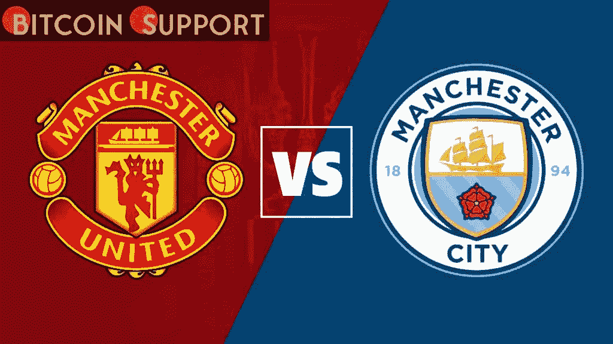

# 曼彻斯特联队和曼城队的竞争始于 Web3 球场

> 原文：<https://medium.com/coinmonks/the-rivalry-between-manchester-united-and-manchester-city-begin-on-the-web3-pitch-57539d3a447a?source=collection_archive---------86----------------------->

**Visit our website:-** [**https://bitcoinsupports.com/**](https://bitcoinsupports.com/)

继一个多月前曼联与区块链初创公司 Tezos 的关系之后，曼城通过与加密货币交易所 OKX 的合作首次进入该领域，为技术霸权的竞争增添了新的竞争。英国领先的足球俱乐部曼城宣布与加密货币交易所 OKX 建立初步关系，该交易所将横跨该俱乐部的男子和女子球队，以及其不断增长的电子竞技业务。

俱乐部的新闻稿称，双方的合作将聚焦于“OKX 全球客户群的独特活动，以及横跨阿提哈德体育场和学院体育场的场内活动”今年早些时候从 OKEx 更名而来的 OKX 是业内第二大现货交易所，拥有超过 2000 万客户，过去 24 小时内的正常交易量超过 43 亿美元。这一数字领先于比特币基地，后者以大约 33 亿美元排在第三位，但远远落后于币安以超过 162 亿美元高居榜首。OKX 首席执行官 Jay Hao 表示:“曼城是一个俱乐部，它体现了足球改善人们生活的力量，并将人们团结在对美好游戏的共同激情周围。”

[https://twitter.com/ManCity/status/1499686384835170309](https://twitter.com/ManCity/status/1499686384835170309)

在曼彻斯特市持续的竞争和对吹嘘权的激烈争夺中——特别是考虑到本周日的德比比赛——两家俱乐部的商业部门都在数字资产领域取得了重大进展，与行业公司达成了利润丰厚的交易，并竞相扩大其在 Web3 领域的影响力。2 月初，曼联超越竞争对手，与区块链初创公司 Tezos 合作，成为其官方训练套件和技术合作伙伴，该俱乐部渴望扩展到元宇宙和不可伪造的代币(NFT)收藏市场。《福布斯》提供了 2021 年 4 月世界上最有价值足球俱乐部的数据。虽然西班牙重量级球队巴塞罗那和皇家马德里名列榜首，但曼联排名第四，估值为 42 亿美元，预计 2020 年收入为 6.43 亿美元。另一方面，曼城以 40 亿美元和 6.09 亿美元的估值排在第六位。类似地，总部位于伦敦北部的英超俱乐部阿森纳试图进入球迷代币市场，但被广告标准局阻止，因为它违反了规定，根据该监管机构的说法，“不负责任地利用消费者缺乏经验，未能充分说明投资的风险”。"

**访问我们的网站:-**[**https://bitcoinsupports.com/**](https://bitcoinsupports.com/)

**免责声明:以上为作者观点，不应视为投资建议。读者应该自己做研究。**