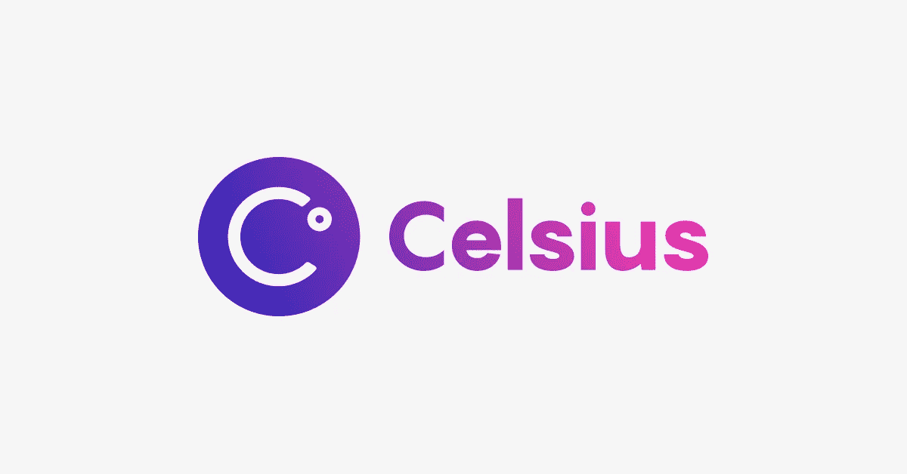
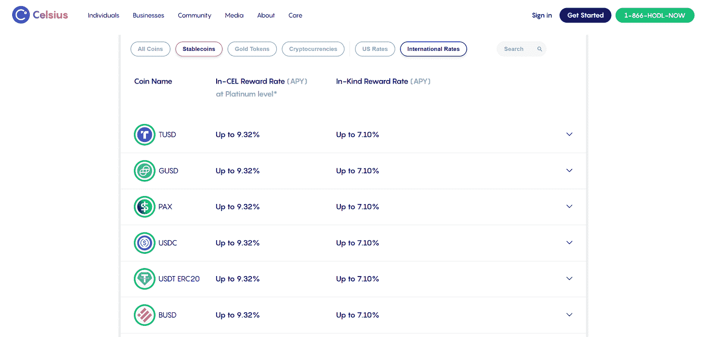
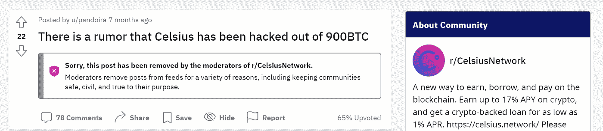
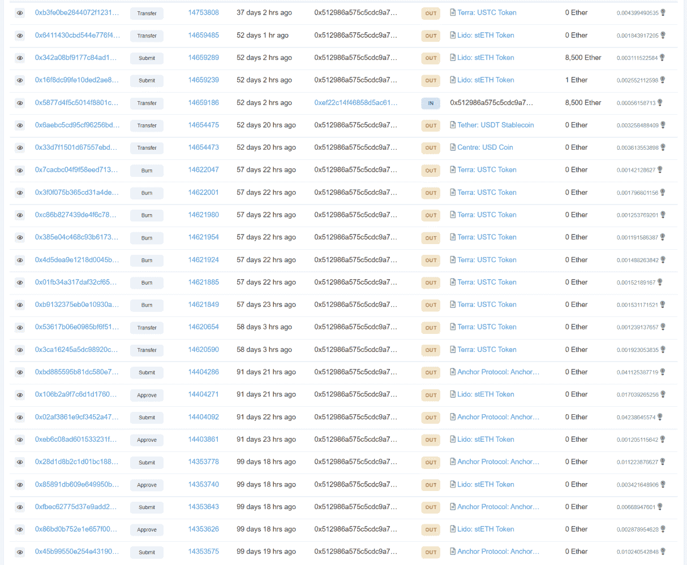
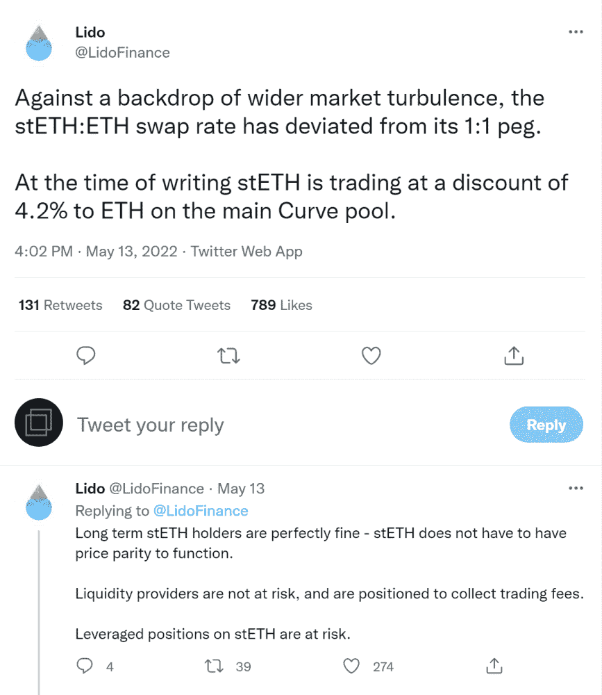

# 将摄氏温度带到崩溃边缘的道路

> 原文：<https://medium.com/coinmonks/the-road-that-brought-celsius-to-brink-of-collapse-3ff2fae3cdb5?source=collection_archive---------1----------------------->

blog.celsius.network

6 月 13 日周日，Celsius Network 宣布停止该平台上的所有取款、转账和资产交换。给出的理由是“极端的市场条件”，以及随着时间的推移，使 Celsius 处于“更有利的地位”来履行其提款义务。Celsius 用户的反应是恐慌和愤怒，这是可以理解的，因为许多人已经将他们一生的积蓄投入到 Celsius 中。

此前，Celsius 向其超过 100 万的用户提供加密收益，以及以加密资产为抵押借款的能力。目标很简单:扰乱金融业，通过加密引入金融自由。

celsius.network

摄氏温度提供了诱人的收益。它们的 stablecoins 实际上是与法定货币一对一绑定的加密货币，收益率高达 10%，比特币和以太坊等主要加密货币的收益率高达 8%。

但是怎么做呢？Celsius 从未提供任何详细的解释或报告，除了其首席执行官亚历克斯·马辛斯基在几次采访中表示，他们通过向可信机构“出借密码”(如比特币或以太坊)来创造收入。

# Celsius Network —发生了什么？

似乎在 2021 年秋末的某个时候，向资产负债表稳健的可信机构出借加密数据的趋势，已经转变为将客户的加密资产投资于越来越奇特、风险越来越高的工具，以便为储户赚取收益。

# 2021 年 12 月 2 日—巴杰道黑客

Celsius 的问题至少可以追溯到 12 月 21 日，当时 BadgerDAO，一个在以太坊上用令牌化的比特币赚取收益的 DeFi 协议，成为了一次攻击的受害者。一份链上数据显示，Celsius Network 可能是 1.2 亿美元 BadgerDAO 黑客攻击中的最大输家。

攻击者从一个以“0x534”开头的地址提取了 896.8 个包装好的比特币，价值超过 5100 万美元。链上数据表明，该地址与 Celsius Network 密切相关，该网络在 11 月 21 日看到该地址将 125 ETH 转移到另一个以“0xdb3”开头的地址。“0xdb3”钱包中有不到 6800 万美元，其中 4120 万美元是 Celsius 的 CEL 令牌。它还与 Celsius 的一个主要钱包进行了多次七位数的交易，该钱包以“0x4f6”开头，在 Etherscan 上被标记为“Celsius Network: Wallet 5”。

此外，当有人发布损失的谣言时，Celsius Network 从其 Reddit 页面上删除了与该事件有关的问题，以保持“社区安全”。

reddit.com

2021 年 12 月 3 日，在 YouTube 直播 AMA 期间，Celsius 的首席执行官 Alex Mashinsky 证实，该公司在 BadgerDAO 黑客事件中确实“损失了金钱”，但没有说明损失的确切数额。

# 2022 年 5 月 9 日——地球的 UST 崩溃

2021 年 12 月，区块链分析显示，Celsius 向 Terra 的 Anchor Protocol 进行了大量存款，该协议为 TerraUSD 的存款提供了高达 20%的回报。

根据区块链分析公司 Block Research 进行的分析，由 Celsius 控制的钱包在过去五个月中向 Anchor Protocol 发送了至少 261，000 个 ETH。

etherscan.io

Celsius 的存款始于 12 月 19 日，截至 3 月 17 日，共存入 146，000 ETH。随后步伐加快，在 4 月 6 日至 5 月 3 日之间又存入了 115，000 ETH。

我们假设策略是将贝丝放在 Anchor 协议上作为借入 UST 的抵押品，然后将 UST 放在 Anchor 上获得 19%的收益。

然而，根据 Block Research 的分析，5 月 11 日，随着 TerraUSD 的崩溃，Celsius 从 Anchor Protocol 收回了约 225，000 ETH(或 4.63 亿美元)。Block Research 无法确定剩余资金是否被提取或注销，这些资金当时价值约为 8000 万美元。

# 2022 年 5 月 13 日—丽都金融入股 ETH Depeg

或许 Celsius 最大的失误是决定将客户的以太代币投资于利多金融。

Lido 是针对 ETH 2.0 的一个灵活的锁定解决方案，它允许用户锁定他们的 ETH，而无需锁定资产或维护基础设施。本质上，用户将他们的 ETH 交换为“staked”ETH 或 stETH，1 stETH 等于 1 ETH。

Celsius 向客户承诺乙醚存款的回报率在 6%至 8%之间。据跟踪区块链数据的分析公司 Nansen 称，该公司的主要 DeFi 钱包中至少有 4.5 亿美元，但其他地方可能还有更多。

5 月 13 日，利多发了一条推文，称在加密市场动荡之际，ETH 和 stETH 之间的互换利率已经偏离了一对一的挂钩，并警告说，虽然 stETH 的长期持有者和流动性提供者没有风险，但 stETH 的杠杆头寸有风险。

twitter.com

虽然一个 stETH 应该可以兑换一个 ether，但 stETH 的价格在最近几周与 ether 相比有所下降，因为加密市场的下跌促使持有者出售他们的 stETH。这种差异使得 Celsius 很难将其 stETH 转换回 ether 来满足客户的提款需求。

由于 Celsius 持有大量 stETH，而 stETH 正在脱离其挂钩，流动性不足的担忧进一步加剧，因为用 stETH 购买 ETH 的市场流动性不足以让 Celsius 的大量头寸在不遭受重大损失的情况下退出。

此外，比特币的暴跌也给 Celsius 带来了压力，今年比特币的价值已缩水约一半。根据分析公司 Nansen 的说法，它将与比特币挂钩的加密资产作为其他加密货币贷款的抵押品，随着比特币下跌，Celsius 必须补足抵押品。

随着越来越多的用户从平台上撤回资金，加密货币市场在周末已经大幅抛售，Celsius 宣布他们将暂停平台上的所有提款、掉期和资产转移。

# 摘要

Celsius 运营中最严重的问题是，越来越明显的是，该公司用用户的资金承担了巨大的风险。《华尔街日报》周二报道称，Celsius 已经聘请了重组律师。他们的条款和条件明确规定，

> “如果 Celsius 破产、进入清算程序或因其他原因无法偿还其债务，则在 Earn 服务中使用的或在 Borrow 服务中用作抵押品的任何合格数字资产可能无法收回，并且除了根据任何适用法律您作为 Celsius 债权人的权利之外，您可能没有与 Celsius 对您的义务相关的任何法律救济或权利。"

他们能否解决这个问题将取决于市场条件、运气和时间。

最终，中本聪对比特币的愿景是一个基于加密证据而非信任的电子支付系统。因此，允许第三方存储你的私钥是违背比特币的货币主权理念的。

从中可以得出一个教训:不是你的钥匙，也不是你的密码。

*免责声明:本文包含的信息仅用于教育目的，并不构成 Wheatstones 的任何形式的建议或推荐，用户在做出(或避免做出)任何投资决定时也不打算依赖这些信息。*

> 加入 Coinmonks [电报频道](https://t.me/coincodecap)和 [Youtube 频道](https://www.youtube.com/c/coinmonks/videos)了解加密交易和投资

# 另外，阅读

*   [有哪些交易信号？](https://coincodecap.com/trading-signal) | [Bitstamp vs 比特币基地](https://coincodecap.com/bitstamp-coinbase) | [买索拉纳](https://coincodecap.com/buy-solana)
*   [如何给 MetaMask 钱包添加 Arbitrum？](https://coincodecap.com/how-to-add-arbitrum-to-metamask-wallet)
*   [KuCoin vs 北海巨妖 vs BitYard](https://coincodecap.com/kucoin-vs-kraken-vs-bityard)
*   [加密交易的最佳 VPN](https://coincodecap.com/best-vpns-for-crypto-trading)
*   [ProfitFarmers 点评](https://coincodecap.com/profitfarmers-review) | [如何使用 Cornix 交易机器人](https://coincodecap.com/cornix-trading-bot)
*   [西班牙 5 大最佳文案交易平台](https://coincodecap.com/copy-trading-spain)