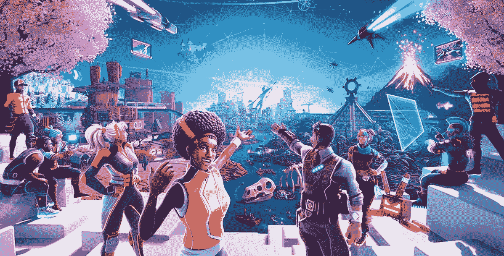
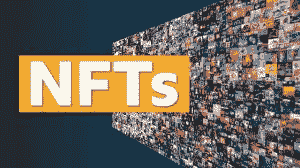

# 元宇宙国家森林公园的作用。

> 原文：<https://medium.com/coinmonks/the-role-of-nfts-in-the-metaverse-9b888a3821c9?source=collection_archive---------29----------------------->

起初，我确实只把 NFTs 看作是一个普通的数字图像，但是最近 NFTs 以数百万美元的价格出售的消息激发了我学习和理解术语 NFTs 的兴趣。

在我的研究中，我使用的许多视频和内容都非常复杂，以至于我对从哪里开始感到非常困惑。

希望在这篇文章中，我已经将这些概念分解到最突出的理解层次，这样就可以简单地向您介绍元宇宙和 NFTs。

在这篇文章的结尾，你会明白什么是 NFT，他们在元宇宙中的角色，以及什么是元经文。

# 什么是元宇宙？

**元宇宙:**这是一个虚拟的现实世界，这一切都是在电脑上进行的，而且都是虚拟的。在元宇宙你可以做很多不同的事情，比如与人、建筑和物体互动。这几乎就像在电脑上玩生命游戏。你也可以在元宇宙拥有自己的东西。例如，你可以拥有土地并建造一个虚拟建筑。你也可以在元宇宙拥有数字资产，称为 NFTs(不可替代的代币)。

图片来源:Unit 2 Games Limited

从技术上讲，元宇宙是下一个互联网；这是一个数字空间，在这里你可以做你在现实世界中做的事情。然而，元宇宙很容易被理解为一个持久的、共享的 3D 虚拟空间，与感知的虚拟世界相连。马克·扎克伯格将元宇宙定义为你身处其中的互联网，而不仅仅是看一眼。

数字空间很像现实世界，因为用户可以在元宇宙做他们在现实中做的事情。元宇宙的常见问题是:

你如何进入元宇宙？

我怎样才能看到元宇宙？

可能你也问过自己同样的问题。

但在此之前，我想让你知道元宇宙的概念，所以想想我们只有一个地球的自然世界，它不像元宇宙。我们有不同类型的元宇宙；你要选择你想要或喜欢与哪一个互动。

*   **集中元诗句:**这些是公司拥有的元诗句，非区块链。这方面的一个例子是脸书元宇宙。
*   **分权的元宇宙:**这些是区块链的元宇宙，没有一家公司拥有。[道](https://en.wikipedia.org/wiki/The_DAO_(organization))辖如此。例子有[分散土地](https://decentraland.org/)和沙箱。

# 什么是 NFT？

NFT 代表不可替换的令牌；NFT 是区块链上的代币，充当真实性的数字证书，可以立即验证，并显示其先前所有者的历史。不可替代的可以称为不可替代的。这意味着 NFTs 不能被复制。

NFT 是数字资产，具有独特和具体的属性，使其区别于其他资产。除了 NFT 的不可替代性之外，它还具有不可分割、可转移、防欺诈和可编程的特点。这意味着 NFTs 创作者可以决定每次 NFT 转手时，版税将由买家支付给他们。

**一些流行的非功能性测试包括:**

**密码朋克:**这是一万幅八位风格的像素图片的集合，可以作为 NFT 出售，它们的价格已经超过了数百万美元

**NBA 热门镜头:**这是一个球迷可以交易 NBA 时刻 NFT 的市场。这些时刻是被包装成 NFT 的视频剪辑。

**NFT 的其他著名例子包括:**

推特创始人杰克·多西以 NFT 的身份以 290 万美元的价格出售了他的第一条推特。

毕普以 NFT 的名义将他的作品卖了 6900 万美元。

# 如何购买 NFT？

理论上，我们已经理解了什么是 NFT。我们开始练习吧。你怎么能买到 NFT 呢？一般来说，有两种类型的 NFT 市场:

*   **集中的 NFT 市场**
*   **分散的 NFT 市场**

**集中式 NFTs 市场:**您可以在集中式市场中使用信用卡或其他支付方式注册并为您的账户提供资金。集中市场的一个例子是 Nifty gateway。交易所双子座拥有它，你可以用你的双子座的余额购买 NFT。

**分散的 NFTs 市场:**另一方面，你需要一个与你的 NFT 创建地区块链兼容的钱包。例如:在以太坊的例子中，元掩码是最受欢迎的选项。这是一个钱包，你可以用它登录分散的 NFT 市场，如 [OpenSEA](https://opensea.io/) 、 [SuperRare。](https://superrare.com/)想要拥有一件 NFT，你可以在 NFT 市场上出价或购买。

此外，NFT 是一种硬币或令牌，可以像任何其他加密货币一样存储在您的钱包中。请记住，除非你是一个狂热的收藏家，否则你也需要在某个时候卖掉 NFT，而 NFT 的流动性不是很好。

然而，你知道 NFT 市场是非常炒作驱动的。这可能导致这样一种情况，一个人花数百万美元买了一幅 NFT 的画，却发现他后来不能卖掉它，因为他对那幅特定的 NFT 作品不再感兴趣了。

# 元宇宙国家森林小组的作用

你可能会问，如果所有的 NFT 人都在吹嘘对区块链的一个数字文件的所有权，那么它在元宇宙扮演什么角色呢？

元宇宙国家森林机构的参与极大地影响了元宇宙的发展。然而，NFT 增加了元宇宙的访问者或用户的数量，它也是数字世界与现实世界之间的一个很好的链接。以下是国家森林机构在元宇宙发挥的一些作用。

**身份和社区体验:**NFT 在元宇宙项目中的一个重要作用是用户的社区和身份体验。元宇宙的非物质文化遗产不仅仅是艺术。NFT 头像代表元宇宙用户，它还扮演着代币的角色，元宇宙的玩家可以用它来进入或改变元宇宙的位置。

此外，NFT 增强了用户真实世界身份的扩展，并提供了所有权证明来构建用户的虚拟身份。metaverses 和 NFT 的参与改善了用户的社交和社区体验。

**交易所:** NFTs 技术向用户授予土地和建筑物等数字资产的所有权证明。在 NFTs 技术的帮助下，用户可以购买、出售和转让。换句话说，非正规金融服务是元宇宙的一种交易手段。

此外，NFT 是你在元宇宙拥有某些东西的门票。例如，你需要在元宇宙获得或拥有一个数字空间或土地；NFTs 技术出现了。就像你知道的那样，你可以在元宇宙买卖土地，在区块链的帮助下，元宇宙的房地产项目以 NFT 作为交换的象征。[分散地](https://decentraland.org/)是元宇宙著名的房地产市场。

NFT 也可以在 [DeFI](https://en.wikipedia.org/wiki/Decentralized_finance) 中代替加密货币用作抵押品或担保。这相当于在现实世界中典当自己的东西来获得贷款。NFTFI 是 NFT 抵押贷款市场的一个例子。如你所见，这个想法是无穷无尽的。

**结论:** NFT 是下一个大事件，或者他们只是对主要时间的狂热？很难说。一方面，似乎每个人都在谈论 NFTs，所有的大公司都在进入数字空间。

另一方面，很难理解人们愿意支付数百万美元来购买所有权的数字证明，而在现实世界中却没有任何要求。NFT 技术对元宇宙项目的贡献是不可预测的，它可能是随后的世界经济的依赖。

新一代互联网的快速发展将广泛惠及其用户。你还怀疑元宇宙、NFTs 和区块链的未来吗？那很好；我也很怀疑。您可以加入 [**真实报道**](https://therealreports.substack.com/p/the-crypto-world-shouts-for-your) 简讯，了解并接收关于区块链的有价值的报道。

如果你有任何问题，请在评论区提出。