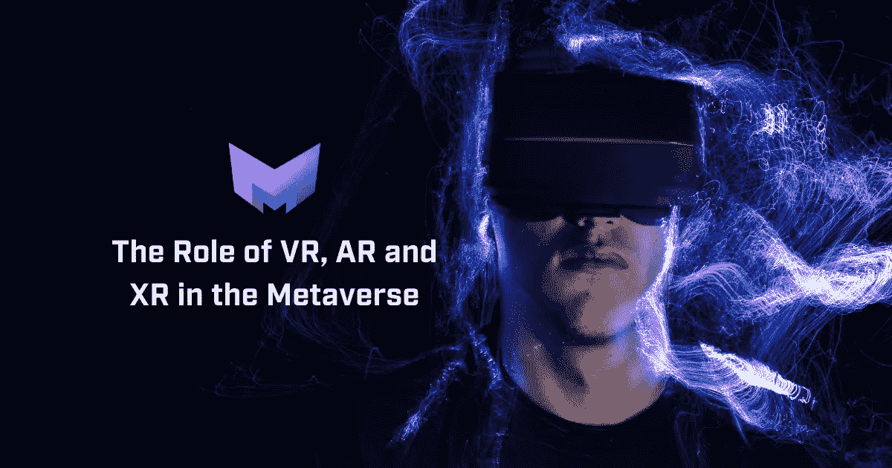
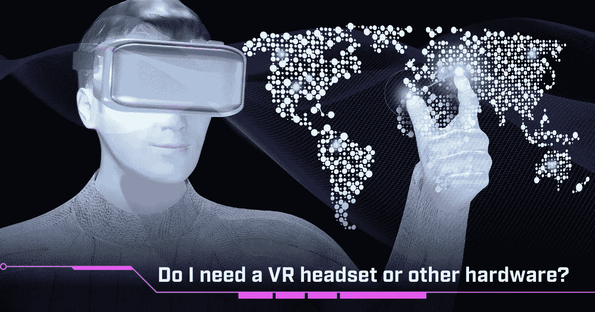
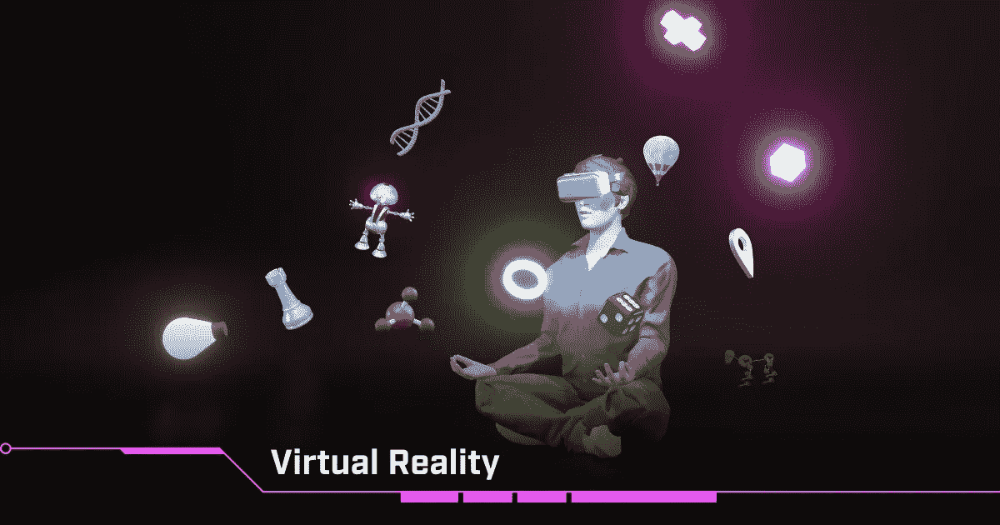
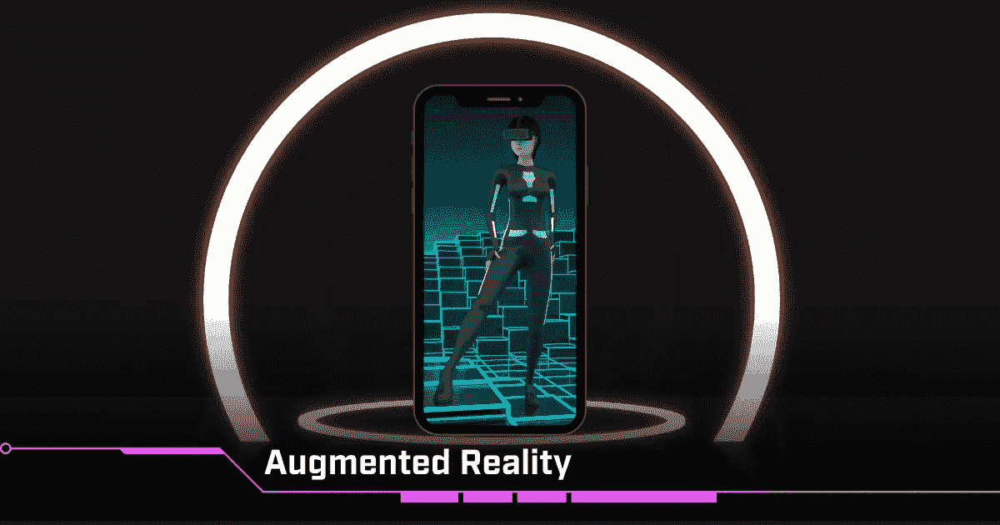
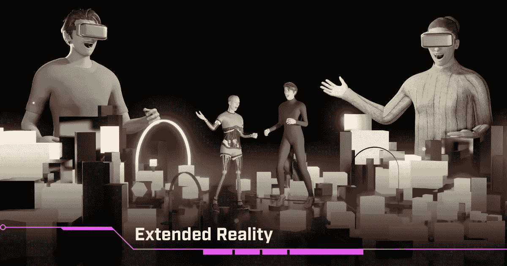
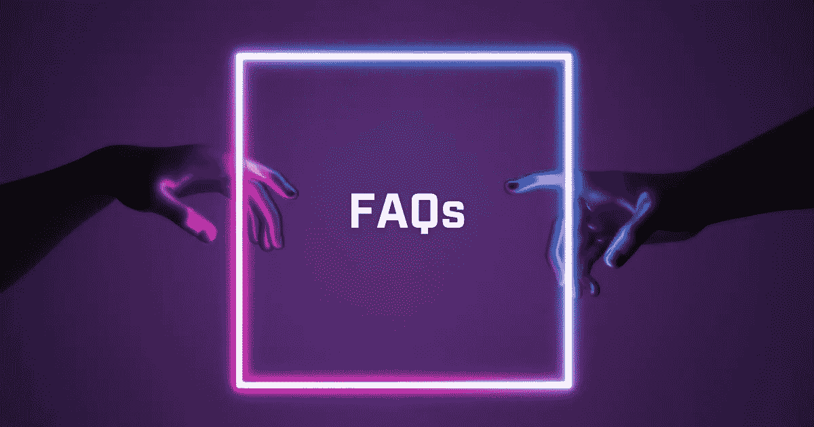

# VR、AR 和 XR 在元宇宙的作用

> 原文：<https://medium.com/coinmonks/the-role-of-vr-ar-and-xr-in-the-metaverse-2ab2de11573?source=collection_archive---------8----------------------->

MetaMetaverse 是一个创建你自己的元宇宙的平台。每个元宇宙都是一个虚拟社会，有自己的游戏、互动体验、经济和治理。这些元数据是用 metameta lang 构造的，meta meta lang 是元宇宙互操作性的第 1 层协议。

**目录**

*   什么是元宇宙？
*   我需要一个 VR 头戴设备或者其他硬件吗？
*   虚拟现实
*   增强现实
*   扩展现实
*   一个新世界在等着我们

元元宇宙高于一切，是一个沉浸式的领域。这是一个深入不同世界并探索数字空间的地方。因此，很容易想象虚拟现实(VR)、增强现实(AR)和扩展现实(XR)等前沿技术是如何成为焦点的。在这篇文章中，我们将会看到所有这些方面在元宇宙中发挥的程度。

# 什么是元宇宙？

最简单地说，元宇宙是一个允许在线互动的数字空间。人们聚集在这个开放的网络空间来实现某种目标。可能只是打发时间和娱乐，可能是购物或网上约会。元宇宙是通向网络上真实生活世界的门户。

元元宇宙将这些概念向前推进了一步。结合 web3 技术，如加密货币、NFTs 和基于区块链的基金会，我们可以创建一个真正的虚拟社会。虚拟世界的沉浸感更深，在这里，数字财产和物品的所有权变得真实，我们的互动以一种前所未有的方式充实起来。

那么像 VR、AR 和 XR 这样的扩展现实的想法是如何发挥作用的呢？

# 我需要一个 VR 头戴设备或者其他硬件吗？

首先，这个紧迫的问题肯定应该得到解决。最简单的答案是否定的，除了安全访问互联网之外，不需要任何东西。使用这些工具进一步参与是一个额外的收获，因为整个世界变得更加互动。然而，作为一个希望接触所有感兴趣的人的系统，我们已经创建了一个不需要这些工具的系统。

[在某个时候，一个移动平台将会为移动中的 meta ver 用户提供](/@metametaverse/metametaverse-interfaces-personal-computer-mobile-phone-vr-neuralink-mindmaze-4a3aab13df7a)，桌面应用将会有更好的易用性和结构。

# 虚拟现实

在今天的技术世界里，我们通常会将 VR 与耳机和沉浸式游戏联系在一起。这当然是非常正确的，并且适用于元元世界。您可以使用当今市场上可用的技术，成为这个不断发展的社区的一部分。

虚拟现实硬件的一个例子是 Meta/脸书的 Oculus 耳机。使用这些工具，你可以获得真正深刻的体验，帮助你与元宇宙世界和空间内的其他用户建立联系。

使用虚拟现实技术是虚拟世界体验的巅峰。这是为了各种体验，无论是为了好玩，还是为了从事商业。利用这种技术，你的工作概念可以扩展。你可以用一种更简单易懂的方式展示建议和复杂的想法，你可以展示商业计划，并向你的伙伴介绍你的计划。

所有这一切都清晰地呈现在你的眼前。

# 增强现实

增强现实与 VR 不同，它将真实世界作为数字概念的基础。这用数字图像掩盖了真实世界。这可能是一个全球定位系统或数据阅读器，也可能是一个简单的联系人列表。它基本上是通过日常设备的技术应用。你可以想到 2010 年代初失败的谷歌眼镜实验，或者更常用的谷歌地图。

有了这个软件，你可以进入城镇和城市，了解一个地方的外观和地标。这可以帮助你理解布局以及如何在给定的空间内走动。

一个更加现代和明显的例子是口袋妖怪 Go。几年前风靡一时的游戏现在看起来几乎过时了。但是用软件把现实世界和数字世界融合起来，才是 AR 技术的基础。它是数字和真实的综合。

谷歌眼镜的理念正在被重新发明。更新、更高效的型号现在也有了。这些透明耳机将使数字视觉融入我们的日常街道和城镇。它们不同于 VR 头戴设备，因为它们体积更小，可以在外出时佩戴，并且可以在真实世界中进行渲染。

这也是元元宇宙的一大部分。系统已经到位，将天气特征和真实世界物理等想法纳入虚拟空间，以获得真实的生活体验。增强现实可以用来测试定理，给出建筑演示，并在安全和受控的环境中显示可能的危险情况。

或者，同样，在一个有趣和迷人的环境中。MetaMetaverse 的基础是为人们创造一个吸引人的、有价值的交流空间。增强现实将这些想法带到了生活中。

# 扩展现实

我们可以在 XR 中看到这些技术的融合。扩展现实是所有这些想法进入 web3 的桥梁。这为网络概念、虚拟聚会、在线购物、数据存储以及区块链、虚拟现实和增强现实技术奠定了基础。这是网络潜力的完整循环，允许每个人都参与到一个真正独一无二的世界中。

MetaMetaverse 开创了封装 XR 体验的所有概念，让我们有机会一瞥数字空间的未来。独立，个人和社区，交易自由，使用加密货币和智能合同，以及乐趣。这种对目前已开发内容的扩展推动了我们对网络生活的理解，并给人一种完全不同的现实感受。

例如，您可以使用交互式、动画、属性或虚拟项目等 NFT 进行实时互动。结识新朋友，建立联系，将您的数字世界带到任何地方。它简单易用，所有人都可以使用。诚然，使用 VR 头戴设备和移动应用程序可以进一步增强体验，但虚拟社会对所有人开放，不需要先进的硬件。

Metaverse 团队正在构思所有这些令人难以置信的技术壮举，并希望让它们离你更近。随着我们的发展壮大，您可以通过 XR 加入并发现元宇宙技术的奇迹。[了解这个项目的所有可能性，并加入进来！](/@metametaverse)

# 一个新世界在等着我们

你不需要成为一个科技迷来参与元宇宙科技。找到关于 XR 技术和数字世界奇迹的所有信息是如此容易。如果是为了工作，娱乐，或者只是单纯的好奇，你有机会成为更大的万维网的一部分。一个安全且完全沉浸其中的地方。

请务必在我们的[推特](https://twitter.com/m2verse)、[脸书](https://www.facebook.com/meta2verse/)、 [Instagram](https://www.instagram.com/m2verse/) 、[抖音](https://www.tiktok.com/@m2verse)、[不和](https://discord.gg/TzTpmmSGXG)、[电报](https://t.me/metametaversechat)和[媒体](/@metametaverse)平台上关注我们，或者尽快查看我们的[网站](https://www.metametaverse.io/)以了解更多关于 Metaverse 的信息！

## 常见问题

**我可以在 MetaMetaverse 中使用 VR 耳机吗？**

是啊！要在 MetaMetaverse 中获得完全沉浸式的体验，可以使用 Meta/脸书 Oculus 等耳机。在虚拟世界中，这种硬件将给你更大的访问权限和更多样的体验。

**VR、AR、XR 分别代表什么？**

VR 代表虚拟现实，通常是指形成数字世界的一部分，使用硬件来查看数字世界。AR 代表增强现实，使用手机等技术将数字世界融入现实世界。增强现实技术已经克服了早期的一些失误，现在消费者可以使用更新的技术。扩展现实(Extended Reality，XR)是这些想法的进一步延续，通过引入社交和区块链概念，通过 VR 和 AR 技术给你一种真实世界的感觉。

**虚拟现实在元虚拟世界中有哪些用途？**

元元世界可以让我们概念化和想象那些原本可能非常抽象或难以理解的事物。使用耳机，您可以查看建筑物的建造过程或不同天气模式对地理特征的影响，例如，在容易发生洪水的河流上建造大坝会产生什么影响。

> 加入 Coinmonks [电报频道](https://t.me/coincodecap)和 [Youtube 频道](https://www.youtube.com/c/coinmonks/videos)了解加密交易和投资

# 另外，阅读

*   [如何在 FTX 交易所交易期货](https://coincodecap.com/ftx-futures-trading) | [OKEx vs 币安](https://coincodecap.com/okex-vs-binance)
*   [CoinLoan 审查](https://coincodecap.com/coinloan-review) | [YouHodler 审查](/coinmonks/youhodler-4-easy-ways-to-make-money-98969b9689f2) | [BlockFi 审查](https://coincodecap.com/blockfi-review)
*   XT.COM 评论[币安评论](https://coincodecap.com/profittradingapp-for-binance) |
*   [SmithBot 评论](https://coincodecap.com/smithbot-review) | [4 款最佳免费开源交易机器人](https://coincodecap.com/free-open-source-trading-bots)
*   [比特币基地僵尸程序](/coinmonks/coinbase-bots-ac6359e897f3) | [AscendEX 审查](/coinmonks/ascendex-review-53e829cf75fa) | [OKEx 交易僵尸程序](/coinmonks/okex-trading-bots-234920f61e60)