# 关于比特币，罗马人能教给我们什么？

> 原文：<https://medium.com/coinmonks/the-roman-era-a-model-for-how-humans-interact-with-technology-f3339b346afa?source=collection_archive---------0----------------------->

## 罗马人展示了技术和有效治理的结合是如何统治世界的。

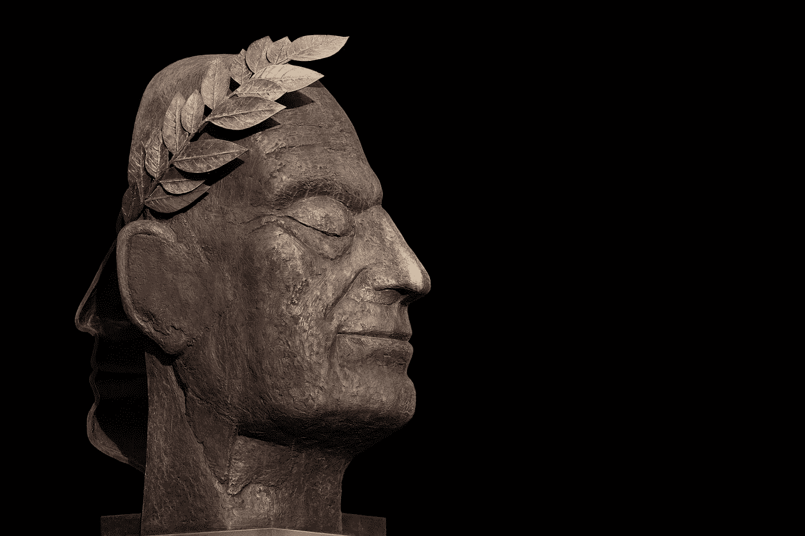

Photo by [Ilona Frey](https://unsplash.com/@couleuroriginal?utm_source=medium&utm_medium=referral) on [Unsplash](https://unsplash.com?utm_source=medium&utm_medium=referral)

通过一系列文章，我将解释我们如何实现今天的数字化转型，以及为什么这是比特币在现代世界取得成功的关键。你将了解并发现罗马和比特币是如何建立在惊人相似的原则上的。让我们深入研究一下。

# **共和国 500 年**

罗马共和国(公元前 509-27 年)是一个古老的地中海国家，由 300-500 名民选参议员管理。在此之前，罗马有一系列的君主，但该系统最终被推翻，最后一个国王被流放。

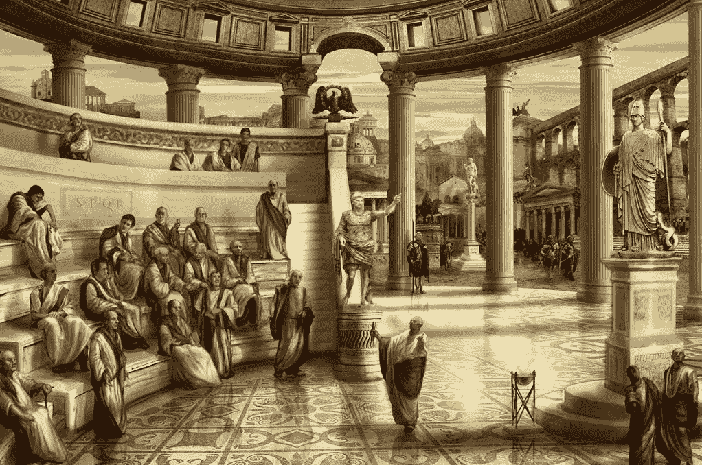

当罗马元老院在公元前 27 年授予凯撒·奥古斯都非凡的权力时，这实际上使他成为了第一个罗马皇帝——从而结束了共和国并带来了最终的灾难。

这些共和国长寿的主要原因是组织机构、受人尊敬的历法和由自然迷信和军队控制的政治体系的结合。如果他们粗心大意，他们不可能用 500 年的黄金时代统治世界这么多地方。

我先解释一下罗马政治的原则。

# **《三月十五日》**

***‘三月十五日’***原本是罗马年的第一个满月，但几个世纪后变成了罗马历的第 74 天(3 月 15 日)。

这是一个重要的日子，通常以债务期限、宗教仪式和一年一度的两位新执政官选举为标志。这些是最高级别的罗马政治家，他们一起任职一年。

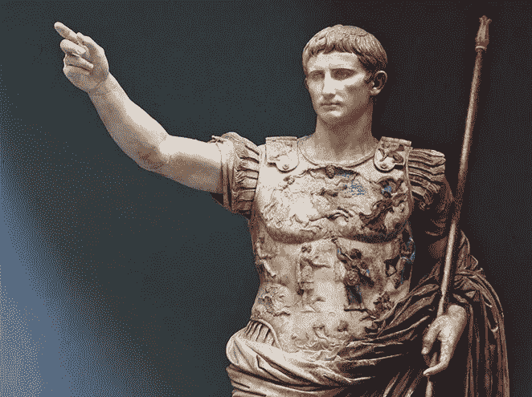

Roman Colsulate

选举结束后，将举行为期两周的宗教仪式。在此期间，每个人都履行公民义务，向神献祭，最重要的是，为战争做准备。

## **竞选和自然政治的年度模式**

3 月 15 日六周后，军事行动开始。这项运动每年从五月持续到八月。罗马人是一个军国主义的民族，军事胜利是成为罗马受人尊敬的统治者的必要条件。

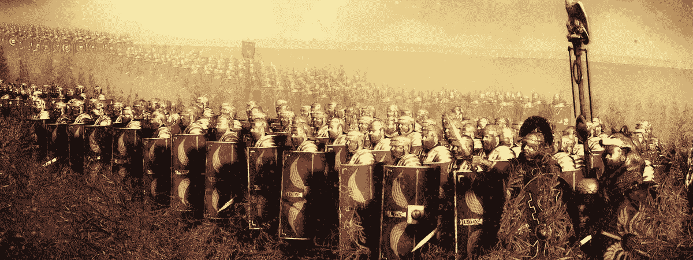

如果战争到八月还没有结束，他们就提前结束。他们明白自然环境比任何敌人都更具威胁性。大多数人死于自然原因——暴风雨、寒冷等。因此，在从 11 月到 2 月的冬季，政治和军事冬眠。

## 冬天的政治

当罗马人不打仗的时候，他们正在组织更多的战争。对罗马人来说，这表现为政治活动和为下一次选举做准备。

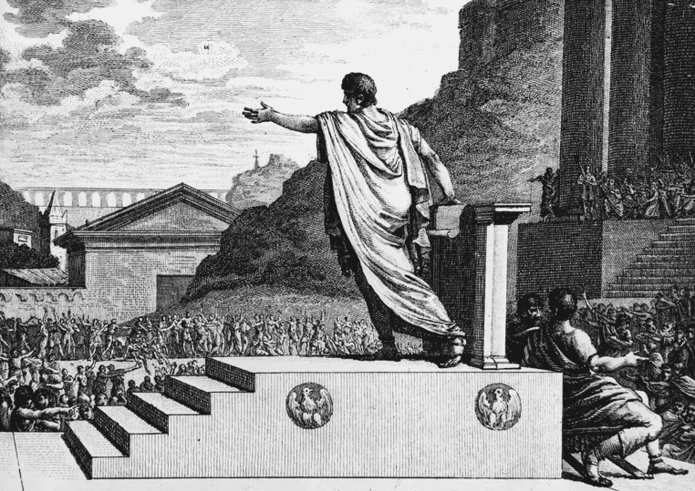

3 月 15 日又来了，是时候给上层社会的每个人指定一个角色了——论坛报、领事馆、总督。如果有人在这一年去世，明年会有另一个人接替他们的位置。

“每个人都会轮到自己”的概念在罗马共和国时期是真实的。

## 罗马共和国杰出的将军？没关系。

大西庇阿(公元前 236/235-183 年)通常被认为是有史以来最优秀的军事指挥官和战略家之一。他领导罗马战胜了宿敌迦太基，并在公元前 202 年的扎马战役中击败了传奇人物汉尼拔

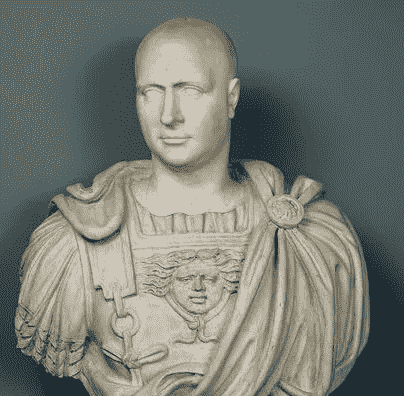

Scipio Africanus

在他的父亲和叔叔死于第二次布匿战争(公元前 218 年至 201 年)后，西庇阿在 20 岁出头时掌权。如果有一个家庭成员为共和国而死，他们知道下一个亲属会受到尊敬。今年，你是你父亲的财产；明年，你将是指挥官。

然而，即使你是最杰出的将军，你的未来也不能保证。组织比个人更重要。新人才的不断流动是保持权力的必要条件。如果只有一个中央领导人或王朝，文明的结构就会瓦解。罗马人曾经明白这一点。

这些共和国的政治制度是分散的。如果我们将这一原则与比特币或中央领导的组织进行比较，我们可以认识到去中心化的优越性和反脆弱性。比特币是 3 月 15 日。

# **竞争创造责任**

罗马执政官是最有才华的将军。他知道他的军官来自罗马所有其他相互竞争的家族——如果将军懒惰、酗酒、懦弱或愚蠢，就会报告给元老院。或者他被杀了。

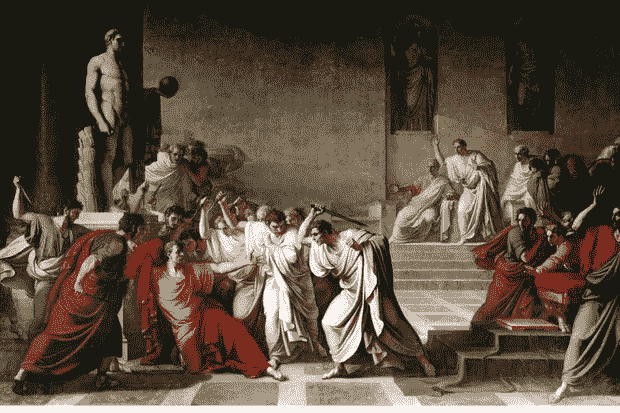

当你知道每个人都在看着你，你可以被取代，这带来了更高水平的诚信和责任感。

你可以把它比作自由市场中的垄断者和企业家。垄断没有竞争，也没有自然选择，而企业家们则不断面临客户流失的威胁。

# **罗马的技术优势**

正如我们之前了解到的，罗马人严肃对待战争，并且明白没有“公平的战斗”这样的事情。

他们发明了弹射器，管理士兵的武器，并组织成大规模的、纪律严明的编队，一起有效地移动和战斗。

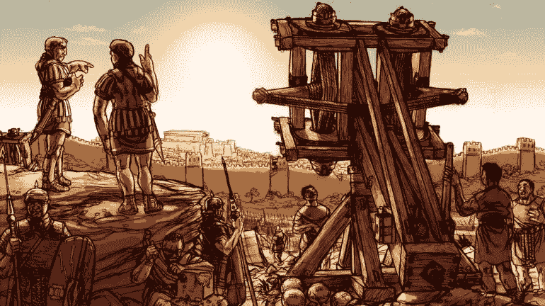

在与其他帝国的数百场战斗中，罗马人发射了大炮，建造了堡垒，适应了不同的武器、战场和战斗风格，并以建立复杂的物流系统而闻名。他们智胜对手，通过技术占据优势。

## **罗马海军的创建**

罗马人是出了名的糟糕水手，而他们的宿敌，来自现代突尼斯的迦太基人，则完全相反。一天，一场风暴将一艘迦太基船带进了罗马港口。这对罗马人来说是一件幸运的事情，因为他们立即开始逆向工程。

他们发现迦太基人用易于组装的可重复使用的标准化零件来制造他们的船。在每一个单独的船舶零件上，都可以找到安装手册，说明零件的位置以及它们是如何装配在一起的。罗马人复制了整个蓝图并开始建造他们自己的船。

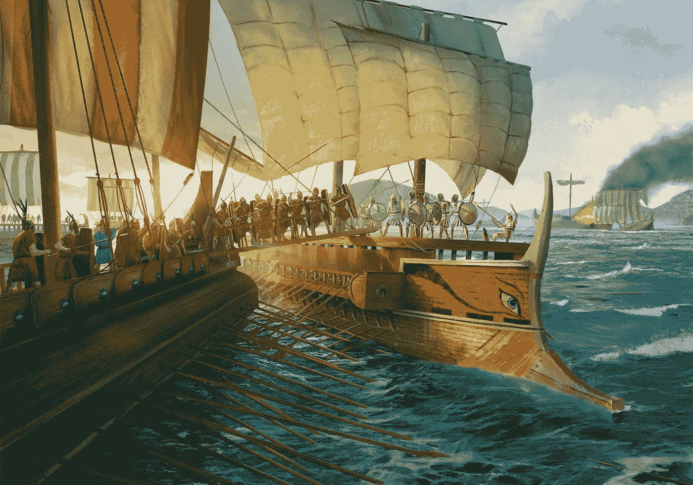

90 天后，他们制造了 150 艘船。这些人不是在鬼混。战争有办法加快你的行动。凭借 150 艘船只，罗马人赢得了第一次布匿战争，成为那个时代最强的海军力量。

他们没有发明所有的东西。他们最擅长偷窃。一个比较就是 Satoshi 对比特币的发现。他没有发明区块链、哈希函数、密码术或数字支付。作为一名工程师，他设法把它组装起来。

# **罗马标准化**

罗马帝国为他们的军团修建了欧洲第一条长途公路。

他们用他们战车轨距的距离来标准化正常的铁路轨道。因为战车是为罗马制造的，所以它们的轮距是一样的——4 英尺，8.5 英寸宽。今天它仍然是当前的标准铁路轨距(两个铁轨之间的距离)。

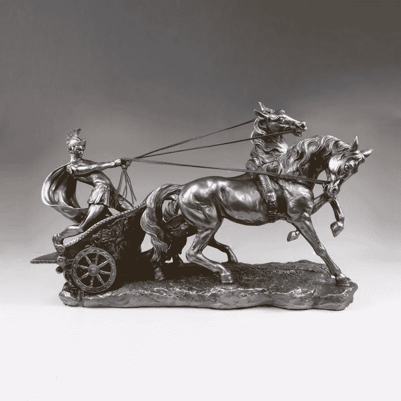

如果你能比你的敌人更快地在你的边界内移动军队，你将拥有显著的优势并赢得战争。快速移动你的军队相当于交易。如果你能使用加密轨道，而不是传统的金融轨道更快地交易，你就能击败你的竞争对手。罗马的道路系统是一个值得骄傲的地方，它给了这个政体一些重要的动脉。

协议很重要。如果你没有他们，人们就不能合作。后勤或军事协议同样重要。罗马人的标准化堪比比特币的标准化协议。协议是不可变的:如果你改变它，之前和之后的一切都会受到影响。该协议是非常宝贵的，将在本系列的后面讨论。

# **罗马渡槽与工程**

罗马人明白了水力学的重要性，并把它带到了一个新的高度(字面上)。他们创造了从 70 英里外取水的沟渠。

Panorama view of Aqueduct of Segovia, Spain. One of the best-preserved elevated Roman aqueducts.

一个地方的自然经济密度取决于你能得到多少水；口干舌燥(和痢疾)的交易很少。然而，有了导水管，你可以把居民从 500 人增加到 5000 人，从而增加经济。

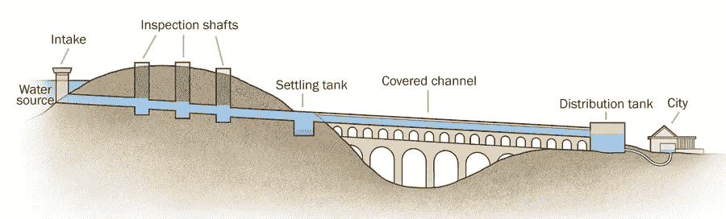

罗马人是工程师。工程是一个令人难以置信的可敬的、道德的、肯定生命的职业。工程学的基本哲学是观察你周围的自然和环境，利用你的智力和手头的材料，为每个人创造一个更好的世界。罗马人认真对待他们的工程。

聪也是。比特币并不是一个复杂的概念——区块链、良好的隐私、公钥和私钥加密、哈希。技术坐在那里，等着有人把它结合起来，然后点火。聪把两根棍子摩擦在一起，产生了火。嗯，不仅仅是摩擦两根棍子那么简单。有一天，比特币可能会被认为与火的发明同等重要。

# **罗马政治和货币协议的衰落**

## 罗马货币的贬值

罗马皇帝并不完美。他们选择扩大货币供应，以帮助支付持续不断的战争和基础设施项目。他们通过掺入更便宜的金属，如铜，降低硬币的价值，同时保持硬币的面值不变。贬值增加了货币供应量，从而增加了政府的购买力。这与当今许多政府的做法没有太大不同。

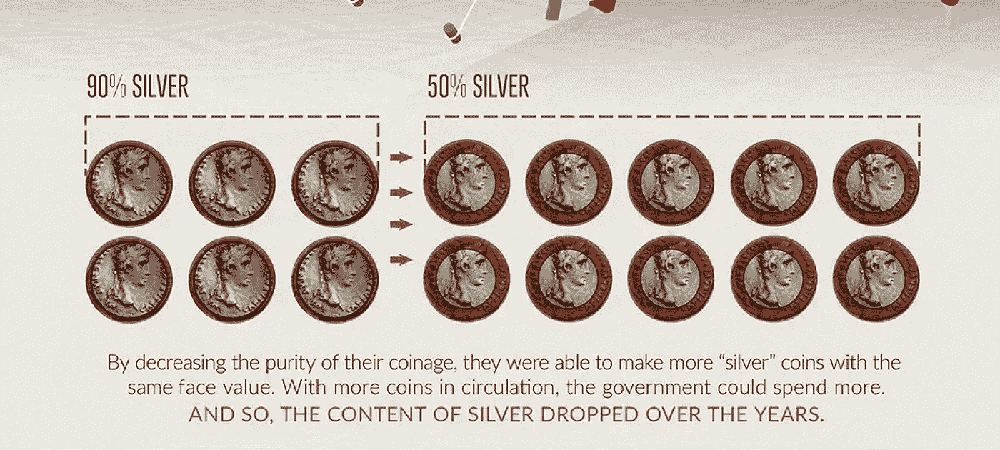

帝国在自身的重压下挣扎，最终分裂为东西罗马(拜占庭)帝国。不久之后，他们的政治协议在一系列内战中妥协了。他们的政客被贬低了。这个过程比他们的硬币贬值还要快。

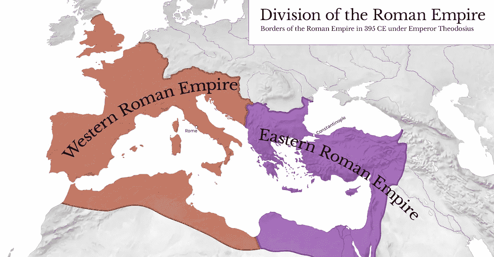

一切都是相关的——一旦你的政治或经济协议被打破，其他一切都会崩溃。这就是我们在世界各地看到的情况，比如在美国或中国。

## 共和国是怎么撑了 500 年的？

大约在公元前 50 年，罗马的情况开始变糟。在那之前，他们有一个持续了 500 年的伟大的共和制度，这是历史上无与伦比的壮举。

共和国是怎么撑了这么久的？组织。罗马政治出人意料地透明、流动和竞争，这有助于该系统保持其完整性和有效性。然而，天下没有不散的宴席。

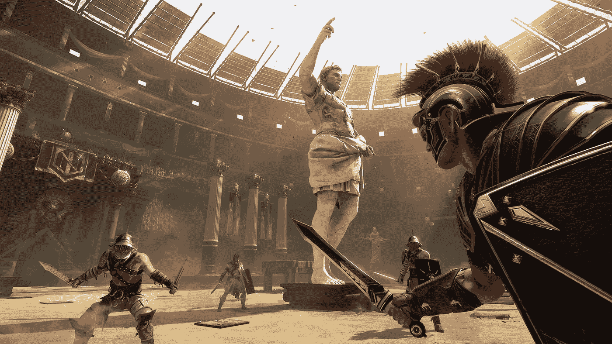

一旦规则改变，他们脱离君主制，他们就失去了优势。如果你试图将自己与竞争隔绝，你的文明就会忘记如何做事。压力源是自然界和人类的重要信息。你正在切断驱动你适应的数据。

这与区块链如何调节和改变协议以隔离/保护自己相比较。过去十年，比特币一直处于自由市场，并经过了实战考验。它是不断发展的。

# **秋天**

罗马共和国向罗马帝国的过渡阶段(公元 138 年至 180 年)，被称为安东尼*时代。*当时人均寿命是 72 岁。你有洗澡，写作，先进的文明，政治，卫生设施，沟渠和道路。

罗马帝国解体后，我们艰难地进入了黑暗时代。它的特点是经济、智力和文化的衰退。事情正在破裂。预期寿命从 72 岁上升到 30 岁。它提醒我们没有什么是确定的。如果你错过了关键的洞察力，你可能会失去 1000 年。

## **苦难 1000 年**

中国人在 2000 年前发明了印刷机，但他们从未考虑过将其商业化。中文字母表是象形的，你需要 25，000 个字符来完全包含这种语言。他们有“错误的语言”

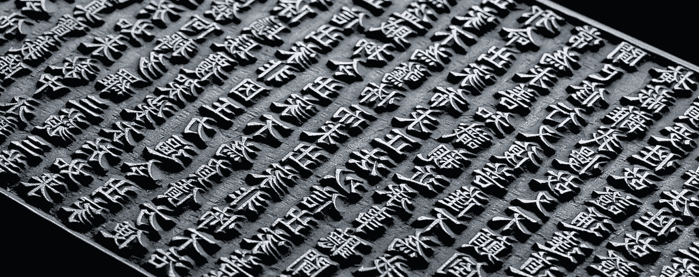

罗马人有罗马字母表，可以印出 26 或 50 枚的任何东西。那是“正确的”语言，然而它从未在那里被发明出来。由于他们与远东隔绝，他们不知道新闻。

我们不得不等到 1453 年约翰·古腾堡在西方发明了印刷机，这使得书籍的大规模生产成为可能。从公元 476 年到 1453 年，差不多有 1000 年的蒙昧时期。

## **我们忘记了地球是圆的**

在梵蒂冈的圣彼得广场，你可以找到图拉真的圆柱。它建于公元 113 年，是罗马在达契亚战争中获胜的纪念碑。在顶部，天主教堂安装了圣彼得的雕像。

在古代，它有着不同的形象。图拉真曾身着朝服站在那里，手握世界。**世界是一个球体。**

如果我们快进 1400 年——人类认为世界是平的。甚至现在一些傻瓜认为世界是平的。如果他们不把雕像拿下来，他们可以学习一些基本的东西。甚至最基本和最直观的知识都会丢失，你的文明也会随之丢失。

利用现有的技术，让我们不要再犯同样的错误。没有足够多的政策制定者和个人将比特币作为一门学科来学习。如果你走错一步，我们就有可能再失去 1000 年。

## **总结**

随着罗马的崛起，我们看到了一个复杂的社会。它掌握了物流网络、标准化工具、水供应，并以如此辉煌的方式处理政治，以至于遍及已知的世界。在罗马帝国之后，我们进入了一个衰落的遗忘世界。法治和标准化的缺失甚至会让最文明的人沦为穴居人。

我以罗马共和国 500 年的成功为参照，比较了技术和比特币将如何对现代世界产生影响。

在下面的文章中，我将解释世界上最大的帝国幸存下来的原因，以及这是比特币成功的关键。

网址:[shawnmunir.com](https://shawnmunir.com/)
推特:[twitter.com/munirshawn](https://twitter.com/munirshawn)
邮件:[me@shawnmunir.com](mailto:me@shawnmunir.com)
媒介:[blog.shawnmunir.com](https://blog.shawnmunir.com/)

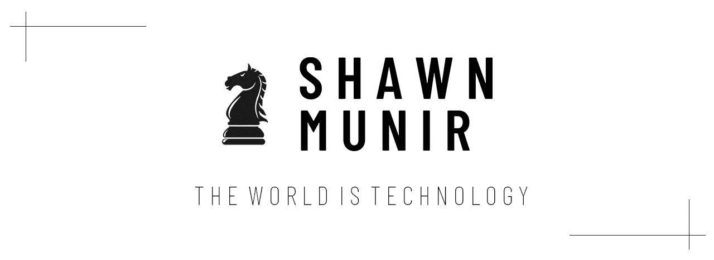

如果你喜欢这篇文章，请在 Twitter 上加入讨论。如果你能通过分享这篇文章来帮助我传播观点和见解，我将非常感激。

> 加入 Coinmonks [电报频道](https://t.me/coincodecap)和 [Youtube 频道](https://www.youtube.com/c/coinmonks/videos)了解加密交易和投资

# 另外，阅读

*   [如何购买 Monero](https://coincodecap.com/buy-monero) | [IDEX 评论](https://coincodecap.com/idex-review) | [BitKan 交易机器人](https://coincodecap.com/bitkan-trading-bot)
*   [CoinDCX 评论](/coinmonks/coindcx-review-8444db3621a2) | [加密保证金交易交易所](https://coincodecap.com/crypto-margin-trading-exchanges)
*   [红狗赌场评论](https://coincodecap.com/red-dog-casino-review) | [Swyftx 评论](https://coincodecap.com/swyftx-review) | [CoinGate 评论](https://coincodecap.com/coingate-review)
*   [Bookmap 点评](https://coincodecap.com/bookmap-review-2021-best-trading-software) | [美国 5 大最佳加密交易所](https://coincodecap.com/crypto-exchange-usa)
*   [如何在 FTX 交易所交易期货](https://coincodecap.com/ftx-futures-trading) | [OKEx vs 币安](https://coincodecap.com/okex-vs-binance)
*   [CoinLoan 审查](https://coincodecap.com/coinloan-review) | [YouHodler 审查](/coinmonks/youhodler-4-easy-ways-to-make-money-98969b9689f2) | [BlockFi 审查](https://coincodecap.com/blockfi-review)