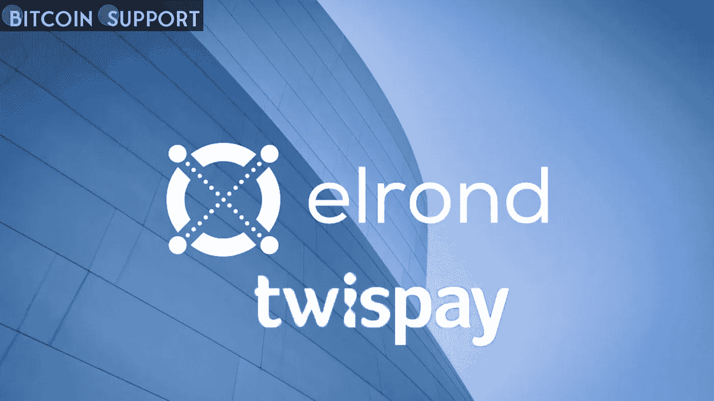

# 罗马尼亚中央银行已经批准了埃尔隆德对 Twispay 的收购

> 原文：<https://medium.com/coinmonks/the-romanian-central-bank-has-approved-elronds-purchase-of-twispay-3ad6022c7e27?source=collection_archive---------87----------------------->

**Visit our website:-** [**https://bitcoinsupports.com/**](https://bitcoinsupports.com/)

埃尔隆德的主要目的是使用 Twispay 的电子货币许可证发行可以在欧盟使用的稳定货币。

罗马尼亚国家银行批准了区块链的一项收购，允许区块链公司埃尔隆德购买一个支付处理平台。

根据周四发布的公告，专注于分布式应用的区块链初创公司埃尔隆德已经获得批准，收购电子货币机构 Capital Financial Services，该公司以 Twispay 为品牌运营。

Twispay 是一种全球支付解决方案，接受多种法定货币，集成了多种支付方式。该公司是 Visa 和 Mastercard 的主要成员，这意味着它具有发卡和收购商户的能力。该公司还获得了罗马尼亚国家银行的授权，可以开展支付服务和发行电子货币，并可以在整个欧洲经济区开展业务。

埃尔隆德收购 Twispay 是一项战略举措，旨在将自己打造成传统银行和加密货币业务之间的桥梁。通过此次收购，埃尔隆德还将能够为更快、更便宜的支付解决方案提供基础设施。

新的 stablecoins、支持加密的借记卡以及 DeFi、NFTs 和其他 Web3 技术的优势都是可能的用例，这些技术将提高现有金融机构的信任度和效率。据埃尔隆德公司的一位女发言人说，该公司最近收购的主要目标之一是发行稳定的报纸。

**“主要目的是使用 Twispay 的电子货币许可证发行可在欧盟用于支付和价值转移的稳定货币，供个人和公司使用，也可能供机构层面的官方使用。”埃尔隆德创始人兼首席执行官 Beniamin Mincu 表示:“罗马尼亚中央银行的这一历史性决定为欧盟国民打开了大门，很快将为世界各地的所有人打开大门。”。

埃尔隆德于 2021 年 10 月首次宣布收购电子货币业务的[意向。埃尔隆德宣布于 2022 年 1 月收购大型加密支付服务提供商 Utrust。该公司的代表表示，最近的收购，以及最近的 Utrust 收购，旨在通过充当“碳负、完全分散、廉价和接近即时的大量新金融服务的轨道”，在欧洲金融的数字化中发挥关键作用

**访问我们的网站:-**](https://elrond.com/blog/elrond-acquires-twispay-emoney-license/)[**https://bitcoinsupports.com/**](https://bitcoinsupports.com/)

**免责声明:以上为作者观点，不应视为投资建议。读者应该自己做研究。****