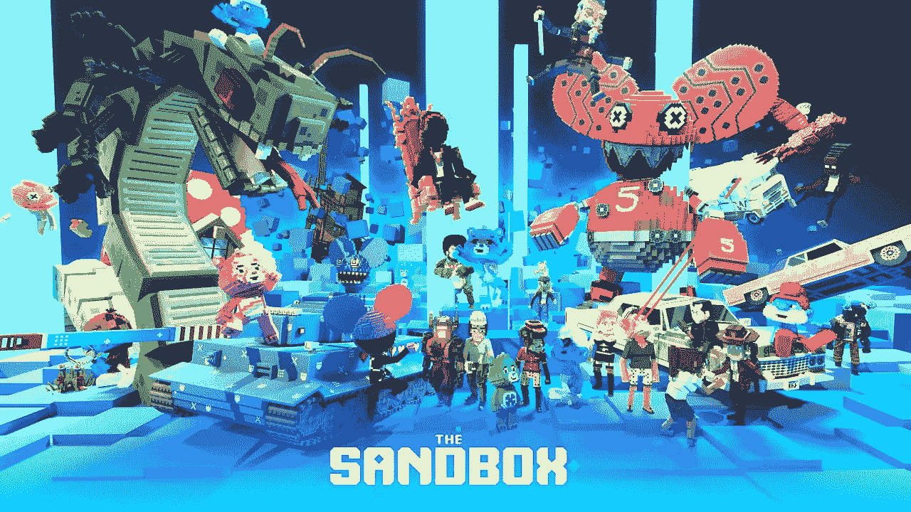

# 沙盒花 100 万美元从月鸟收藏馆买了一幅 NFT

> 原文：<https://medium.com/coinmonks/the-sandbox-bought-an-nft-from-the-moonbirds-collection-for-1-million-ffe127f53fe0?source=collection_archive---------27----------------------->

沙盒元宇宙项目以 350 ETH(在撰写本文时超过 100 万美元)的价格从月鸟 NFT 收藏中购买了一个不可替代的令牌。

化名 oscuranft 的卖方在 OpenSea marketplace 上列出了 Moonbird #2642。4 月 17 日，他以 100 ETH 的价格购买了这幅 NFT。

Moonbirds 是由初创公司 Proof 于 4 月 16 日推出的一万个猫头鹰化身的集合。后者由 True Ventures 的合伙人凯文·罗斯创建。

根据 Block Research 的数据，在大约一周的时间里，NFT Moonbirds 的累计销售额几乎达到了 3.6 亿美元。分析师托马斯·比亚莱克(Thomas Bialek)将此归因于罗斯的支持、他之前的证明集体项目的成功，以及开始选择“有成功记录”的不可替代代币的收藏家的行为。

根据 OpenSea 的数据，月鸟系列的代币目前的最低价格是 33.3 ETH。NFT 铸币成本为每单位 2.5 ETH。

早些时候，哲学家、邪教著作《黑天鹅》(The Black Swan)的作者纳西姆·塔勒布(Nassim Taleb)承认，在美联储收紧货币政策的背景下，不可替代代币市场将会破裂。

让我提醒你，4 月份，媒体了解到沙盒计划结束一轮 4 亿美元的融资。该公司的估值可能超过 40 亿美元。

> 加入 Coinmonks [电报频道](https://t.me/coincodecap)和 [Youtube 频道](https://www.youtube.com/c/coinmonks/videos)了解加密交易和投资

# 另外，阅读

*   [南非的加密交易所](https://coincodecap.com/crypto-exchanges-in-south-africa) | [BitMEX 加密信号](https://coincodecap.com/bitmex-crypto-signals)
*   [MoonXBT 副本交易](https://coincodecap.com/moonxbt-copy-trading) | [阿联酋的加密钱包](https://coincodecap.com/crypto-wallets-in-uae)
*   [Remitano 审查](https://coincodecap.com/remitano-review)|[1 英寸协议指南](https://coincodecap.com/1inch) | [购买 Floki](https://coincodecap.com/buy-floki-inu-token)
*   [MoonXBT vs Bybit vs 币安](https://coincodecap.com/bybit-binance-moonxbt) | [Arbitrum:第二层解决方案](https://coincodecap.com/arbitrum)
*   [买 PancakeSwap(蛋糕)](https://coincodecap.com/buy-pancakeswap)|[matrix export Review](https://coincodecap.com/matrixport-review)