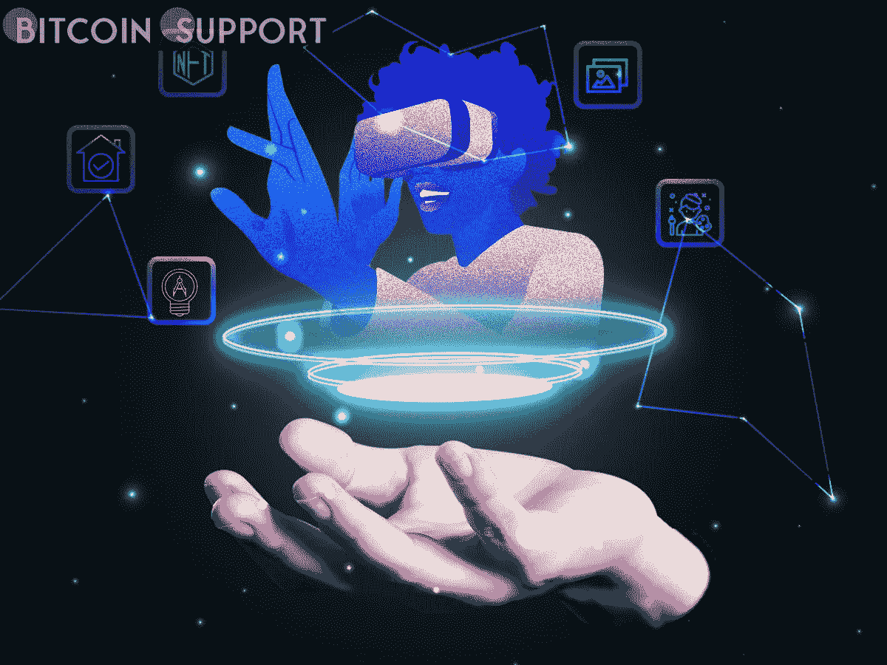
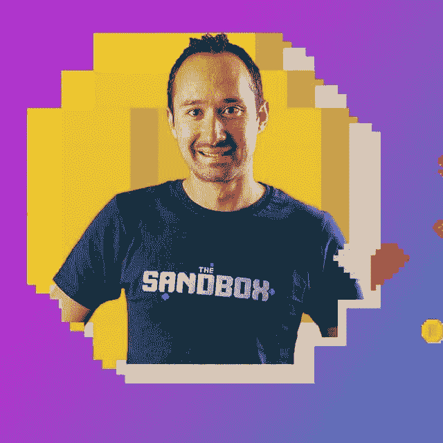

# 沙盒创始人说，元宇宙让我们看到了人类的想象力

> 原文：<https://medium.com/coinmonks/the-sandbox-founder-says-that-the-metaverse-lets-us-look-into-human-imagination-cfc0940c5768?source=collection_archive---------69----------------------->

**Visit our website:-** [**https://bitcoinsupports.com/**](https://bitcoinsupports.com/)

“我们确信，开放元宇宙的关键价值是去中心化、互操作性和用户生成的内容，”沙盒的创始人塞巴斯蒂安·博尔杰说。虽然人们对元宇宙的兴趣似乎在减弱，但该领域的一位先驱继续倡导开放的元宇宙，一个去中心化和可互操作的多元宇宙。

区块链开放世界游戏《沙盒》的创作者塞巴斯蒂安·博格特(Sebastien Borget)在 Web3 上发表了他的观点和知识以及元宇宙的状况。博尔格断言，元宇宙是通向新体验的门户，而这种体验只受到个人想象力的限制。他是这样表述的:

**“Web 3.0 和元宇宙让我们每个人都成为自己人类想象力的探索者，创造了新的平行宇宙，我们可以在其中挑选自己的经历。”此外，沙盒创始人指出，元宇宙已经开始影响人们如何“社交、发展经济关系和组成社区”他预计在十年内，将会有更多的空间开发。

**“我们预见到，在未来十年内，元宇宙将极大地改变我们对工作、社交、娱乐以及通过其创造的经济机会和工作岗位赚钱的看法。”Borget 认为，平台应该优先考虑确保创作过程令人愉快和满足，以及倾听人们的愿望。“我们创造了这个生态系统，但它是由玩家创造和分享的经验和资产驱动的，”Borget 解释道。

除此之外，Borget 认为元宇宙的政府应该下放给使用者。这将通过建立一个具有投票程序的分散自治组织来实现。

沙箱是一个分布式的元宇宙。Borget 解释说，这意味着用户不局限于平台。“对我们来说至关重要的是，你在沙盒中拥有或创建的内容可以转移到其他开放的 metaverses，反之亦然，”他解释道。博格特还强调了去中心化的重要性，而不是被锁在一个内容所有权被大型科技公司垄断的 Web2“微服务器”中。

**“我们坚信开放元宇宙的关键原则是去中心化、互操作性和用户生成内容。”**

当被问及沙盒的未来时，创始人表示团队正在逐渐壮大平台。“我们的想法是一个分散的娱乐元宇宙，任何人都可以玩，制作和赚钱。我们正在逐步扩大生态系统，以充分发挥沙盒为玩家、制作人和合作伙伴提供的潜力，”Borget 解释道。****

**Visit our website:-** [**https://bitcoinsupports.com/**](https://bitcoinsupports.com/)

除此之外，这位创始人指出，公司的下一个目标是让创作者能够在自己的土地上创造和分享经验。Borget 预计该社区将在未来继续贡献更多的原创内容。此外，尽管美国、中国和土耳其等国政府已经宣布了元宇宙战略，但这些政党将无法主导元宇宙。“由于所有权的多样性，没有一个实体能够对元宇宙行使权力，”他解释说。

Borget 也提到了沙盒增加游戏权益的目标。据创始人称，他们“特别想让沙盒成为女性制作人和玩家的安全空间。”这可能有助于吸引更多女性用户使用 Web3。

**“我们鼓励创作者创造包容性的环境，促使游戏玩家看到超越表面差异的东西，同时仍然欣赏它们。”**

**访问我们的网站:-**[**https://bitcoinsupports.com/**](https://bitcoinsupports.com/)

**免责声明:以上为作者观点，不应视为投资建议。读者应该自己做研究。**