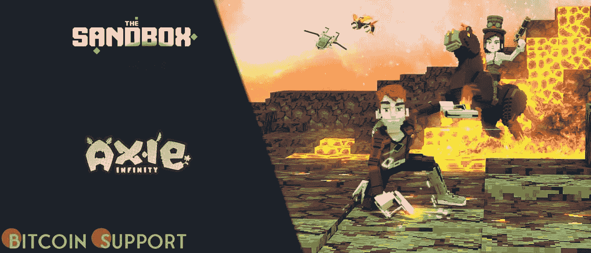

# 《沙盒》是继 Axie Infinity 之后谷歌搜索次数第二多的 NFT 作品集

> 原文：<https://medium.com/coinmonks/the-sandbox-is-the-second-most-googled-nft-collection-after-axie-infinity-333d3bf4333f?source=collection_archive---------70----------------------->

**Visit our website:-** [**https://bitcoinsupports.com/**](https://bitcoinsupports.com/)

据证实，Axie Infinity 是搜索次数最多的 NFT 系列，每月全球搜索次数高达 386 万次，自 2021 年底以来，搜索次数增长了五倍多。根据谷歌的统计，沙盒是第二大被谷歌搜索的 NFT，每月有 553，000 次全球搜索。根据谷歌的数据，NBA Top Shot 以每月 47.7 万的全球搜索量排名第三。根据谷歌趋势，Axie Infinity 被认为是世界上最受欢迎的 NFT(不可替代的代币)系列。

根据每月在谷歌上被搜索的次数，创意资源设计捆绑包调查了最受欢迎的非传统技术(NFTs)。根据 Finbold 提供的新闻稿，Axie Infinity 是最受欢迎的搜索引擎，每月收到 386 万次全球搜索。

自 2021 年末以来，“NFT”的搜索量增长了约 5 倍，在全球范围内平均每月有 510 万次点击。这比前一年增加了近五倍。由于最近名人和媒体的关注，这种交易资源被称为“新加密货币”

**访问我们的网站:-**[**https://bitcoinsupports.com/**](https://bitcoinsupports.com/)

**免责声明:以上为作者观点，不应视为投资建议。读者应该自己做研究。**