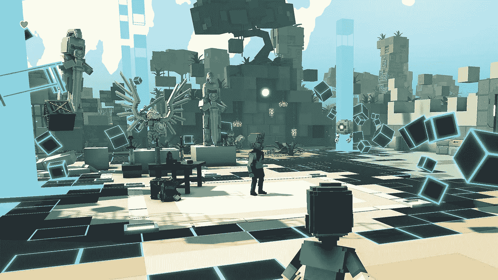

# 沙盒元宇宙

> 原文：<https://medium.com/coinmonks/the-sandbox-metaverse-eb4cc3897476?source=collection_archive---------13----------------------->

沙盒是一个基于区块链的虚拟世界，允许用户在游戏中创建和交易数字资产。沙盒由 Pixowl 于 2011 年推出，是一个位于区块链的虚拟世界，允许用户以游戏的形式创建、购买和出售数字资产。沙箱(SAND)是一个用户控制的虚拟世界，玩家可以在其中出售游戏资产。沙盒是一个虚拟世界，玩家可以在以太坊区块链使用沙盒和实用令牌创建、拥有和货币化游戏体验。

沙盒平台目前只在以太坊区块链上运行，这将它们令牌化。沙盒通过引入 SAND 实用程序令牌来促进平台上的交易，从而利用了区块链技术的力量。

沙盒是一个独特的平台，因为沙盒将区块链技术引入了游戏世界。通过创建一个允许玩家创建和收集区块链资产的世界，沙盒加密旨在彻底改变游戏行业。沙盒平台将被称为一个开创性的项目，将权力和控制权从游戏发行商/游戏开发商手中转移到艺术家、加密货币爱好者和游戏玩家手中，他们实际上为游戏的成功做出了贡献。

沙盒团队已经签署了 50 多个合作伙伴关系，在该平台上开发内容，包括像 Shaun the Sheep 这样的品牌，像 Dapper Labs (CryptoKitties)这样的 dApp 游戏工作室，像 Square Enix(最终幻想，古墓丽影)这样的投资者，以及像 ATARI 这样的标志性游戏公司。(过山车大亨，Pong)雅达利过山车大亨 Pong。这些合作伙伴已经在沙盒中保护了他们的虚拟房地产，并将在该平台的公开发布会上以及以后成为首批提供多人社交体验的合作伙伴之一。沙盒已经与许多知名品牌合作，如 Snoop Dogg，他在沙盒中设计了他的虚拟豪宅，以及 Walking Dead，他们创造了一种有待发现的游戏体验。通过专注于用户生成的内容，沙盒创建了一个参与玩家的元宇宙，他们为沙盒的持续发展做出了贡献。

与 Roblox 不同，沙箱是一个非常以加密为中心的平台。沙盒团队持有加密货币、稳定货币和法定货币的资金。你可以访问它的虚拟世界的一部分，而不用花钱，这是一个很好的方式来看看沙盒在做什么。

玩家在土地买卖中购买土地，以增加互动游戏、资源和体验。在完整的元宇宙中，土地权标是一块数字不动产或游戏内资产，用户可以用游戏制作者创建的游戏和 VoxEdit 创建的资产来填充。沙盒中的玩家可以出售虚拟土地(土地代币)，用 4683 沙进行交易。

沙子是用于支付沙盒中土地代币的加密货币。SAND 是建立在公共以太坊区块链上的 ERC-20 实用令牌，很快将成为沙盒中的交易基础，并将用于以下目的。作为游戏制造商沙盒社区的一员，在沙盒市场上交易各种资产和游戏有助于塑造在线游戏的未来 4683 沙盒代币是沙盒虚拟世界中的 ERC-721 代币，代表沙盒卡丁车数字资产的一部分。

社区成员能够购买数字房地产土地，这使他们有权使用 EverdreamSoft 的独家 NFTs 及其沙盒… 27 分钟前*用户必须使用 SAND token 和新的相关视频购买虚拟土地和物品。在区块链上，游戏本身是基于以太坊网络的。虚拟房地产投资——在 OpenSea 最大的 NFT 市场上，一幅 NFT 伪造“地球”的图像正在出售，这里的世界是区块链游戏“沙盒”的虚拟土地。一个稍微复杂的新区块链连接视频游戏是一个社区驱动的平台，创作者可以在以太坊上创建和货币化体素资产和游戏体验。

沙盒游戏的构建模块是称为体素的 3D 像素:名称不是指沙盒项目；我们正在谈论虚拟现实的演变。在沙盒中，玩家使用免费的 VoxEdit 沙盒程序从称为体素的 3D 像素中创建他们的游戏体验。沙盒游戏引擎还支持来自 VoxEdit 的自定义体素模型、装备和动画格式(VXM、VXR、VXA)。

游戏玩家可以以 NFT 的形式创建数字资产，将它们上传到市场，并使用沙盒游戏制作工具将它们集成到游戏中。沙盒结合了分散自治组织(Dao)和不可替代令牌(NFT)的力量，为蓬勃发展的游戏社区创建了一个分散平台。因为用户可以完全控制一个成熟的虚拟世界，他们自然可以以比集中式游戏设置更快的速度增长和适应。

除了专注于时尚的元宇宙空间，古驰还将发布时尚单品，沙盒玩家可以在游戏的虚拟现实中购买和穿着。据《Altcoin 日报》主持人 Austin Arnold 称，时尚巨头古驰在区块链出售虚拟服装的计划对于一个基于以太坊和以太坊的元宇宙来说是个好消息。

在他最新的 YouTube 更新中，Arnold 展示了时尚巨头古驰的最新产品，基于以太坊的沙盒(SAND)元宇宙。古驰周三宣布，它已经在分散式区块链游戏《沙盒》(The Sandbox)中获得了数量不详的虚拟土地。

[来源](https://bigbraincrypto.blogspot.com/2022/02/the-sandbox-metaverse.html)

> 加入 Coinmonks [电报频道](https://t.me/coincodecap)和 [Youtube 频道](https://www.youtube.com/c/coinmonks/videos)了解加密交易和投资

## 也阅读

 [## BlockFi 评论:2022 年的利弊和利率

### 今天，我们提出了一个全面的 BlockFi 评论，这是一个成立于 2017 年的加密贷款平台，拥有其…

coincodecap.com](https://coincodecap.com/blockfi-review)  [## 如何在印度购买比特币？2021 年购买比特币的 7 款最佳应用[手机版]

### 如何使用移动应用程序购买比特币印度

medium.com](/coinmonks/buy-bitcoin-in-india-feb50ddfef94)  [## 加密税务软件——五大最佳比特币税务计算器[2021]

### 不管你是刚接触加密还是已经在这个领域呆了一段时间，你都需要交税。

medium.com](/coinmonks/best-crypto-tax-tool-for-my-money-72d4b430816b)  [## 9 个 2022 年最值得购买的密码| CoinCodeCap

### 9 个 2022 年最值得购买的加密产品阅读加密产品评论和比较，了解比特币交易和…

coincodecap.com](https://coincodecap.com/crypto-to-buy-in-2022)  [## 存储比特币的最佳加密硬件钱包 2022 | CoinCodeCap

### 硬件钱包是我们存储加密资产的唯一可靠选择。在本文中，我们将讨论 8 个…

coincodecap.com](https://coincodecap.com/best-hardware-wallet-bitcoin)  [## Pionex 评论 2021 |免费加密交易机器人和交换

### Pionex 是为交易自动化提供工具的后起之秀。Pionex 上提供了 9 个加密交易机器人…

medium.com](/coinmonks/pionex-review-exchange-with-crypto-trading-bot-1e459d0191ea)  [## 2022 年密码交易员的三大电报渠道

### 加密信号是来自专业交易者的交易想法，以特定的价格或价格买卖特定的加密货币

medium.com](/coinmonks/top-3-telegram-channels-for-crypto-traders-in-2021-8385f4411ff4)  [## 2022 年 5 个最佳免费加密投资组合追踪器

### 在这篇文章中，我们将带你通过一些最好的免费加密投资组合追踪器，让你选择最好的…

coincodecap.com](https://coincodecap.com/free-crypto-portfolio-trackers)