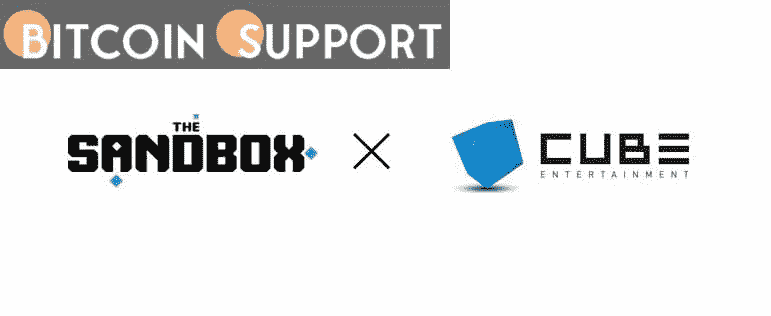

# 沙盒元宇宙拥有 200 万用户，并开始与韩国流行音乐合作

> 原文：<https://medium.com/coinmonks/the-sandbox-metaverse-reaches-2-million-users-and-begins-a-k-pop-partnership-1448857bd487?source=collection_archive---------62----------------------->

**Visit our website:-** [**https://bitcoinsupports.com/**](https://bitcoinsupports.com/)

玩家要完成 200 个任务才有机会赢得阿尔法通行证 NFT，按目前的价格计算，它的价值高达 1000 桑德，约合 3000 美元。在“玩到赚”第二季 alpha 发布期间，NFT 投资巨头 Animoca Brands 旗下的沙盒游戏元宇宙的注册用户突破了 200 万。

这款由 NFTs 及其原生沙币支持的加密游戏已经开发了近四年，而这款游戏的最新一瞥是在备受期待的第一季 alpha 版于 11 月底推出后仅几个月。

第二季今天早些时候开始了，用户现在可以自由探索 35 种不同的虚拟体验，包括与流行艺术家和新发现的 NFT 支持者史努比·道格合作创作的“史努比·维斯”的第一瞥。玩家完成 200 个任务就有机会赢得一个阿尔法通行证 NFT，按当前价格计算，它的价值可达 1000 沙石，或约 3000 美元的游戏币。

[https://twitter.com/deantak/status/1499473551589457920](https://twitter.com/deantak/status/1499473551589457920)

3 沙盒计划在未来分阶段推出该项目，根据该平台 2022 年的战略，将在下个季度推出一个允许沙子、虚拟土地和头像持有者投票特权的 DAO。Sandbox 在其 alpha 版本中拥有强大用户基础的一个重要原因是该公司有一长串著名的合作伙伴，包括华纳音乐、行尸走肉、Snoop Dogg 和 Deadmau5 等等。

[https://Twitter . com/The sandbox game/status/1499432142731976713](https://twitter.com/TheSandboxGame/status/1499432142731976713)

沙子的价格在过去 24 小时内下跌了 5%，交易价格为 3.05 美元。看起来对第二季第一集的期待还没有影响到价格的上涨。过去 30 天，该指数也下跌了逾 24%，较三个月前的历史高点下跌了近 64%。

在 NFTs 方面，沙盒虚拟土地地块的楼面价在上周下跌了 8%，至 2.97 以太(ETH)，目前价值约 8100 美元。

3 月 2 日，沙盒宣布与 Cube Entertainment 合作，为游戏打造令牌化素材，将主打 K-Pop 等韩国文化。作为声明的一部分，沙盒首席运营官和联合创始人 Sebastien Borget 说:“Cube 通过其 K-culture hub 进一步深入沙盒，真正拥抱了开放元宇宙的精神，在那里它积极地管理其主要 K-POP 品牌的当地品牌和合作伙伴，并通过自己的土地向沙盒提供他们的存在。”

**访问我们的网站:-**[**https://bitcoinsupports.com/**](https://bitcoinsupports.com/)

**免责声明:以上为作者观点，不应视为投资建议。读者应该自己做研究。**

> 加入 Coinmonks [电报频道](https://t.me/coincodecap)和 [Youtube 频道](https://www.youtube.com/c/coinmonks/videos)了解加密交易和投资

# 另外，阅读

*   [Stackedinvest 评论](https://coincodecap.com/stackedinvest-review) | [北海巨妖评论](/coinmonks/kraken-review-6165fc1056ac) | [bitFlyer 评论](https://coincodecap.com/bitflyer-review)
*   最佳[加密借贷平台](/coinmonks/top-5-crypto-lending-platforms-in-2020-that-you-need-to-know-a1b675cec3fa) | [杠杆令牌](/coinmonks/leveraged-token-3f5257808b22)
*   最佳[加密制图工具](/coinmonks/what-are-the-best-charting-platforms-for-cryptocurrency-trading-85aade584d80) | [最佳加密交易所](/coinmonks/crypto-exchange-dd2f9d6f3769)
*   [比斯勒评论](https://coincodecap.com/bitsler-review)|[WazirX vs coin switch vs coin dcx](https://coincodecap.com/wazirx-vs-coinswitch-vs-coindcx)
*   [7 大副本交易平台](https://coincodecap.com/copy-trading-platforms) | [BuyCoins 点评](https://coincodecap.com/buycoins-review)
*   [my constant Review](https://coincodecap.com/myconstant-review)|[8 款最佳摇摆交易机器人](https://coincodecap.com/best-swing-trading-bots)
*   [Godex.io 审核](/coinmonks/godex-io-review-7366086519fb) | [邀请审核](/coinmonks/invity-review-70f3030c0502) | [BitForex 审核](https://coincodecap.com/bitforex-review)